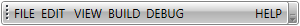
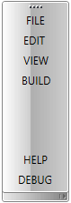

# Item Alignment

Since our __Q3 2014__ official release the __RadToolBar__ provides a mechanism to customize the alignment of the elements inside it. The default alignment is left. This means that the first element is hosted on the leftmost side of the toolbar and each next is visualized on the right of the previous one. Refer to Figure 1 for clarification.


The code that produces this layout is the following:

#### __XAML__
```XAML
	<telerik:RadToolBar>
		<telerik:RadButton Content="FILE" />
		<telerik:RadButton Content="EDIT " />
		<telerik:RadButton Content="VIEW" />
		<telerik:RadButton Content="BUILD" />
		<telerik:RadButton Content="DEBUG" />
		<telerik:RadButton Content="HELP" />
	 </telerik:RadToolBar>
```

There are numerous scenarios where an element is needed to be aligned on the opposite side. This can be achieved by using the attached __ItemAlignment__ property. It can be set to either __Left__ or __Right__. It controls where in the __RadToolBar__ the corresponding element will be positioned. The following Figure 2 shows the layout of the toolbar when a button is right aligned.



#### __XAML__	
```XAML
	<telerik:RadToolBar>
		<telerik:RadButton Content="FILE" />
		<telerik:RadButton Content="EDIT " />
		<telerik:RadButton Content="VIEW" />
		<telerik:RadButton Content="BUILD" />
		<telerik:RadButton Content="DEBUG" />
		<telerik:RadButton Content="HELP" telerik:RadToolBar.ItemAlignment="Right"/>
	</telerik:RadToolBar>
```

In case that there are several elements aligned to the right, the first defined in XAML will be positioned in the rightmost side, the second one will be positioned on its left side and so on.

This code will produce the result in Figure 3.

#### __XAML__
```XAML
	<telerik:RadToolBar>
		<telerik:RadButton Content="FILE"/>
		<telerik:RadButton Content="EDIT "/>
		<telerik:RadButton Content="VIEW" />
		<telerik:RadButton Content="BUILD"/>
		<telerik:RadButton Content="DEBUG" telerik:RadToolBar.ItemAlignment="Right"/>
		<telerik:RadButton Content="HELP" telerik:RadToolBar.ItemAlignment="Right"/>
	</telerik:RadToolBar>
```


If you configure the __RadToolBar__ to be vertical, the __Left__ setting of the __ItemAlignment__ property will act as __Top__ and the __Right__ - as __Bottom__. The result of the following code is visualized on Figure 4.

#### __XAML__
```XAML
	<telerik:RadToolBar Orientation="Vertical">
		<telerik:RadButton Content="FILE"/>
		<telerik:RadButton Content="EDIT "/>
		<telerik:RadButton Content="VIEW" />
		<telerik:RadButton Content="BUILD"/>
		<telerik:RadButton Content="DEBUG" telerik:RadToolBar.ItemAlignment="Right"/>
		<telerik:RadButton Content="HELP" telerik:RadToolBar.ItemAlignment="Right"/>
	</telerik:RadToolBar>
```

