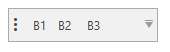
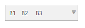

# {{ site.framework_name }} RadToolBar Grip Visibility

By default a small grip visual is shown in the `RadToolBar` control. 

To hide it, set the `GripVisibility` property to `Collapsed`.

#### __[XAML] Example 3: Hiding the grip__
{{region radtoolbar-features-grip-visibility-0}}	
	<telerik:RadToolBar GripVisibility="Collapsed">
		<telerik:RadButton Content="B1" />
		<telerik:RadButton Content="B2 " />
		<telerik:RadButton Content="B3" />
	</telerik:RadToolBar>           
{{endregion}}

## See Also
* [Getting Started]()
* [Overflow Items]()
* [RadToolBarTray]()