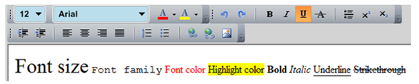

# ToolBarTray Overview

RadToolBarTray is an __ItemsControl__ and handles multiple toolbars in the same tray. The __RadToolBarTray__ handles the position, sizing and the order of toolbars inside it. It is divided by __Bands__ and each __Band__ can contain multiple toolbars. The developer controls the layout by initializing the __Band__ and __BandIndex__ properties.

#### __XAML__

{{region radtoolbartray-overview_0}}
	    <telerik:RadToolBarTray>
	        <telerik:RadToolBar Band="0" BandIndex="0" />
	        <telerik:RadToolBar Band="0" BandIndex="1" />
	        <telerik:RadToolBar Band="1" BandIndex="0" />
	    </telerik:RadToolBarTray>
{{endregion}}

> The __telerik__ alias points to the following namespace: 'xmlns:telerik="http://schemas.telerik.com/2008/xaml/presentation"'

#### __C#__

{{region radtoolbartray-overview_1}}
	using Telerik.Windows.Controls;
	
	RadToolBarTray toolBarTray = new RadToolBarTray();
	RadToolBar toolBar1 = new RadToolBar();
	RadToolBar toolBar2 = new RadToolBar();
	RadToolBar toolBar3 = new RadToolBar();
	toolBar1.Band = 0;
	toolBar1.BandIndex = 0;
	toolBar2.Band = 0;
	toolBar2.BandIndex = 1;
	toolBar3.Band = 1;
	toolBar3.BandIndex = 0;
	this.LayoutRoot.Children.Add(toolBarTray);
	toolBarTray.Items.Add(toolBar1);
	toolBarTray.Items.Add(toolBar2);
	toolBarTray.Items.Add(toolBar3);
{{endregion}}

#### __VB.NET__

{{region radtoolbartray-overview_1}}
	Imports Telerik.Windows.Controls

	Dim toolBarTray As New RadToolBarTray()
	Dim toolBar1 As New RadToolBar()
	Dim toolBar2 As New RadToolBar()
	Dim toolBar3 As New RadToolBar()
	toolBar1.Band = 0
	toolBar1.BandIndex = 0
	toolBar2.Band = 0
	toolBar2.BandIndex = 1
	toolBar3.Band = 1
	toolBar3.BandIndex = 0
	Me.LayoutRoot.Children.Add(toolBarTray)
	toolBarTray.Items.Add(toolBar1)
	toolBarTray.Items.Add(toolBar2)
	toolBarTray.Items.Add(toolBar3)
{{endregion}}