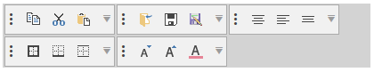
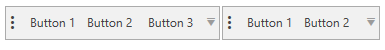
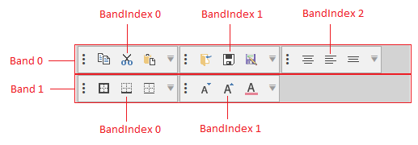
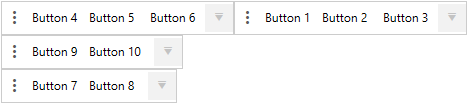
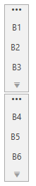

# ToolBarTray

The toolbars suite provides you with the `RadToolBarTray` control that allows you to host several `RadToolBar` elements in the same tray. The tray handles the position, size, and order of toolbars inside of it. It is divided by bands (rows) and each band can contain multiple toolbars.

#### __Figure 1: RadToolBarTray Overview__


## Defining ToolBarTray

The following example shows a very basic definition of the `RadToolBarTray` control with two RadToolBars.

__Example 1: Define the tray in XAML__
```XAML
	<telerik:RadToolBarTray VerticalAlignment="Center" Width="460">
		<telerik:RadToolBar>
			<telerik:RadButton Content="Button 1" />
			<telerik:RadButton Content="Button 2 " />
			<telerik:RadButton Content="Button 3" />
		</telerik:RadToolBar>
		<telerik:RadToolBar>
			<telerik:RadButton Content="Button 1" />
			<telerik:RadButton Content="Button 2 " />
		</telerik:RadToolBar>          
	</telerik:RadToolBarTray>
```

#### __Figure 2: RadToolBarTray populated with RadToolBars__


## Setting Band and BandIndex

The `RadToolBar` control exposes a `Band` property that can be used to define the row of the toolbar in the tray. The position (the order) in the current band is controlled via the `BandIndex` property of the toolbar.

The following picture shows how the band and band index affect the positions of the toolbars in the tray.

#### __Figure 3: RadToolBarTray Band and BandIndex__


> By default all `RadToolBar` elements hosted in the tray are positioned in the first band (Band=0). The default band index is the based on the collection index of the toolbar plus the current band position.

__Example 2: Setting Band and BandIndex manually__
```XAML
	<telerik:RadToolBarTray>
		<telerik:RadToolBar BandIndex="1">
			<telerik:RadButton Content="Button 1" />
			<telerik:RadButton Content="Button 2 " />
			<telerik:RadButton Content="Button 3" />
		</telerik:RadToolBar>
		<telerik:RadToolBar BandIndex="0">
			<telerik:RadButton Content="Button 4" />
			<telerik:RadButton Content="Button 5 " />
			<telerik:RadButton Content="Button 6" />
		</telerik:RadToolBar>
		<telerik:RadToolBar Band="2">
			<telerik:RadButton Content="Button 7" />
			<telerik:RadButton Content="Button 8 " />
		</telerik:RadToolBar>
		<telerik:RadToolBar Band="1">
			<telerik:RadButton Content="Button 9" />
			<telerik:RadButton Content="Button 10 " />
		</telerik:RadToolBar>
	</telerik:RadToolBarTray>
```

#### __Figure 4: RadToolBars with Band and BandIndex set__


## Setting Orientation

By default, the `RadToolBarTray` will order the toolbars horizontally. Also, the RadToolBar controls will order its items horizontally. To switch the orientation of the tray and the toolbars set the `Orientation` property of `RadToolBarTray` to `Vertical`.

__Example 3: Setting Orientation__
```XAML
	<telerik:RadToolBarTray Orientation="Vertical" VerticalAlignment="Center" Width="460">
		<telerik:RadToolBar>
			<telerik:RadButton Content="B1" />
			<telerik:RadButton Content="B2 " />
			<telerik:RadButton Content="B3" />
		</telerik:RadToolBar>
		<telerik:RadToolBar>
			<telerik:RadButton Content="B4" />
			<telerik:RadButton Content="B5 " />
			<telerik:RadButton Content="B6" />
		</telerik:RadToolBar>           
	</telerik:RadToolBarTray>
```

#### __Figure 4: RadToolBarTray with Vertical Orientation__


## Use the RadToolBarTray in an MVVM scenario

Since the __R1 2020 SP1__ release, the RadToolBarTray supports generating RadToolBars when its ItemsSource property is set. __Examples 4 and 5__ demonstrate how to achieve the same result shown in Example 2 in an MVVM manner.

__Example 4: Sаmple models and viewmodels__
```C#
	public class ToolBarButtonViewModel 
    {
        public string Content { get; set; }
    }

	public class ToolBarModel
    {
        public ToolBarModel()
        {
            this.ItemModels = new ObservableCollection<ToolBarButtonViewModel>();
        }

        public ObservableCollection<ToolBarButtonViewModel> ItemModels { get; set; }

        public int Band { get; set; }

        public int BandIndex { get; set; }
    }

	public class MainViewModel
    {
        private ObservableCollection<ToolBarModel> toolBarModels;

        public ObservableCollection<ToolBarModel> ToolBarModels
        {
            get
            {
                if (this.toolBarModels == null)
                {
                    this.toolBarModels = this.CreateToolBarModels(); 
                }

                return toolBarModels;
            }
        }

        private ObservableCollection<ToolBarModel> CreateToolBarModels()
        {
            return new ObservableCollection<ToolBarModel>()
                                        {
                                            new ToolBarModel()
                                            {
                                                BandIndex = 1,
                                                ItemModels = new ObservableCollection<ToolBarButtonViewModel>()
                                                {
                                                    new ToolBarButtonViewModel() {Content = "Button 1"},
                                                    new ToolBarButtonViewModel() {Content = "Button 2"},
                                                    new ToolBarButtonViewModel() {Content = "Button 2"},
                                                },
                                            },

                                            new ToolBarModel()
                                            {
                                                BandIndex = 0,
                                                ItemModels = new ObservableCollection<ToolBarButtonViewModel>()
                                                {
                                                    new ToolBarButtonViewModel() {Content = "Button 4"},
                                                    new ToolBarButtonViewModel() {Content = "Button 5"},
                                                    new ToolBarButtonViewModel() {Content = "Button 6"},
                                                },
                                            },

                                            new ToolBarModel()
                                            {
                                                Band = 2,
                                                ItemModels = new ObservableCollection<ToolBarButtonViewModel>()
                                                {
                                                    new ToolBarButtonViewModel() {Content = "Button 7"},
                                                    new ToolBarButtonViewModel() {Content = "Button 8"},
                                                },
                                            },
                                            new ToolBarModel()
                                            {
                                                Band = 1,
                                                ItemModels = new ObservableCollection<ToolBarButtonViewModel>()
                                                {
                                                    new ToolBarButtonViewModel() {Content = "Button 9"},
                                                    new ToolBarButtonViewModel() {Content = "Button 10"},
                                                },
                                            },
                                        };
        }
    }
```
```VB.NET
	Public Class ToolBarButtonViewModel
		Public Property Content() As String
	End Class

	Public Class ToolBarModel
		Public Sub New()
			Me.ItemModels = New ObservableCollection(Of ToolBarButtonViewModel)()
		End Sub

		Public Property ItemModels() As ObservableCollection(Of ToolBarButtonViewModel)

		Public Property Band() As Integer

		Public Property BandIndex() As Integer
	End Class

	Public Class MainViewModel
		Private _toolBarModels As ObservableCollection(Of ToolBarModel)

		Public ReadOnly Property ToolBarModels() As ObservableCollection(Of ToolBarModel)
			Get
				If Me._toolBarModels Is Nothing Then
					Me._toolBarModels = Me.CreateToolBarModels()
				End If

				Return _toolBarModels
			End Get
		End Property

		Private Function CreateToolBarModels() As ObservableCollection(Of ToolBarModel)
			Return New ObservableCollection(Of ToolBarModel)() _
				From {
					New ToolBarModel() With {
						.BandIndex = 1,
						.ItemModels = New ObservableCollection(Of ToolBarButtonViewModel)() From {
							New ToolBarButtonViewModel() With {.Content = "Button 1"},
							New ToolBarButtonViewModel() With {.Content = "Button 2"},
							New ToolBarButtonViewModel() With {.Content = "Button 2"}
						}
					},
					New ToolBarModel() With {
						.BandIndex = 0,
						.ItemModels = New ObservableCollection(Of ToolBarButtonViewModel)() From {
							New ToolBarButtonViewModel() With {.Content = "Button 4"},
							New ToolBarButtonViewModel() With {.Content = "Button 5"},
							New ToolBarButtonViewModel() With {.Content = "Button 6"}
						}
					},
					New ToolBarModel() With {
						.Band = 2,
						.ItemModels = New ObservableCollection(Of ToolBarButtonViewModel)() From {
							New ToolBarButtonViewModel() With {.Content = "Button 7"},
							New ToolBarButtonViewModel() With {.Content = "Button 8"}
						}
					},
					New ToolBarModel() With {
						.Band = 1,
						.ItemModels = New ObservableCollection(Of ToolBarButtonViewModel)() From {
							New ToolBarButtonViewModel() With {.Content = "Button 9"},
							New ToolBarButtonViewModel() With {.Content = "Button 10"}
						}
					}
				}
		End Function
	End Class
```

__Example 5: Defining the RadToolBarTray in xaml__
```XAML
	<Grid>
        <Grid.Resources>
            <DataTemplate DataType="{x:Type local:ToolBarButtonViewModel}">
                <telerik:RadButton Content="{Binding Content}" />
            </DataTemplate>

            <!-- If you are using the NoXaml dlls, you should base you style on the default one like so-->
            <!--<Style x:Key="ToolBarStyle" TargetType="telerik:RadToolBar" BasedOn="{StaticResource RadToolBarStyle}">-->
            <Style x:Key="ToolBarStyle" TargetType="telerik:RadToolBar" >
                <Setter Property="ItemsSource" Value="{Binding ItemModels}" />
                <Setter Property="Band" Value="{Binding Band}" />
                <Setter Property="BandIndex" Value="{Binding BandIndex}" />
            </Style>
        </Grid.Resources>
        <Grid.DataContext>
            <local:MainViewModel />
        </Grid.DataContext>

        <telerik:RadToolBarTray ItemsSource="{Binding ToolBarModels}" ItemContainerStyle="{StaticResource ToolBarStyle}" />
    </Grid>
```