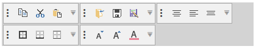
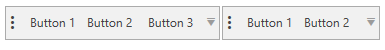
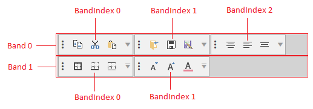
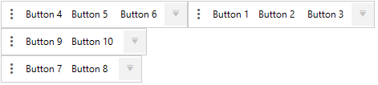
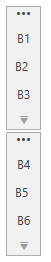

# ToolBarTray

The toolbars suite provides you with the `RadToolBarTray` control that allows you to host several `RadToolBar` elements in the same tray. The tray handles the position, size, and order of toolbars inside of it. It is divided by bands (rows) and each band can contain multiple toolbars.

#### __Figure 1: RadToolBarTray Overview__

## Defining ToolBarTray

The following example shows a very basic definition of the `RadToolBarTray` control with two RadToolBars.

__Example 1: Define the tray in XAML__
<snippet id='radtoolbar-features-radtoolbartray-overview-block_1-xaml' />

#### __Figure 2: RadToolBarTray populated with RadToolBars__

## Setting Band and BandIndex

The `RadToolBar` control exposes a `Band` property that can be used to define the row of the toolbar in the tray. The position (the order) in the current band is controlled via the `BandIndex` property of the toolbar.

The following picture shows how the band and band index affect the positions of the toolbars in the tray.

#### __Figure 3: RadToolBarTray Band and BandIndex__

> By default all `RadToolBar` elements hosted in the tray are positioned in the first band (Band=0). The default band index is the based on the collection index of the toolbar plus the current band position.

__Example 2: Setting Band and BandIndex manually__
<snippet id='radtoolbar-features-radtoolbartray-overview-block_2-xaml' />

#### __Figure 4: RadToolBars with Band and BandIndex set__

## Setting Orientation

By default, the `RadToolBarTray` will order the toolbars horizontally. Also, the RadToolBar controls will order its items horizontally. To switch the orientation of the tray and the toolbars set the `Orientation` property of `RadToolBarTray` to `Vertical`.

__Example 3: Setting Orientation__
<snippet id='radtoolbar-features-radtoolbartray-overview-block_3-xaml' />

#### __Figure 4: RadToolBarTray with Vertical Orientation__

## Use the RadToolBarTray in an MVVM scenario

Since the __R1 2020 SP1__ release, the RadToolBarTray supports generating RadToolBars when its ItemsSource property is set. __Examples 4 and 5__ demonstrate how to achieve the same result shown in Example 2 in an MVVM manner.

__Example 4: Sаmple models and viewmodels__
<snippet id='radtoolbar-features-radtoolbartray-overview-block_4-cs' />
<snippet id='radtoolbar-features-radtoolbartray-overview-block_5-vb' />

__Example 5: Defining the RadToolBarTray in xaml__
<snippet id='radtoolbar-features-radtoolbartray-overview-block_6-xaml' />