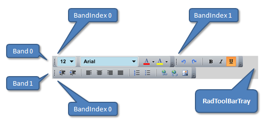

# ToolBarTray Structure

## 

* __ToolBarTray__ - The horizontal tray where toolbars are placed.
					

* __Band__ - In the example above there are two bands: __Band__ 0 contains two toolbars and __Band__ 1 - one.
					

* __BandIndex__ - The position of a __Toolbar__ inside the selected __Band__.
					
