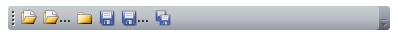

# Creating simple toolbar

The following example shows how to create a __RadToolBar__ with some __Buttons__.

Preview:

Code:

#### __XAML__

{{region radtoolbar-create-simple-toolbar_0}}
	xmlns:telerik=&quot;http://schemas.telerik.com/2008/xaml/presentation&quot;
	<telerik:RadToolBar>
		<Button>
			<Image Source="/Images/ToolBar/Open.png" />
		</Button>
		<Button>
			<StackPanel Orientation="Horizontal">
				<Image Source="/Images/ToolBar/Open.png" />
				<TextBlock Text="..." />
			</StackPanel>
		</Button>
		<Button>
			<Image Source="/Images/ToolBar/Close.png" />
		</Button>
		<Button>
			<Image Source="/Images/ToolBar/Save.png" />
		</Button>
		<Button>
			<StackPanel Orientation="Horizontal">
				<Image Source="/Images/ToolBar/Save.png" />
				<TextBlock Text="..." />
			</StackPanel>
		</Button>
		<Button>
			<Image Source="/Images/ToolBar/SaveAll.png" />
		</Button>
	</telerik:RadToolBar>
{{endregion}}