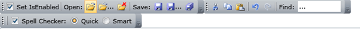
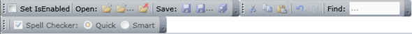

# Enable / Disable items state

## 

You can control the IsEnabled state of the __RadToolBar__ items thus modifying the overall look of the control: 

RadToolBar with enabled items:

RadToolBar with disabled items:

You can disable an item placed inside the __RadToolBar__ by changing its __IsEnabled__ property:

	
    <telerik:RadToolBar x:Name="toolbar">
        <Button IsEnabled="False">
            <Image Source="/Images/Open.png" />
        </Button>
    </telerik:RadToolBar>
					

If you want to disable all __RadToolBar__ items in code behind, you can traverse the Items colelction of the control and change the enable state of each item:
			

	
			foreach (object o in toolbar.Items)
			{
				Control control = o as Control;
				if (control != null)
				{
					control.IsEnabled = false;
				}
			}
					

	
For Each o As Object In toolbar.Items
	Dim control As Control = TryCast(o, Control)
	If control IsNot Nothing Then
		control.IsEnabled = False
	End If
Next
					

>
					The __TextBlock__ control inherits the __FrameworkElement__, but not the __Control__, i.e. it has not the __IsEnabled__ property. This is the reason that it can not be enabled and disabled.
				
