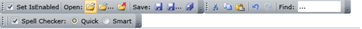
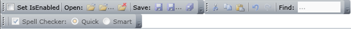

# Enable / Disable items state

You can control the IsEnabled state of the __RadToolBar__ items thus modifying the overall look of the control: 

RadToolBar with enabled items:

RadToolBar with disabled items:

You can disable an item placed inside the __RadToolBar__ by changing its __IsEnabled__ property:

<snippet id='radtoolbar-howto-enable-toolbar-items-block_1-xaml' />

If you want to disable all __RadToolBar__ items in code behind, you can traverse the Items collection of the control and change the enable state of each item:

<snippet id='radtoolbar-howto-enable-toolbar-items-block_2-cs' />
<snippet id='radtoolbar-howto-enable-toolbar-items-block_3-vb' />

> The __TextBlock__ control inherits the __FrameworkElement__, but not the __Control__, i.e. it has not the __IsEnabled__ property. This is the reason that it can not be enabled and disabled.