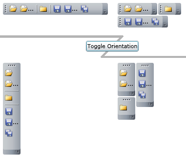

# Orientation

## Values

The __Orientation__ property is of type __System.Windows.Controls.Orientation__. Possible values are:
* __Orientation.Horizontal__: the tollbar/tray is oriented horizontal;
* __Orientation.Vertical__: the tollbar/tray is oriented vertical;						

> You can change the orientation at run-time.

<!-- -->
> The orientation of the tray overrides the toolbar's orientation, i.e. the layout will respects only the tray's orientation.

<!-- -->
> Sometime it is necessary to adjust the horizontal and vertical alignments when you have changed the orientation - all this depends on the container that holds the __ToolBar__ or the tray control.					

<snippet id='radtoolbar-howto-orientation-block_1-xaml' />

<snippet id='radtoolbar-howto-orientation-block_2-cs' />
<snippet id='radtoolbar-howto-orientation-block_3-vb' />

## Preview
