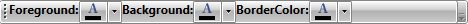

# Use MVVM in RadToolbar

This example shows how to use the __RadToolBar__ control with the Model-View-ViewModel (MVVM) pattern and a custom **DataTemplateSelector**.

### 1. __Implement the custom DataTemplateSelector__

Because RadToolBar may contain a variety of other controls as its items, we will use a custom DataTemplateSelector to help us determine the template for each item inside its ItemsSource.

__Example 1: The custom DataTemplateSelector__

<snippet id='radtoolbar-howto-use-mvvm-in-radtoolbar-block_1-cs' />
<snippet id='radtoolbar-howto-use-mvvm-in-radtoolbar-block_2-vb' />

__Example 2: Assign the ItemTemplateSelector property__

<snippet id='radtoolbar-howto-use-mvvm-in-radtoolbar-block_3-xaml' />

### 2. __Create ViewModels__

We will create two view models for this example: **ColorPickerViewModel** and **TextBlockViewModel**. The ColorPickerViewModel will contain a collection of colors and the TextBlockViewModel will contain a single text property.

__Example 3: Define ColorPickerViewModel and TextViewModel__

<snippet id='radtoolbar-howto-use-mvvm-in-radtoolbar-block_4-cs' />
<snippet id='radtoolbar-howto-use-mvvm-in-radtoolbar-block_5-vb' />

### 3. __Define the DataTemplates for the DataTemplateSelector__           

> In order to use the RadColorPicker control, you have to add a reference to the following assembly: __Telerik.Windows.Controls.Input__

#### __[XAML] Example 4: Defining the templates for the ViewModels:

<snippet id='radtoolbar-howto-use-mvvm-in-radtoolbar-block_6-xaml' />

### 4. __Create the MainViewModel__

Let's now create the MainViewModel which will contain a collection of our ViewModels.

__Example 5: Create the MainViewModel__

<snippet id='radtoolbar-howto-use-mvvm-in-radtoolbar-block_7-cs' />
<snippet id='radtoolbar-howto-use-mvvm-in-radtoolbar-block_8-vb' />

### 5.  __Set the DataContext and ItemsSource of the RadToolBar__

Finally we need to instantiate our ViewModel and assign it as the DataContext of the ToolBar. You should then bind the **ItemsSource** property to the **Items** property in our ViewModel. Let's also set the **VerticalAlignment** to **Center** and add some margins for better visualization.

__Example 6: Set the DataContext and ItemsSource of the RadToolBar__

<snippet id='radtoolbar-howto-use-mvvm-in-radtoolbar-block_9-xaml' />

#### __Figure 1: MVVM ToolBar with custom DataTemplateSelector__

> For an extended implementation with custom styles, check out the [ToolBarMVVM](https://github.com/telerik/xaml-sdk/tree/master/ToolBar/ToolBarMVVM) demo from our [SDK Samples Browser](https://demos.telerik.com/xaml-sdkbrowser/).

## See Also
* [ToolBar DataBinding]()