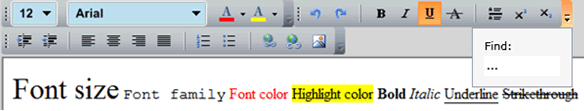

# Overview



## 

Thank you for choosing Telerik __RadToolBar__!
				

__RadToolBar__ is an __ItemsControl__ that contains a group of controls (items). The __RadToolBar__ can displays its items
					in accompanying (pop-up) overflow area if the available area is too small.
				

The __RadToolBar__ mimics the functionality and behavior of the VS toolbar with its __Strip__ and __Overflow__ areas. All the items in the toolbar will jump between the strip and the overflow depending on the toolbar’s size. In addition, the developer is able to stick items into one of these areas using a single property  - __OverflowMode__.
				

The __RadToolBar__ also supports a __Style Selector__ that sets defauld styles to its items. There are pre-defined styles for many of the regular controls – Button, RadButton, ToggleButton, RadToggleButton, CheckBox, RadioButton, RadRadioButton, RadDropDownButton, TextBox, TextBlock, RadToolBarSeparator, RadSeparator.
				

>__Location__:
					Assembly: __Telerik.Windows.Controls.Navigation.dll__
						Namespace: __Telerik.Windows.Controls__

#### __XAML__

{{region radtoolbar-overview_0}}
	xmlns:telerik="http://schemas.telerik.com/2008/xaml/presentation"
	<!-- ... -->
	<telerik:RadToolBar>
	
	<!-- ... -->
	</telerik:RadToolBar>
	{{endregion}}

#### __C#__

{{region radtoolbar-overview_1}}
	using Telerik.Windows.Controls;
	void CreateToolbar()
	{
		RadToolBar toolbar = new RadToolBar();
		this.toolbarHolder.Children.Add(toolbar);
	}
	{{endregion}}

#### __VB.NET__

{{region radtoolbar-overview_1}}
		Imports Telerik.Windows.Controls
	
		Private Sub CreateToolbar()
			Dim toolbar As New RadToolBar()
			Me.toolbarHolder.Children.Add(toolbar)
		End Sub
	#End Region
	
	End Class

>The __RadToolBar__ provides an overflow mechanism that places items that do not fit in the toolbar into an overflow area.
					
