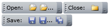

# Getting Started

## Object instantiation

>

In order to use __RadToolBar__control in your projects you have to add references to the following assemblies:

* __Telerik.Windows.Controls__

* __Telerik.Windows.Controls.Navigation__

* __Telerik.Windows.Data__

You can find more info [here](http://www.telerik.com/help/wpf/installation-installing-controls-dependencies-wpf.html).

>

In order to use __RadToolBar__ you need to add reference to the following assemblies in your project:

* __Telerik.Windows.Controls__

* __Telerik.Windows.Controls.Navigation__

You can find more info [here](http://www.telerik.com/help/silverlight/installation-installing-controls-dependencies.html).

#### __C#__

{{region radtoolbar-declaration_0}}
	using Telerik.Windows.Controls;
	RadToolBar toolBar = new RadToolBar();
	{{endregion}}

#### __XAML__

{{region radtoolbar-declaration_1}}
	xmlns:telerik="http://schemas.telerik.com/2008/xaml/presentation"
	<telerik:RadToolBar />
	{{endregion}}

## Adding Items

#### __C#__

{{region radtoolbar-declaration_2}}
	using Telerik.Windows.Controls;
	RadToolBar toolBar = new RadToolBar();
	Button button = new Button(){ Content="Button" };
	toolBar.Items.Add(button);
	{{endregion}}

#### __XAML__

{{region radtoolbar-declaration_3}}
	xmlns:telerik=http://schemas.telerik.com/2008/xaml/presentation
	<telerik:RadToolBar>
	
	<Button Content="Button" />
	</telerik:RadToolBar>
	{{endregion}}

## Overflow Mode

The OverflowMode Attached Property determines whether the items are distributed among __Strip__ and __Overflow__ areas. Possible values are:

* __OverflowMode.Never__: item will be placed only in the Strip panel;

* __OverflowMode.Always__: item will be placed only in the Overflow panel;

* __OverflowMode.AsNeeded__: item’s location depends on the available space in the Strip panel;

>

There are corresponding methods __GetOverflowMode__ and __SetOverflowMode__ to access the __OverflowMode__ property for the specified element.

#### __C#__

{{region radtoolbar-declaration_4}}
	using Telerik.Windows.Controls;
	RadToolBar toolBar = new RadToolBar();
	this.LayoutRoot.Children.Add(toolBar);
	Button button = new Button(){ Content="Button" };
	toolBar.Items.Add(button);
	RadToolBar.SetOverflowMode(button, OverflowMode.Never);
	OverflowMode om = RadToolBar.GetOverflowMode(toolBar);
	{{endregion}}

#### __XAML__

{{region radtoolbar-declaration_5}}
	xmlns:telerik="http://schemas.telerik.com/2008/xaml/presentation"
	<telerik:RadToolBar>
	
	<Button Content="Button" telerik:RadToolBar.OverflowMode="Always"/>
	</telerik:RadToolBar>
	{{endregion}}

##  ItemsSource

Following standards for __ItemsControls__ the tollbar’s items can be generated via __ItemsSource__.

#### __C#__

{{region radtoolbar-declaration_6}}
	using Telerik.Windows.Controls;
	RadToolBar toolBar = new RadToolBar();
	this.LayoutRoot.Children.Add(toolBar);
	toolBar.ItemsSource = new List<object>()
	{
	
	new CheckBox() { IsChecked = true, Content = "Check box"},
	new Button() { Content = "Button"},
	new Image() { Source = new BitmapImage(new Uri("Images/image.png", UriKind.RelativeOrAbsolute))}
	};
	{{endregion}}

#### __XAML__

{{region radtoolbar-declaration_7}}
	xmlns:telerik="http://schemas.telerik.com/2008/xaml/presentation"
	
	<telerik:RadToolBar ItemsSource="{Binding Source={StaticResource MyToolBarItemsCollection}}" />
	{{endregion}}

## Toolbar tray related properties

## Band

Dependency property.

Gets or sets a value that indicates in which Band the RadToolBarTray will layout the toolbar.

## BandIndex

Dependency property.
Gets or sets a value that indicates at which position in selected Band the RadToolBarTray will layout the toolbar.

__Code:__

#### __C#__

{{region radtoolbar-declaration_8}}
	using Telerik.Windows.Controls;
	RadToolBarTray toolBarTray = new RadToolBarTray();
	RadToolBar toolBar = new RadToolBar();
	this.LayoutRoot.Children.Add(toolBarTray);
	toolBarTray.Items.Add(toolBar);
	toolBar.Band = 0;
	toolBar.BandIndex = 3;
	{{endregion}}

#### __XAML__

{{region radtoolbar-declaration_9}}
	xmlns:telerik="http://schemas.telerik.com/2008/xaml/presentation"
	<telerik:RadToolBarTray>
	
	<telerik:RadToolBar Band="0" BandIndex="0" />
	<telerik:RadToolBar Band="0" BandIndex="1" />
	<telerik:RadToolBar Band="1" BandIndex="0" />
	</telerik:RadToolBarTray>
	{{endregion}}

__Preview:__

         
      
