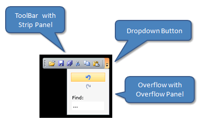

# Structure

This section defines terms and concepts used in the scope of __RadToolBar__ you have to get familiar with prior to continue reading this help. They can also be helpful when contacting our support service in order to describe your issue better. For more detailed descriptions of the required parts of the control please visit the [Required Parts]() section.

* __ToolBar__ - The horizontal gray part from the picture. It holds the __Grip__, the __Strip__ panel and the __DropDown__ button 
* __Strip panel__ - The main area that holds items - buttons, etc. 
* __Dropdown Button__ - A button to act on in order to open/ close the __Overflow__. 
* __Overflow panel__ - The area that holds all items not located in the __Strip__ panel. 

## See Also
 * [Getting Started]()
 * [Required Parts]()