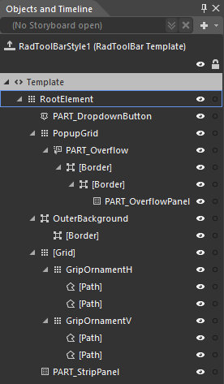
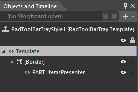

# Templates Structure 

Like most controls, the __RadToolBar__ also allows you to template it in order to change the control from the inside. Except for templating the whole control, you can template only parts of it. This topic will make you familiar with the structure of the RadToolBar's templates.

>tip For more information about templating and how to modify the default templates of the RadControls you can read the [Editing Control Templates]() on this matter.

## RadToolBar Template Structure

* __RootElement__: Is of type __Grid__ and hosts the __RadToolBar's__ template.
	* __PART_DropdownButton__: The button responsible for open/close the __Overflow__ area.
	* __PopupGrid__: Is of type __Grid__ and host the dropdown __Popup__ element.
		* __PART_Overflow__: This element is of type __Popup__ and holds the __Overflow__ panel and is responsible for all the pop-up management.
			* __PART_OverflowPanel__: This element is of type __RadToolBarOverflowPanel__ and serves as a place holder for all items not fitted in __Strip__ panel.
	* __[Grid]__: This element holds the Grip element of the RadToolBar.
		* __[GripOrnamentH]__: This element is of type __Grid__ and represent the horizontal visualization of the grip area.
			* __[Path]__
			* __[Path]__
		* __[GripOrnamentV]__: This element is of type __Grid__ and represent the vertical visualization of the grip area.
			* __[Path]__
			* __[Path]__
	* __PART_StripPanel__: This element is of type __RadToolBarPanel__ and serves as a place holder for all visible items.	
	
## RadToolBarTray Template Structure

* __[Border]__: This element holds the ItemPresenter.
	* __PART_ItemsPresenter__: This element is of type __ItemPresenter__ which visualize every specified __RadToolBar__. 
	
## See Also

* [Getting Started]()
* [ToolBarTray Overview]()