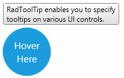
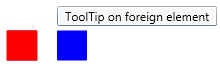

# Getting Started with {{ site.framework_name }} ToolTip

## Assembly References

To use the __RadToolTip__ in your projects you have to add references to the following assemblies:

* __Telerik.Licensing.Runtime__
* __Telerik.Windows.Controls__

You can find the required assemblies for each control from the suite in the [Controls Dependencies]()[Controls Dependencies]() help article.

>tip With the 2025 Q1 release, the Telerik UI for WPF has a new licensing mechanism. You can learn more about it [here]().

### Adding Telerik Assemblies Using NuGet

To use __RadToolTip__ when working with NuGet packages, install the `Telerik.Windows.Controls.for.Wpf.Xaml` package. The [package name may vary]() slightly based on the Telerik dlls set - [Xaml or NoXaml]()

Read more about NuGet installation in the [Installing UI for WPF from NuGet Package]() article.

## Using RadToolTip in the Project

In order to use __RadToolTip__ you should take advantage of the __RadToolTipService__. You can set the attached property __RadToolTipService.TooltipContent__ on some element in XAML in order to show tooltip over it.

#### __[XAML] Example 1__
{{region radtooltip-getting-started-0}}
     <Grid x:Name="LayoutRoot" Background="White">
        <Ellipse x:Name="ellipse"
                 Width="80"
                 Height="80"
                 Fill="#FF1B9DDE"
                 Stroke="#FF1B9DDE"
                 StrokeThickness="2"
                 Visibility="Visible"
                   telerik:RadToolTipService.VerticalOffset="-5"
                 telerik:RadToolTipService.Placement="Top"
                 telerik:RadToolTipService.ToolTipContent="RadToolTip enables you to specify&#x0a;tooltips on various UI controls.">
            <telerik:RadToolTipService.ToolTipContentTemplate>
                <DataTemplate>
                    <telerik:RadToolTipContentView>
                        <TextBlock Text="{Binding}" />
                    </telerik:RadToolTipContentView>
                </DataTemplate>
            </telerik:RadToolTipService.ToolTipContentTemplate>
        </Ellipse>

        <TextBlock Name="tBlock"
                   HorizontalAlignment="Center"
                   VerticalAlignment="Center"
                   FontFamily="Segoe UI"
                   FontSize="16"
                   Foreground="White"
                   IsHitTestVisible="False">
            <Run Text="Hover"/>
            <LineBreak />
            <Run Text=" Here" />
        </TextBlock>
     </Grid>
{{endregion}}

Figure 1 demonstrates how the code above is rendered on screen.





The same configuration can be achieved from code like this:

#### __[C#] Example 2__
{{region radtooltip-getting-started-1}}
    RadToolTipService.SetToolTipContent(this.ellipse, "RadToolTip enables you to specify&#x0a;tooltips on various UI controls.");
    RadToolTipService.SetPlacement(this.ellipse, System.Windows.Controls.Primitives.PlacementMode.Center);
{{endregion}}

#### __[VB.NET] Example 2__
{{region radtooltip-getting-started-2}}
    RadToolTipService.SetToolTipContent(Me.ellipse, "RadToolTip enables you to specify&#x0a;tooltips on various UI controls.")
    RadToolTipService.SetPlacement(Me.ellipse, System.Windows.Controls.Primitives.PlacementMode.Center)
{{endregion}}

The __RadToolTipService__ controls the open/close functionality as well as the visual appearance of a __RadToolTip__ object. Also, the service provides a rich set of properties customizing the visualization of the __RadToolTip__ object.

For example you can change the element next to which a tooltip will be opened. This can be achieved by setting the __RadToolTipService.PlacementTarget__ property

#### __[XAML] Example 3__
{{region radtooltip-getting-started-3}}
    <StackPanel Orientation="Horizontal">
		<Rectangle Width="30"
		           Height="30"
		           Margin="20 0"
		           Fill="Red"
		           telerik:RadToolTipService.Placement="Top"
		           telerik:RadToolTipService.PlacementTarget="{Binding ElementName=rect}"
		           telerik:RadToolTipService.ToolTipContent="ToolTip on foreign element"
		           telerik:RadToolTipService.VerticalOffset="-5" />
		<Rectangle x:Name="rect"
		           Width="30"
		           Height="30"
		           VerticalAlignment="Center"
		           Fill="Blue" />
	</StackPanel>
{{endregion}}

Figure 2 shows how the ToolTip will be visualized with the above defined settings





## Properties

Below are listed all properties exposed by the RadToolTipService along with short description.

* __BetweenShowDelay__: A property of type int and gets or sets the maximum time between the display of two tooltips where the second tooltip appears without a delay.
* __HorizontalOffset__: A property of type double which gets or sets the offset from the left of the area that is specified for the tooltip by the PlacementRectangle and PlacementTarget properties. 
* __InitialShowDelay__: A property of type int and gets or sets the  time in miliseconds before a tooltip opens. 
* __IsEnabled__: A property of type bool which gets or sets a value controlling wheter the tooltip should appear.
* __Placement__: A property of type PlacementMode and gets or sets orientation of the tooltip when it opens and specifies how the tooltip behaves when it overlaps screen boundaries. 
* __PlacementRectangle__: A property of of type Rect and gets or sets the rectangular area relative to which the tooltip is positioned.
* __PlacementTarget__: A property of of type UIElement and gets or sets the object relative to which the tooltip is positioned.
* __ShowDuration__: A property of type int and gets or sets the time in miliseconds that a tooltip remains visible.
* __ToolTipContent__: A property of type object and gets or sets the content of the ToolTip.
* __ToolTipContentTemplate__: A property of of type DataTemplate and gets or sets the content template of the ToolTip.
            

## Events

The __RadToolTipService__ exposes the following events:

* __ToolTipOpening__ - occures when a tooltip is in process of opening.           

* __ToolTipClosing__ - occures when a tooltip is in process of closing.

## Setting a Theme

>important Telerik themes are not turned on by default in RadToolTip. To use predefined Telerik styles you can check the [Theming]() help article.

The controls from our suite support different themes. You can see how to apply a theme different than the default one in the [Setting a Theme]() help article.

>important Changing the theme using implicit styles will affect all controls that have styles defined in the merged resource dictionaries. This is applicable only for the controls in the scope in which the resources are merged. 

To change the theme, you can follow the steps below:

* Choose between the themes and add reference to the corresponding theme assembly (ex: **Telerik.Windows.Themes.Windows8.dll**). You can see the different themes applied in the **Theming** examples from our [WPF Controls Examples](https://demos.telerik.com/wpf/)[Silverlight Controls Examples](https://demos.telerik.com/silverlight/#ToolTip/Theming) application.

* Merge the ResourceDictionaries with the namespace required for the controls that you are using from the theme assembly. For the RadToolTip, you will need to merge the following resources:

	* __Telerik.Windows.Controls__

__Example 4__ demonstrates how to merge the ResourceDictionaries so that they are applied globally for the entire application.

#### __[XAML] Example 4: Merge the ResourceDictionaries__  
{{region radtooltip-getting-started_7}}
	<Application.Resources>
		<ResourceDictionary>
			<ResourceDictionary.MergedDictionaries>
				<ResourceDictionary Source="/Telerik.Windows.Themes.Windows8;component/Themes/System.Windows.xaml"/>
				<ResourceDictionary Source="/Telerik.Windows.Themes.Windows8;component/Themes/Telerik.Windows.Controls.xaml"/>
			</ResourceDictionary.MergedDictionaries>
		</ResourceDictionary>
	</Application.Resources>
{{endregion}}

>Alternatively, you can use the theme of the control via the [StyleManager](https://docs.telerik.com/devtools/wpf/styling-and-appearance/stylemanager/common-styling-apperance-setting-theme-wpf)[StyleManager](https://docs.telerik.com/devtools/silverlight/styling-and-appearance/stylemanager/common-styling-apperance-setting-theme).

__Figure 3__ shows a RadToolTip with the **Windows8** theme applied.

#### __Figure 3: RadToolTip with the Windows8 theme__


## Telerik UI for WPF Learning Resources

* [Telerik UI for WPF ToolTip Component](https://www.telerik.com/products/wpf/tooltip.aspx)
* [Getting Started with Telerik UI for WPF Components]()
* [Telerik UI for WPF Installation]()
* [Telerik UI for WPF and WinForms Integration]()
* [Telerik UI for WPF Visual Studio Templates]()
* [Setting a Theme with Telerik UI for WPF]()
* [Telerik UI for WPF Virtual Classroom (Training Courses for Registered Users)](https://learn.telerik.com/learn/course/external/view/elearning/16/telerik-ui-for-wpf) 
* [Telerik UI for WPF License Agreement](https://www.telerik.com/purchase/license-agreement/wpf-dlw-s)


