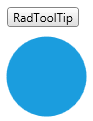

# Customizing ToolTip Content

Telerik themes are not turned on by default in __RadToolTip__. In order to use the predefined Telerik styles you can define a __ContentTemplate__ for the __RadToolTip__ component and use the __RadToolTipContentView__ control inside the template.

The following code example demonstrates how to set up __RadToolTip__ to use the Telerik themes.

__Example 1: Setting ToolTipContentTemplate property__
<snippet id='radtooltip-theming-block_1-xaml' />

Another approach that can be used for setting up the __RadToolTip__ theming is to set the __ToolTipContentTemplate__ property to null and then define the __RadToolTipContentView__ control inside the __ToolTipContent__.

__Example 2: Setting ToolTipContent property__
<snippet id='radtooltip-theming-block_2-xaml' />

The end result is demonstrated in the picture below:

## See Also
 * [Getting Started]()