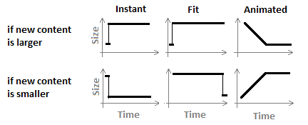

# Animated Layout Change

We have taken a step further in the RadTransitionControl functionality and implemented layout animation mechanism. Animating the layout can be very CPU expensive but still depending on the project this may be required. Also even if fluid resize may be expensive, using animations with discrete steps would be acceptable.

Currently the RadTransitionControl places an Image of the old content and a ContentPresenter with the new Content in a common panel. The layout animation is achieved by modifying attached properties on these 3 UIElements. Changing the control Template of the RadTransitionControl may break the layout animations. The further detail of the implementation of these animations is outside the bounds of this topic.
      

In previous versions when the size of the old content differed the new the captured Image used to stretch. Such behavior works relatively well with images but not with UI. The Image now has Stretching mode set to None. Currently __the alignment of the Image with the old content__ depends on the __HorizontalContentAlignment__ and __VerticalContentAlignment__ of the RadTransitionControl.      

## Shader Layout Animations

The current public API for enabling layout animations on existing transitions that is available through the __ShaderTransitionProvider__’s __LayoutAnimation__ property. Some of the available transitions that have this option are:

* FadeTransition

* FlipWrapTransition

* LinearFadeTransition

* MappedLightTransition

* MotionBlurredZoomTransition

* PerspectiveTransition

* PixelateTransition

* RollTransition

* SlideAndZoomTransition

* WaveTransition

Note this is not a complete list.

The __LayoutAnimation__ is of __enum__ type __ShaderLayoutAnimation__ and can be set to one of the:

* __Instant__ – the default behavior. The RadTransitionControl instantly assumes the size of the new content clipping or aligning the Image of the old content.

* __Fit__ – when the transition starts the RadTransitionControl assumes size the will fit horizontally and vertically both the new content and the Image of the old content. This size is preserved during the transition and at the end the RadTransitionControl resizes second time to assume the size of the new content.

* __Animated__ – the RadTransitionControl animates its size so at the middle of the transition it can fit horizontally and vertically both the new content and the Image of the old content. After that it animates its size so it fits perfectly the new content at the end of the transition. __Please note that the animation constantly invalidates the layout which may be slow if a complex content is placed inside the RadTransitionControl__.

The ActualWidth and ActualHeight of the RadTransitionControl would have values such as the drawn on the graphic below if the RadTransitionControl is not stretched and does not have fixed Width or Height.   		



## LayoutClipTransition

This transition provider has only one option – to set its Orientation to Horizontal or Vertical. To take affect the RadTransitionControl should be Left or Right aligned if the Orientation is Horizontal and Top or Right if the Orientation is Vertical. It will animate the layout so it looks like the RadTransitionControl is getting smaller clipping the content until it gets its ActualWidth or ActualHeight based on the Orientation to zero so nothing is visible, swap the old with the new content and start to grow in size revealing the new Content until it is fully visible.      	

#### __XAML__

```XAML
	<telerik:RadTransitionControl VerticalAlignment="Top" Content="{Binding ElementName=ImageSelector, Path=SelectedItem}">
	    <telerik:RadTransitionControl.Transition>
	        <telerik:LayoutClipTransition Orientation="Vertical" />
	    </telerik:RadTransitionControl.Transition>
	</telerik:RadTransitionControl>
```