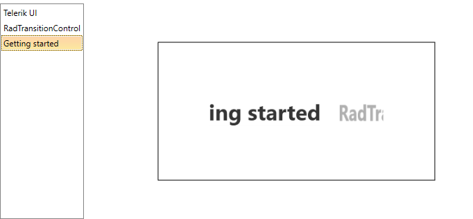

# Getting Started with {{ site.framework_name }} TransitionControl

The __RadTransitionControl__ derives from __ContentControl__ and its purpose is to visualize some content (__UserControls__, __UIElements__, __Data__ etc). Additionally it can apply transition effects upon changing its content. This tutorial will help you get started with the RadTransitionControl basics.

* [Assembly References](#assembly-references)

* [Add a RadTransitionControl to your application](#add-a-radtransitioncontrol-to-your-application)

* [Display strings listed in a RadListBox](#display-strings-listed-in-a-radlistbox)

* [Change default transition](#change-default-transition)

## Assembly references

In order to use RadTransitionControl control in your projects, you have to add a reference to the following assemblies:

* __Telerik.Licensing.Runtime__
* __Telerik.Windows.Controls__

>tip With the 2025 Q1 release, the Telerik UI for WPF has a new licensing mechanism. You can learn more about it [here]().

### Adding Telerik Assemblies Using NuGet

To use __RadTransitionControl__ when working with NuGet packages, install the `Telerik.Windows.Controls.for.Wpf.Xaml` package. The [package name may vary]() slightly based on the Telerik dlls set - [Xaml or NoXaml]()

Read more about NuGet installation in the [Installing UI for WPF from NuGet Package]() article.

## Add a RadTransitionControl to your application

In order to add a __RadTransitionControl__ to your application, you have to simply create an instance of it in your XAML. As the __RadTransitionControl__ is located in the __Telerik.Windows.Controls__ namespace of the __Telerik.Windows.Controls__ assembly, you have to add the following namespace declaration in your __UserControl__:

#### __[XAML] Example 1: Adding telerik namespace__

{{region xaml-radtransition-getting-started_0}}
	xmlns:telerik="clr-namespace:Telerik.Windows.Controls;assembly=Telerik.Windows.Controls"
{{endregion}}

#### __[XAML] Example 2: Creating a RadTransitionControl__

{{region xaml-radtransition-getting-started_1}}
	<telerik:RadTransitionControl x:Name="radTransitionControl" />
{{endregion}}

>The __RadTransitionControl__ doesn't have any visual elements, so if it has no content, nothing will be visualized.

## Display strings listed in a RadListBox

The RadTransitionControl is a content control. Besides displaying content it can apply transition effects upon its change. To make you familiar with this, a collection of RadListBoxItems will be used in this tutorial, which will be listed in a __RadListBox__ control. The content of the selected RadListBoxItem should appear as content of the RadTransitionControl. Changing the selected item should change the content of the control, too.

Here is a sample __RadListBox__ definition, which is populated with RadListBoxItems with a string for __Content__.

#### __[XAML] Example 3: Sample RadListBox definition__

{{region xaml-radtransition-getting-started_2}}
	 <telerik:RadListBox x:Name="radListBox">
		<telerik:RadListBox.Items>
			<telerik:RadListBoxItem Content="Telerik UI" />
			<telerik:RadListBoxItem Content="RadTransitionControl" />
			<telerik:RadListBoxItem Content="Getting started" />
		</telerik:RadListBox.Items>
	</telerik:RadListBox>
{{endregion}}

The content of the __RadTransitionControl__ should be represented by the content of the __SelectedItem__ in the __RadListBox__. This can be done by using element to element binding.

>tipYou can learn more about binding the __RadTransitionControl__ in the [Data Binding]() topic.

#### __[XAML] Example 4: Binding RadTransitionControl Content__

{{region xaml-radtransition-getting-started_3}}
	<Grid>
        <Grid.ColumnDefinitions>
            <ColumnDefinition Width="Auto" />
            <ColumnDefinition Width="*"/>
        </Grid.ColumnDefinitions>
        <telerik:RadListBox x:Name="radListBox">
            <telerik:RadListBox.Items>
                <telerik:RadListBoxItem Content="Telerik UI" />
                <telerik:RadListBoxItem Content="RadTransitionControl" />
                <telerik:RadListBoxItem Content="Getting started" />
            </telerik:RadListBox.Items>
        </telerik:RadListBox>

        <Border Margin="50 0 0 0" Grid.Column="1" BorderThickness="1" BorderBrush="Black" Width="400" Height="200" >
            <telerik:RadTransitionControl
                            FontSize="35"
                            FontWeight="Bold"
                            HorizontalAlignment="Center" 
                            VerticalAlignment="Center"
                            Content="{Binding SelectedItem.Content, ElementName=radListBox}">
            </telerik:RadTransitionControl>
        </Border>
    </Grid>
{{endregion}}

If you run your application at this point, the content of the __RadTransitionControl__ should change when you select an item in the __RadListBox__.

## Change default transition

The __RadTransitionControl__ automatically detects when the content is changed and applies a transition to the content. The default transition is __MotionBlurredZoomTransition__.

>tipTo learn more about the transitions in the __RadTransitionControl__ read the [Transitions]() topic.

As the built-in transition effects are located in the __Telerik.Windows.Controls.TransitionEffects__ namespace of the __Telerik.Windows.Controls__ assembly, you have to add the following namespace declaration in your __UserControl__:

#### __[XAML] Example 5: Adding TransitionEffects namespace__

{{region xaml-radtransition-getting-started_4}}
	xmlns:telerikTransitions="clr-namespace:Telerik.Windows.Controls.TransitionEffects;assembly=Telerik.Windows.Controls"
{{endregion}}

In order to change the applied transition you can set the __Transition__ property of the RadTransitionControl to one of the available transitions in the __TransitionEffects__ namespace.

#### __[XAML] Example 6: Applying SlideAndZoomTransition to RadTransitionControl__

{{region xaml-radtransition-getting-started_5}}
	 <telerik:RadTransitionControl
                			Grid.Column="1"
                            FontSize="35"
                            FontWeight="Bold"
                            HorizontalAlignment="Center" 
                            VerticalAlignment="Center"
                            Content="{Binding SelectedItem.Content, ElementName=radListBox}">
		<telerik:RadTransitionControl.Transition>
			<telerikTransitions:SlideAndZoomTransition />
		</telerik:RadTransitionControl.Transition>
	</telerik:RadTransitionControl>
{{endregion}}

#### __Figure 1: Result from Example 6__


## Telerik UI for WPF Learning Resources

* [Telerik UI for WPF TransitionControl Component](https://www.telerik.com/products/wpf/transition.aspx)
* [Getting Started with Telerik UI for WPF Components]()
* [Telerik UI for WPF Installation]()
* [Telerik UI for WPF and WinForms Integration]()
* [Telerik UI for WPF Visual Studio Templates]()
* [Setting a Theme with Telerik UI for WPF]()
* [Telerik UI for WPF Virtual Classroom (Training Courses for Registered Users)](https://learn.telerik.com/learn/course/external/view/elearning/16/telerik-ui-for-wpf) 
* [Telerik UI for WPF License Agreement](https://www.telerik.com/purchase/license-agreement/wpf-dlw-s)


## See Also

 * [Working with the RadTransitionControl]()

 * [Transitions]()

 * [Data Binding]()

 * [Integration with Content Controls]()

 * [RadTransitionControl SDK examples]()
