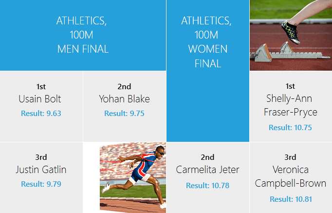
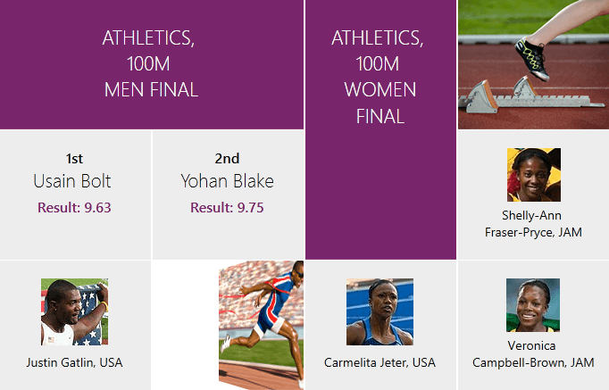

# {{ site.framework_name }} TransitionControl Overview

Thank you for choosing Telerik __RadTransitionControl__!

The __RadTransitionControl__ allows you to create transition animations that will appear upon changing the content of the control. It also provides an extended animation framework that can be used to customize the animations of existing controls, such as __RadMenu__, __RadComboBox__, __RadDocking__, etc., allowing you to provide a more rich look-and-feel to your RIA with minimal effort.












This is a list with short descriptions of the top-of-the-line features of __Telerik's RadTransitionControl__:

* __Transition Effects__ - there are several built-in effects available, but you are allowed to implement your own effects. [Read more]()

* __Content and ContentTemplate Transitions__- allows you to apply transition animations upon changing the control’s content. [Read more]()

* __Extensible Pixel Shader Animations__- allows you to define custom animations in __High Level Shader Language__ (__HLSL__). [Read more]()

* __Integration with other Controls__ - you can integrate the __RadTransitionControl__ in any other complex __ContentControl__ (like __HeaderedContentControl__, __ScrollViewer__, __Frame__ etc.) or in any control that displays content. [Read more]()


## Telerik UI for WPF Support and Learning Resources

* [Telerik UI for WPF TransitionControl Homepage](https://www.telerik.com/products/wpf/transition.aspx)
* [Get Started with the Telerik UI for WPF TransitionControl]()
* [Telerik UI for WPF API Reference](https://docs.telerik.com/devtools/wpf/api/)
* [Getting Started with Telerik UI for WPF Components]()
* [Telerik UI for WPF Virtual Classroom (Training Courses for Registered Users)](https://learn.telerik.com/learn/course/external/view/elearning/16/telerik-ui-for-wpf) 
* [Telerik UI for WPF TransitionControl Forums](https://www.telerik.com/forums/wpf)
* [Telerik UI for WPF Knowledge Base](https://docs.telerik.com/devtools/wpf/knowledge-base)


## See Also

 * [Getting Started]()

 * [Working with the RadTransitionControl]()

 * [Data Binding]()

 * [Use with Prism]()
