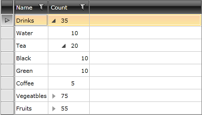
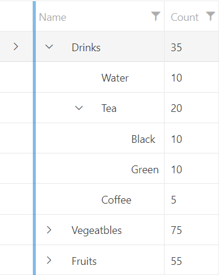

# Hierarchy Column and Hierarchy Indent

The RadTreeListView control allows you to control the both the column that contains the tree view UI, as well as the indent of the expand/collapse button.

## Hierarchy Column

By default, the first column contains the tree view UI. In order to change the column which holds it, you can set the `HierarchyColumnIndex` property to the desired value. The default value of this property is __0__.

__Changing the column that contains the tree view UI__
```XAML
	<telerik:RadTreeListView x:Name="radTreeListView"
	                            AutoGenerateColumns="False"
	                            HierarchyColumnIndex="1">
	    <telerik:RadTreeListView.ChildTableDefinitions>
	        <telerik:TreeListViewTableDefinition ItemsSource="{Binding Items}">
	        </telerik:TreeListViewTableDefinition>
	    </telerik:RadTreeListView.ChildTableDefinitions>
	    <telerik:RadTreeListView.Columns>
	        <telerik:GridViewDataColumn DataMemberBinding="{Binding Name}"
	                                    Header="Name" />
	        <telerik:GridViewDataColumn DataMemberBinding="{Binding Count}"
	                                    Header="Count" />
	    </telerik:RadTreeListView.Columns>
	</telerik:RadTreeListView>
```

__RadTreeListView with the tree view UI shown on the second column__



## Hierarchy Indent

The RadTreeListView control allows you to control the indent of the hierarchy button via the `HierarchyIndent` property. The default value of this property is __20__.

__Changing the indent of the hierarchy button__
```XAML
	<telerik:RadTreeListView x:Name="radTreeListView" 
	                         AutoGenerateColumns="False" 
	                         HierarchyIndent="40"
	                         ItemsSource="{Binding WarehouseItems}">
	    <telerik:RadTreeListView.ChildTableDefinitions>
	        <telerik:TreeListViewTableDefinition ItemsSource="{Binding Items}" />
	    </telerik:RadTreeListView.ChildTableDefinitions>
	    <telerik:RadTreeListView.Columns>
	        <telerik:GridViewDataColumn DataMemberBinding="{Binding Name}" 
	                                Header="Name" />
	        <telerik:GridViewDataColumn DataMemberBinding="{Binding Count}" 
	                                Header="Count" />
	    </telerik:RadTreeListView.Columns>
	</telerik:RadTreeListView>
```

__RadTreeListView with increased indent on the hierarchy button__



## See Also
 * [Columns]()
 * [Getting Started]()
 * [Data Binding]()