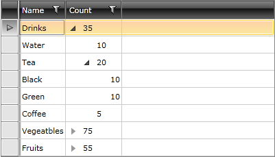
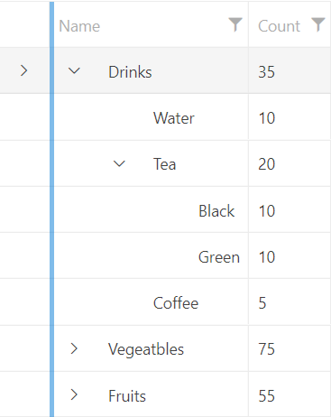

# Hierarchy Column and Hierarchy Indent

The RadTreeListView control allows you to control the both the column that contains the tree view UI, as well as the indent of the expand/collapse button.

## Hierarchy Column

By default, the first column contains the tree view UI. In order to change the column which holds it, you can set the `HierarchyColumnIndex` property to the desired value. The default value of this property is __0__.

__Changing the column that contains the tree view UI__
<snippet id='radtreelistview-features-hierarchy-column-block_1-xaml' />

__RadTreeListView with the tree view UI shown on the second column__

## Hierarchy Indent

The RadTreeListView control allows you to control the indent of the hierarchy button via the `HierarchyIndent` property. The default value of this property is __20__.

__Changing the indent of the hierarchy button__
<snippet id='radtreelistview-features-hierarchy-column-block_2-xaml' />

__RadTreeListView with increased indent on the hierarchy button__

## See Also
 * [Columns]()
 * [Getting Started]()
 * [Data Binding]()