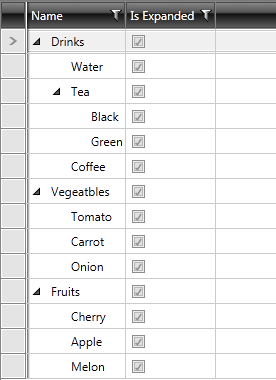

# IsExpandedBinding and IsExpandableBinding

Since __Q1 2013__ release, __RadTreeListView__ has two new properties - __IsExpandedBinding__ and __IsExpandableBinding__ which can be used to synchronize its expanded and expandable states with your view-model.

## Use of IsExpandedBinding

IsExpandedBinding property can be used to show you whether a TreeListView's row is expanded or not.
        

Follow these steps to accomplish the task:

1. For the purpose of this tutorial we will add a boolean property - IsExpanded to our WarehouseItem collection:
        

>Please, note that our WarehouseItem class implements the __INotifyPropertyChanged__ interface.
          

#### __C#__

{{region radtreelsitview-how-to-use-of-IsExpandedBinding_and_IsExpandableBinding_2}}
	public class WarehouseItem : INotifyPropertyChanged
	    {
	        public event PropertyChangedEventHandler PropertyChanged;
	
	        private bool isExpanded;
	        private string name;
	        private int count;
	
	        public WarehouseItem(string name, int count, bool isExpanded = true)
	        {
	            this.Name = name;
	            this.IsExpanded = isExpanded;           
	        }
	
	        public string Name
	        {
	            get
	            {
	                return this.name;
	            }
	            set
	            {
	                if (value != this.name)
	                {
	                    this.name = value;
	                    this.OnPropertyChanged("Name");
	                }
	            }
	        }
	
	        public bool IsExpanded
	        {
	            get
	            {
	                return this.isExpanded;
	            }
	            set
	            {
	                if (value != this.isExpanded)
	                {
	                    this.isExpanded = value;
	                    this.OnPropertyChanged("IsExpanded");
	                }
	            }
	        }
	    protected virtual void OnPropertyChanged(PropertyChangedEventArgs args)
	        {
	            PropertyChangedEventHandler handler = this.PropertyChanged;
	            if (handler != null)
	            {
	                handler(this, args);
	            }
	        }
	
	        private void OnPropertyChanged(string propertyName)
	        {
	            this.OnPropertyChanged(new PropertyChangedEventArgs(propertyName));
	        }
	{{endregion}}

#### __VB.NET__

{{region radtreelsitview-how-to-use-of-IsExpandedBinding_and_IsExpandableBinding_3}}
	    Public Class WarehouseItem
	        Implements INotifyPropertyChanged
	        Public Event PropertyChanged As PropertyChangedEventHandler
	
	        Private m_isExpanded As Boolean
	        Private m_name As String
	        Private count As Integer
	
	        Public Sub New(name As String, count As Integer, Optional isExpanded As Boolean = True)
	            Me.Name = name
	            Me.IsExpanded = isExpanded
	        End Sub
	
	        Public Property Name() As String
	            Get
	                Return Me.m_name
	            End Get
	            Set(value As String)
	                If value <> Me.m_name Then
	                    Me.m_name = value
	                    Me.OnPropertyChanged("Name")
	                End If
	            End Set
	        End Property
	
	        Public Property IsExpanded() As Boolean
	            Get
	                Return Me.m_isExpanded
	            End Get
	            Set(value As Boolean)
	                If value <> Me.m_isExpanded Then
	                    Me.m_isExpanded = value
	                    Me.OnPropertyChanged("IsExpanded")
	                End If
	            End Set
	        End Property
	        Protected Overridable Sub OnPropertyChanged(args As PropertyChangedEventArgs)
	            Dim handler As PropertyChangedEventHandler = Me.PropertyChanged
	            RaiseEvent handler(Me, args)
	        End Sub
	
	        Private Sub OnPropertyChanged(propertyName As String)
	            Me.OnPropertyChanged(New PropertyChangedEventArgs(propertyName))
	        End Sub
	    End Class
	{{endregion}}

2. Add RadTreeListView as demonstrated below:
        

#### __XAML__

{{region radtreelsitview-how-to-use-of-IsExpandedBinding_and_IsExpandableBinding_0}}
	<telerik:RadTreeListView x:Name="radTreeListView"
	                                 IsExpandedBinding="{Binding IsExpanded, Mode=TwoWay}"
	                                 AutoGenerateColumns="False">
	            <telerik:RadTreeListView.ChildTableDefinitions>
	                <telerik:TreeListViewTableDefinition ItemsSource="{Binding Items}" />
	            </telerik:RadTreeListView.ChildTableDefinitions>
	            <telerik:RadTreeListView.Columns>
	                <telerik:GridViewDataColumn DataMemberBinding="{Binding Name}"
	                                    Header="Name" />
	                <telerik:GridViewDataColumn DataMemberBinding="{Binding IsExpanded}" 
	                                    Header="Is Expanded" />
	            </telerik:RadTreeListView.Columns>
	        </telerik:RadTreeListView>
	{{endregion}}

3. Here is a snapshot of the result:
        

>tipA complete example of using RadTreeListView's IsExpandedBinding property is available in
          [ this online demo](http://demos.telerik.com/silverlight/#TreeListView/IsExpanded)[the TreeListView's IsExpanded demo](http://demos.telerik.com/wpf/).
          

## Use of IsExpandableBinding

The use of IsExpandableBinding would be similar as shown for the IsExpandedBinding.

>tipA complete example of using RadTreeListView's IsExpandedBinding property is available in
          [ this online demo](http://demos.telerik.com/silverlight/#TreeListView/OnDemandDataLoading)[the TreeListView's OnDemandDataLoading demo](http://demos.telerik.com/wpf/).
          
