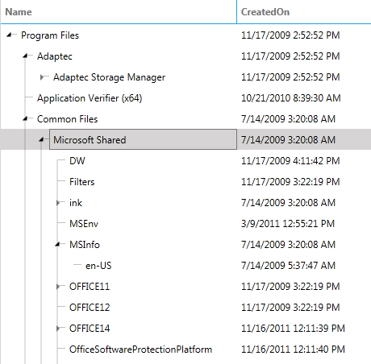

# Connecting Lines

In order to offer a way of showing a multi-level hierarchy in a comprehensible way, we introduced __connecting lines__ for __RadTreeListView__. 

## 

The __tree lines__ support was added as of version __Q2 2014.__

__The functionality can be configured through the following properties:__

* __TreeLinesVisibylity__ – controls the visibility of the __TreeLines__. It is of type ___Telerik.Windows.Controls.TreeList.TreeLinesVisibility___ and its possible values are listed below:
            

	* __Visible__

	* __Hidded__

* __TreeLinesBrush__ – controls the __Brush__ (_Color_) of the tree lines. It is of type __System.Windows.Media.Brush__

* __TreeLinesStrokeThickness__ – controls the thickness of the tree lines. It is of type __double__

__Figure 1: RadTreeListView__ with tree lines visible. The __TreeLinesStrokeThickness__  is set to ___10___.

You can check out the ["Tree Lines" online Demo.](http://demos.telerik.com/silverlight/#TreeListView/TreeLines)

You can also check out the ["Tree Lines" WPF Demo.](http://demos.telerik.com/wpf/)
