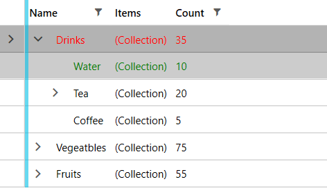

# Modify foreground color of Selected/Hovered row

This help article explains how to change the foreground color of the __TreeListViewRow__ upon selecting it or hovering over it.

## Creating a Style Targeting TreeListViewRow

In order to achieve this you can create a style targeting TreeListViewRow and add triggers that change its __Foreground__ as demonstrated in __Example 1__.

> __Example 1__ uses the WarehouseViewModel and its dependencies defined in the [Getting Started]() article of the RadTreeListView.

__Example 1: Custom style targeting TreeListViewRow__
```XAML

    <Window.DataContext>
        <my:WarehouseViewModel />
    </Window.DataContext>
    <Window.Resources>
        <!-- If you are using the NoXaml binaries, you should base the style on the default one for the theme like so-->
        <!-- <Style TargetType="telerik:TreeListViewRow" BasedOn="{StaticResource TreeListViewRowStyle}"> -->
        <Style TargetType="telerik:TreeListViewRow" >
            <Style.Triggers>
                <Trigger Property="IsSelected" Value="True">
                    <Setter Property="Foreground" Value="Red" />
                </Trigger>
                <MultiTrigger >
                    <MultiTrigger.Conditions>
                        <Condition Property="IsMouseOver" Value="True"/>
                        <Condition Property="IsSelected" Value="False"/>
                    </MultiTrigger.Conditions>
                    <Setter Property="Foreground" Value="Green" />
                </MultiTrigger>
            </Style.Triggers>
        </Style>
    </Window.Resources>
    <telerik:RadTreeListView x:Name="radTreeListView" 
                            ItemsSource="{Binding WarehouseItems}">
        <telerik:RadTreeListView.ChildTableDefinitions>
            <telerik:TreeListViewTableDefinition ItemsSource="{Binding Items}" />
        </telerik:RadTreeListView.ChildTableDefinitions>
    </telerik:RadTreeListView>
```

> The demonstrated approach may not be relevant for all UI for WPF themes. 

#### __Figure 1: Result from Example 1 in the Fluent theme__


## See Also
 * [Templates Structure]()