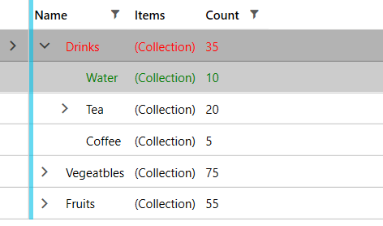

# Modify foreground color of Selected/Hovered row

This help article explains how to change the foreground color of the __TreeListViewRow__ upon selecting it or hovering over it.

## Creating a Style Targeting TreeListViewRow

In order to achieve this you can create a style targeting TreeListViewRow and add triggers that change its __Foreground__ as demonstrated in __Example 1__.

> __Example 1__ uses the WarehouseViewModel and its dependencies defined in the [Getting Started]() article of the RadTreeListView.

__Example 1: Custom style targeting TreeListViewRow__
<snippet id='radtreelistview-how-to-modify-foreground-row-block_1-xaml' />

> The demonstrated approach may not be relevant for all UI for WPF themes. 

#### __Figure 1: Result from Example 1 in the Fluent theme__
