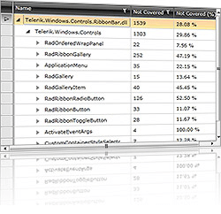

# Overview

## 

Thank you for choosing Telerik __RadTreeListView__! 

Telerik __RadTreeListView__ combines the powerful data-driven features from __RadGridView__ with the capabilities of showing a hierarchical data in a __TreeView__ manner. Native UI virtualization, LINQ-based data engine, smart filtering and built-in data validation are just a few of the advanced features the control provides.

This is a list with short descriptions of the top-of-the-line features of Telerik's __RadTreeListView__ control:

* __LINQ-Based Data Engine and Native UI Virtualization__ - Telerik __RadTreeListView__ handles millions of records without affecting the user experience. The control utilizes horizontal and vertical UI virtualization and introduces container recycling for further improvement of speed and memory footprint, especially when bound to large data sets. The UI virtualization technique ensures that the TreeList creates only the needed containers (rows/cells) which are shown in the viewport of the grid. The container recycling pushes further the speed of scrolling horizontally and vertically. This feature enables __RadTreeListView__ to reuse the existing containers over and over for different data items, instead of creating new ones. These techniques combined with our outstanding LINQ-based data engine guarantee the exceptional fast performance of Telerik’s __RadTreeListView__. [Read more]()

* __Flexible Hierarchy__ - __RadTreeListView__ supports defining of hierarchy relations through the data binding system. Ability to change the hierarchy column index allows flexible tree grid structures similar to Windows Explorer or iTunes.

* __Powerful Databinding__ - binding the __RadTreeListView__ is as simple as setting a single property. [Read more]()

* __Direct Data Operations__ - with Telerik RadTreeListView data operations ([sorting](), [filtering]()) work directly with your data objects. In a common scenario when a control is performing data operations, you need to create your own collection view. With Telerik __RadTreeListView__ there is no requirement for wrapping your data in collection views to do sorting, grouping and filtering.

* __Data Source Updates__ - to achieve better testability and loose coupling in your code it may be more convenient to manipulate data in the original data source instead of using the __RadTreeListView__ API. Telerik __RadTreeListView__ supports that scenario by listening to data source collection change events and reflecting those changes in its visual representation.

* __Truly Lookless, Blend Skinnable, Completely Customizable Control__ - Telerik __RadTreeListView__ can have its appearance and animations completely customized through Microsoft Expression Blend. You can use your own theme or you can use one of the several themes shipped with the control, which will help you deliver a consistent look and feel in your application. [Read more]()

* __Custom Layout__ - you have full control over the way the data is presented in the __RadTreeListView__ through cell customization, row layout customization and column’s cell templates. You can combine the built-in appearance of the cells with a custom view you have defined. You can let some of your cells get generated automatically and provide your own styles and templates for the rest. Or you can customize the column templates and use unbound data columns in __RadTreeListView.__

* __Formatting__ - to give you more control on how the data is displayed Telerik __RadTreeListView__ allows displaying your data as currency, percentage and any other format that suits your needs. You can use a standard .NET format string applied to your cells. You can customize the way the content of the __RadTreeListView__ cells is arranged and displayed or can completely replace the control template of the cells with a custom template. Furthermore you can completely replace the control template of the cells with a custom template. 

* __Totals Row with Aggregate Functions__ - Telerik RadTreeListView control offers a built-in totals row which makes it easy and fast to add a cell which represents the calculated values across a range of data. The summary row with aggregates is available for each column. The user can choose to show in the footer row from a variety of aggregate. [Read more]()

* __Sorting__ - You can have Telerik __RadTreeListView__ automatically sort its columns by setting a single property. There are three sorting modes: ascending, descending and no sort. In addition to the simple one-column sorting __RadTreeListView__ allows you to sort data by several columns. Sorting in __RadTreeListView__ is executed in a manner which respects the hierarchy structure of the data – when you sort by a certain column the main nodes are sorted first and then are sorted the child nodes. [Read more]()

* __Smart Filtering__ - Telerik __RadTreeListView__ allows end users to filter data by applying filter patterns or their own filter criteria. __RadTreeListView__ respects the nodes relations and if a child node matches the filter criteria, all higher parent nodes are shown. [Read more]()

* __Built-in Data Validation__ - Telerik __RadTreeListView__ supports metadata-driven validation via data annotations. You can use the RadTreeListView with the __Validation__ Summary class to implement the automatic validation UI provided by the platform and also benefit from the server-side validation attributes provided by RIA Services. The built-in validation operates on two layers – UI and Data. Furthermore, using the extensible event based API of __RadTreeListView__ users can plug their own data validation mechanism. [Read more]()

* __Column Types__ - the __RadTreeListView__ allows you choose from several predefined column types. The supported out-of-the-box columns are: Data, Hyperlink, DynamicHyperlink, Image, Select, ToggleRowDetailsVisibility and MaskedTextBox. They provide a built-in validation support for editing which cover most of the editing scenarios. If there are specific requirements, the built-in columns can be inherited and their editing validation mechanism can be used without any problem. Furthermore __RadTreeListView__ offers flexible appearance model through the __CellEditTemplate__ property of the column which allows any control to be used as editor. [Read more]()

* __Frozen Columns__ - __RadTreeListView__ allows you to keep part of your data always visible putting the rest of the data in context. To freeze columns, you simply set the __FrozenColumnCount__ property to the number of columns you want to freeze.

* __Row Details__ - Telerik __RadTreeListView__ supports Row Details, which can be used to present additional information related to the row in a visually appealing manner. The Row Details is a very convenient feature when the space at hand is insufficient for the data that needs to be presented. Row Details can also be used for providing a more convenient editing environment for end-users. Defined through a data template, Row Details can present virtually anything to the user, be it for viewing-only or editing. [Read more]()

* __Selecting and Navigating__ - __RadTreeListView__ provides a familiar selection API that will make developers feel at home. The control supports single and multiple record selection that can be manipulated both with the mouse and the keyboard. [Read more]()

* __Localization Support__ - Telerik __RadTreeListView__ provides advanced Localization support.Two new properties were added, so that you don’t have to always create an instance of the __LocalizationManager__:

* Default Culture property -  you can change localized values without changing the UI culture of the current thread

* DefaultResourceManager  - you change localized values using a new resource manager, i.e. a new resource file. [Read more]()

Check out the online demo at: [http://demos.telerik.com/silverlight/#TreeListView/FirstLook](http://demos.telerik.com/silverlight/#TreeListView/FirstLook)

Check out the WPF Demos at: [http://demos.telerik.com/wpf/](http://demos.telerik.com/wpf/)

>tipYou can find more examples on how to implement various scenarios available for download from our online SDK repository
            [here](https://github.com/telerik/xaml-sdk/), the examples are listed under __TreeListView__.
          

# See Also

 * [Visual Structure]()

 * [Getting Started]()

 * [Performance]()

 * [Localization]()

 * [Events]()
