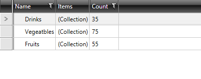
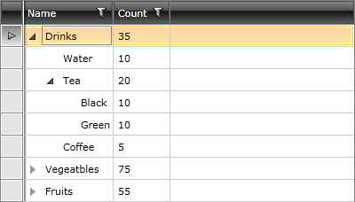

# Getting Started with {{ site.framework_name }} TreeListView

This article will guide you through the process of creating a sample application with __RadTreeListView__.

* [RadTreeListView vs RadGridView](#radtreelistview-vs-radgridview)

* [Assembly References](#assembly-references)

* [Add RadTreeListView to Your Application](#add-radtreelistview-to-the-project)

* [Populating with Data](#populating-with-data)

* [Columns](#columns)

## RadTreeListView vs RadGridView

You should use the __RadTreeListView__ control to display hierarchical data in a tabular format. In order to achieve this, the control combines the functionality of __RadGridView__ control with the ability to display data in a tree view manner. This is implemented by directly inheriting __RadGridView__ and implementing the tree view behavior.

__RadTreeListView__ displays the data in the same way as __RadGridView__. The difference is that each row plays the role of a tree node, which can be expanded or collapsed.

Please note that __RadTreeListView__ and the [Hierarchical RadGridView]() are two different things. The first displays the data in a tree view manner in one and the same table. The second one displays the hierarchical data in nested __RadGridViews__. 

>important Use __RadTreeListView__ only when you need to display __homogeneous data__. For __heterogeneous data__ use the [Hierarchical RadGridView](). Heterogeneous data means a source with different type of objects in it.

>tip You can also check out the __RadGridView__'s [Getting Started section]().

## Adding Telerik Assemblies Using NuGet

To use __RadTreeListView__ when working with NuGet packages, install the `Telerik.Windows.Controls.GridView.for.Wpf.Xaml` package. The [package name may vary]() slightly based on the Telerik dlls set - [Xaml or NoXaml]()

Read more about NuGet installation in the [Installing UI for WPF from NuGet Package]() article.

>tip With the 2025 Q1 release, the Telerik UI for WPF has a new licensing mechanism. You can learn more about it [here]().

## Adding Assembly References Manually

If you are not using NuGet packages, you can add a reference to the following assemblies:

* __Telerik.Licensing.Runtime__
* __Telerik.Windows.Controls__
* __Telerik.Windows.Controls.GridView__
* __Telerik.Windows.Data__
* __Telerik.Windows.Controls.Input__

## Add RadTreeListView to the Project

After you make sure you have added the needed assembly references, you can either add the control manually by writing the __XAML code (Example 2)__ or you can drag it from the Visual Studio Toolbox and drop it over the XAML view.

>In order to use __RadTreeListView__ in XAML, you have to declare the following namespace:
>#### __[XAML] Example 1: Declaring Telerik Namespace__
>{{region radtreeliestview-getting-started_0}}
>	xmlns:telerik="http://schemas.telerik.com/2008/xaml/presentation"
>{{endregion}}

#### __[XAML] Example 2: Adding RadTreeListView in XAML__

{{region radtreeliestview-getting-started_1}}

	<telerik:RadTreeListView x:Name="radTreeListView">
	</telerik:RadTreeListView>
{{endregion}}

## Populating with Data

Populating __RadTreeListView__ with sample data will require a business model and a view model that exposes a collection that the control can be bound to. This section will cover the process of defining them. 

The example will use a collection that represents the contents of a warehouse. It will contain __WarehouseItem__ objects. Each __WarehouseItem__ will have a __Name__, __Count__ and a collection of __WarehouseItem__ objects. Here is the class definition.

#### __[C#] Example 3: Defining a Sample Business Model__

{{region radtreeliestview-getting-started_4}}

	public class WarehouseItem: INotifyPropertyChanged
	{
	    private string name;
	    private int count;
	    private ObservableCollection<WarehouseItem> items;
	
	    public WarehouseItem(string name, int count)
	    {
	        this.Name = name;
	        this.Count = count;
	        this.Items = new ObservableCollection<WarehouseItem>();
	    }
	    public string Name
	    {
	        get 
	        {
	            return this.name;
	        }
	        set 
	        {
	            if (value != this.name)
	            {
	                this.name = value;
	                this.OnPropertyChanged("Name");
	            }
	        }
	    }
	    public ObservableCollection<WarehouseItem> Items
	    {
	        get 
	        {
	            return this.items;
	        }
	        set 
	        {
	            if (value != this.items)
	            {
	                this.items = value;
	                this.OnPropertyChanged("Items");
	            }
	        }
	    }
	    public int Count
	    {
	        get 
	        {
	            return this.count;
	        }
	        set 
	        {
	            if (value != this.count)
	            {
	                this.count = value;
	                this.OnPropertyChanged("Count");
	            }
	        }
	    }
	
	    protected virtual void OnPropertyChanged(PropertyChangedEventArgs args)
	    {
	        PropertyChangedEventHandler handler = this.PropertyChanged;
	        if (handler != null)
	        {
	            handler(this, args);
	        }
	    }
	
	    private void OnPropertyChanged(string propertyName)
	    {
	        this.OnPropertyChanged(new PropertyChangedEventArgs(propertyName));
	    }
	
	    public event PropertyChangedEventHandler PropertyChanged;
	}

{{endregion}}

#### __[VB.NET] Example 3: Defining a Sample Business Model__

{{region radtreeliestview-getting-started_5}}

		Public Class WarehouseItem
		Implements INotifyPropertyChanged

        Private _name As String
        Private _count As Integer
        Private _items As ObservableCollection(Of WarehouseItem)

        Public Sub New(ByVal name As String, ByVal count As Integer)
            Me.Name = name
            Me.Count = count
            Me.Items = New ObservableCollection(Of WarehouseItem)()
        End Sub
        Public Property Name() As String
            Get
                Return Me._name
            End Get
            Set(ByVal value As String)
                If value <> Me._name Then
                    Me._name = value
                    Me.OnPropertyChanged("Name")
                End If
            End Set
        End Property
        Public Property Items() As ObservableCollection(Of WarehouseItem)
            Get
                Return Me._items
            End Get
            Set(ByVal value As ObservableCollection(Of WarehouseItem))
                If value IsNot Me._items Then
                    Me._items = value
                    Me.OnPropertyChanged("Items")
                End If
            End Set
        End Property
        Public Property Count() As Integer
            Get
                Return Me._count
            End Get
            Set(ByVal value As Integer)
                If value <> Me._count Then
                    Me._count = value
                    Me.OnPropertyChanged("Count")
                End If
            End Set
        End Property

		Protected Overridable Sub OnPropertyChanged(ByVal args As PropertyChangedEventArgs)
			Dim handler As PropertyChangedEventHandler = Me.PropertyChangedEvent
			If handler IsNot Nothing Then
				handler(Me, args)
			End If
		End Sub

		Private Sub OnPropertyChanged(ByVal propertyName As String)
			Me.OnPropertyChanged(New PropertyChangedEventArgs(propertyName))
		End Sub

		Public Event PropertyChanged As PropertyChangedEventHandler Implements INotifyPropertyChanged.PropertyChanged
	End Class
{{endregion}}

Here is an example class that dynamically creates the sample data.

#### __[C#] Example 4: Create Sample Data__

{{region radtreeliestview-getting-started_6}}

	public class WarehouseService
	{
	    public static ObservableCollection<WarehouseItem> GetWarehouseData()
	    {
	        ObservableCollection<WarehouseItem> data = new ObservableCollection<WarehouseItem>();
	        WarehouseItem drinks = new WarehouseItem( "Drinks", 35 );
	        drinks.Items.Add( new WarehouseItem( "Water", 10 ) );
	        WarehouseItem tea = new WarehouseItem( "Tea", 20 );
	        tea.Items.Add( new WarehouseItem( "Black", 10 ) );
	        tea.Items.Add( new WarehouseItem( "Green", 10 ) );
	        drinks.Items.Add( tea );
	        drinks.Items.Add( new WarehouseItem( "Coffee", 5 ) );
	        data.Add( drinks );
	        WarehouseItem vegetables = new WarehouseItem( "Vegeatbles", 75 );
	        vegetables.Items.Add( new WarehouseItem( "Tomato", 40 ) );
	        vegetables.Items.Add( new WarehouseItem( "Carrot", 25 ) );
	        vegetables.Items.Add( new WarehouseItem( "Onion", 10 ) );
	        data.Add( vegetables );
	        WarehouseItem fruits = new WarehouseItem( "Fruits", 55 );
	        fruits.Items.Add( new WarehouseItem( "Cherry", 30 ) );
	        fruits.Items.Add( new WarehouseItem( "Apple", 20 ) );
	        fruits.Items.Add( new WarehouseItem( "Melon", 5 ) );
	        data.Add( fruits );
	        return data;
	    }
	}
{{endregion}}

#### __[VB.NET] Example 4: Create Sample Data__

{{region radtreeliestview-getting-started_7}}

	Public Class WarehouseService
	 Public Shared Function GetWarehouseData() As ObservableCollection(Of WarehouseItem)
	  Dim data As New ObservableCollection(Of WarehouseItem)()
	  Dim drinks As New WarehouseItem("Drinks", 35)
	  drinks.Items.Add(New WarehouseItem("Water", 10))
	  Dim tea As New WarehouseItem("Tea", 20)
	  tea.Items.Add(New WarehouseItem("Black", 10))
	  tea.Items.Add(New WarehouseItem("Green", 10))
	  drinks.Items.Add(tea)
	  drinks.Items.Add(New WarehouseItem("Coffee", 5))
	  data.Add(drinks)
	  Dim vegetables As New WarehouseItem("Vegeatbles", 75)
	  vegetables.Items.Add(New WarehouseItem("Tomato", 40))
	  vegetables.Items.Add(New WarehouseItem("Carrot", 25))
	  vegetables.Items.Add(New WarehouseItem("Onion", 10))
	  data.Add(vegetables)
	  Dim fruits As New WarehouseItem("Fruits", 55)
	  fruits.Items.Add(New WarehouseItem("Cherry", 30))
	  fruits.Items.Add(New WarehouseItem("Apple", 20))
	  fruits.Items.Add(New WarehouseItem("Melon", 5))
	  data.Add(fruits)
	  Return data
	 End Function
	End Class
{{endregion}}

Finally, define a view model containing the created sample data.

#### __[C#] Example 5: Define a Sample View Model__
{{region radtreeliestview-getting-started_12}}
	public class WarehouseViewModel: ViewModelBase
	{
	    private ObservableCollection<WarehouseItem> warehouseItems;
	
	    public ObservableCollection<WarehouseItem> WarehouseItems 
	    {
	        get 
	        {
	            if (this.warehouseItems == null)
	            {
	                this.warehouseItems = WarehouseService.GetWarehouseData();
	            }
	
	            return this.warehouseItems;
	        }
	    }
	}
{{endregion}}

#### __[VB.NET] Example 5: Define a Sample View Model__
{{region radtreeliestview-getting-started_13}}
	Public Class WarehouseViewModel
		Inherits ViewModelBase
	
	    Private _warehouseItems As ObservableCollection(Of WarehouseItem)
	
	    Public ReadOnly Property WarehouseItems() As ObservableCollection(Of WarehouseItem)
	        Get
	            If Me._warehouseItems Is Nothing Then
	                Me._warehouseItems = WarehouseService.GetWarehouseData()
	            End If
	
	            Return Me._warehouseItems
	        End Get
	    End Property
	End Class
{{endregion}}

In order to display your data, you need to bind the __ItemsSource__ property of __RadTreeListView__.

#### __[XAML] Example 6: Bind RadTreeListView__

{{region radtreeliestview-getting-started_8}}

	<Window.Resources>
		<my:WarehouseViewModel x:Key="MyViewModel"/>
	</Window.Resources>
	<telerik:RadTreeListView DataContext="{StaticResource MyViewModel}" 
							 x:Name="radTreeListView"
							 ItemsSource="{Binding WarehouseItems}"/>

{{endregion}}

At this point, only the first level of the hierarchical data will get displayed and __RadTreeListView__ will look just like a __RadGridView__. 

__Figure 1: RadTreeListView bound to collection of WarehouseItems__

In order to display the other levels of the hierarchy, you have to define a __TreeListViewTableDefinition__ and set its __ItemsSource__ property to the respective member of the business object. Then you need to set the table definition to the __ChildTableDefinition__ property of __RadTreeListView__. 

>In the context of __RadTreeListView__ control, you shouldn't use the __GridViewTabelDefinition__ class, but instead use the __TreeListViewTableDefinition__ class because it exposes an __ItemSource__ property that should be bound to the property that represents the next level of hierarchy. This property should have the same name at each level of the hierarchy.

#### __[XAML] Example 7: Define a ChildTableDefinition for RadTreeListView__

{{region radtreeliestview-getting-started_10}}

	<telerik:RadTreeListView x:Name="radTreeListView"
	                            ItemsSource="{Binding WarehouseItems}">
	    <telerik:RadTreeListView.ChildTableDefinitions>
	        <telerik:TreeListViewTableDefinition ItemsSource="{Binding Items}" />
	    </telerik:RadTreeListView.ChildTableDefinitions>
	</telerik:RadTreeListView>
{{endregion}}

## Columns

By default, __RadTreeListView__ will auto-generate the columns for its data by creating a column for each property. In order to prevent this, you must set the __AutogenerateColumns__ property to ___False___ and manually add the desired columns to the __Columns__ collection of the control.

#### __[XAML] Example 8: Manually Define the Columns of RadTreeListView__

{{region radtreeliestview-getting-started_11}}

	<telerik:RadTreeListView x:Name="radTreeListView"
	                            AutoGenerateColumns="False"
				    ItemsSource="{Binding WarehouseItems}">
	    <telerik:RadTreeListView.ChildTableDefinitions>
	        <telerik:TreeListViewTableDefinition ItemsSource="{Binding Items}" />
	    </telerik:RadTreeListView.ChildTableDefinitions>
	    <telerik:RadTreeListView.Columns>
	        <telerik:GridViewDataColumn DataMemberBinding="{Binding Name}"
	                                    Header="Name" />
	        <telerik:GridViewDataColumn DataMemberBinding="{Binding Count}"
	                                    Header="Count" />
	    </telerik:RadTreeListView.Columns>
	</telerik:RadTreeListView>
{{endregion}}

>tip __RadTreeListView__ can use the same column types used with __RadGridView__. To learn more about the different types of columns, read [here]().
        
>tip To change the column, which holds the tree view UI, use the __HierarchyColumnIndex__ property.

__Figure 2__ shows a snapshot of the result.

__Figure 2: RadTreeListView with manually defined columns__

## Setting a Theme

The controls from our suite support different themes. You can see how to apply a theme different than the default one in the [Setting a Theme]() help article.

>important Changing the theme using implicit styles will affect all controls that have styles defined in the merged resource dictionaries. This is applicable only for the controls in the scope in which the resources are merged. 

To change the theme, you can follow the steps below:
* Choose between the themes and add reference to the corresponding theme assembly (ex: **Telerik.Windows.Themes.Windows8.dll**). You can see the different themes applied in the **Theming** examples from our [WPF Controls Examples](https://demos.telerik.com/wpf/)[Silverlight Controls Examples](https://demos.telerik.com/silverlight/#TreeListView/Theming) application.

* Merge the ResourceDictionaries with the namespace required for the controls that you are using from the theme assembly. For RadTreeListView, you will need to merge the following resources:

	* __Telerik.Windows.Controls__
	* __Telerik.Windows.Controls.Input__
	* __Telerik.Windows.Controls.GridView__

__Example 9__ demonstrates how to merge the ResourceDictionaries so that they are applied globally for the entire application.

#### __[XAML] Example 9: Merge the ResourceDictionaries__  
{{region radtreeview-getting-started_08}}
		<Application.Resources>
			<ResourceDictionary>
				<ResourceDictionary.MergedDictionaries>
	                <ResourceDictionary Source="/Telerik.Windows.Themes.Windows8;component/Themes/System.Windows.xaml"/>
	                <ResourceDictionary Source="/Telerik.Windows.Themes.Windows8;component/Themes/Telerik.Windows.Controls.xaml"/>
	                <ResourceDictionary Source="/Telerik.Windows.Themes.Windows8;component/Themes/Telerik.Windows.Controls.Input.xaml"/>
	                <ResourceDictionary Source="/Telerik.Windows.Themes.Windows8;component/Themes/Telerik.Windows.Controls.GridView.xaml"/>
				</ResourceDictionary.MergedDictionaries>
			</ResourceDictionary>
		</Application.Resources>
{{endregion}}

__Figure 3__ shows RadTreeListView with the **Windows8** theme applied.
	
#### __Figure 3: RadTreeListView with the Windows8 theme__


## Telerik UI for WPF Learning Resources

* [Telerik UI for WPF TreeListView Component](https://www.telerik.com/products/wpf/treelistview.aspx)
* [Getting Started with Telerik UI for WPF Components]()
* [Telerik UI for WPF Installation]()
* [Telerik UI for WPF and WinForms Integration]()
* [Telerik UI for WPF Visual Studio Templates]()
* [Setting a Theme with Telerik UI for WPF]()
* [Telerik UI for WPF Virtual Classroom (Training Courses for Registered Users)](https://learn.telerik.com/learn/course/external/view/elearning/16/telerik-ui-for-wpf) 
* [Telerik UI for WPF License Agreement](https://www.telerik.com/purchase/license-agreement/wpf-dlw-s)


## See Also
 * [Data Binding]()
 * [Columns]()
 * [Hierarchy Column]()
