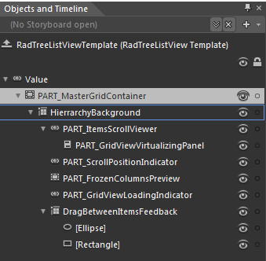
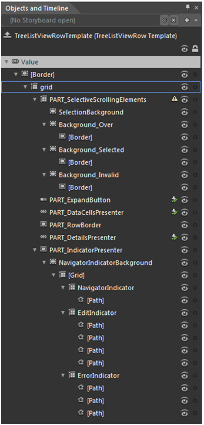

# Templates Structure

This section is intended to give a broad understanding of the possible ways for modifying the appearance of the RadTreeListView and its elements. This can be achieved either by using the resources exposed by the API or by changing the appropriate ControlTemplates. Once you decide on the later, you will be able to reorder some of the template parts or add your own elements. However, in this case you should be careful to include all required parts. 

Basically, this topic will make you familiar with:

* RadTreeListView Template Structure;

* TreeListViewRow Template Structure;

As the RadTreeListView inherits RadGridView, it uses the same styling mechanism and the rest of the templates are equal. You may take a look at the 
        [Styles and Templates](http://www.telerik.com/help/silverlight/radgridview-styles-and-templates-templates-structure.html)[Styles and Templates](http://www.telerik.com/help/wpf/radgridview-styles-and-templates-templates-structure.html)
        section of the RadGridView for further reference.
      

>tip
        For more information about templating and how to modify the default template of the RadControls read 
        [the common topics](http://www.telerik.com/help/silverlight/common-styling-appearance-edit-control-templates-blend.html)[the common topics](http://www.telerik.com/help/wpf/common-styling-appearance-edit-control-templates-blend.html)
        on this matter.
      

## RadTreeListView

               
            

* PART_MasterGridContainer - hosts the elements of the template. It is of type Border and represents the border of the RadGridView.

* HierarchyBackground - provides columns and rows for the template elements. It is of type Grid and represents the background of the RadTreeListView. 

* PART_ITemsScrollViewer - represent the control that handles the different types of rows(e.g. Header Row, Footer Row, New Row) and is of type GridViewScrollViewer.

* PART_TreeListViewVirtualizingPanel - displays the data items of the RadTreeListView and is of type GridViewVirtualizingPanel.

* PART_ScrollPositionIndicator - represents the scrolling indicator that appears when using deferred scrolling in the RadTreeListView and is of type ScrollPositionIndicator.

* PART_FrozenColumnsPreview - represents the drag preview of the draggable element that is used for freezing the RadTreeListView.

* PART_GridViewLoadingIndicator - represents the indicator that appears when the RadTreeListView is loading its data.

* DragBetweenItemsFeedback - represents the RadTreeListView DragVisualCue that is enabled when the following properties are set to True - IsDragDropEnabled, IsDragPreviewEnabled, IsDragToolTipEnabled.  

## TreeListViewRow

               
            

* Grid - host the element of the TreeListViewRow template and it of type SelectiveScrollingGrid.

* SelectionBackground - represents the default background of the row and is of type Border.

* Background_Over - represents the outer border of the row, when the mouse is over it and is of type Border.

* [Border] - represents the inner border and the background of the row, when the mouse is over and is of type Border.

* Background_Selected - represents the outre border of the row, when it is selected and is of type Border.

* [Border] - represents the inner border and the background of the row, when it is selected and is of type Border.

* Background_Invalid - represent the outer border of the row, when it is invalid and is of type Border.

* [Border] - represent the inner border and the background of the row, when it is invalid and is of type Border.

* [GridViewToggleButton] - represents the button that expands the row and is of type GridViewToggleButton.

* [Border] 

* PART_DataCellsPresenter - displays the cells of the row and is of type TreeListCellsPanel.

* PART_RowBorder - represents the border at the bottom of the row and is of type Border.

* [Border] -represents the border and the background of the hierarchy container and is of type Border.

* PART_HierarchyChildPresenter - displays the hierarchy children and is of type ContentPresenter.

* PART_DetailsPResenter - represents the row's details and is of type DetailsPresenter.

* PART_IndicatorPResenter - hosts the elements of the row's indicator and represents its outer border. It is of type Border.

* [Border] - represents the inner border and the background of the row's indicator and is of type Border.

* [Grid] - hosts the different indicators and is of type Grid.

* ErrorIndicator - hosts the Paths for the indicator, when the row is invalid. It is of type Grid.

* [Path]

* [Path]

* [Path]

* NavigationIndicator - hosts the Paths for the indicator, when the row is selected. It is of type Grid.

* [Path]

* [Path]

* [Path]

* EditIndicator - hosts the Paths for the indicator, when the row is being edited. It is of type Grid.

* [Path]

* [Path]

* [Path]

* [Path] 

