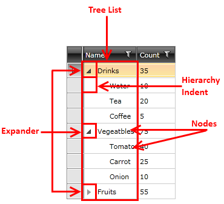

# Visual Structure

This section defines the terms and concepts used in the scope of __RadTreeListView__ that you have to get familiar with prior to continue reading this help. They can also be helpful when contacting the support service in order to describe your issue better. Below you can see snapshots and explanations of the main states and visual elements of the standard __RadTreeListView__ control.

__RadTreeListView__ is an essential user interface control used to display hierarchical structures in tabular format. The represented data is organized in rows and columns and can be additionally sorted and filtered. Below you can see snapshots and explanations of the main visual elements of the standard __RadTreeListView__ control.

>As the __RadTreeListView__ inherits the base class of __RadGridView__ (__GridViewDataControl__) it shares a common visual structure with it. This topic will cover only the specifics around the __RadTreeListView's__ structure. If you want a complete information about  the visual structure, please take a look at the [Visual Structure](http://www.telerik.com/help/wpf/gridview-visual-structure.html) topic in the __RadGridView__ documentation.

* __Tree List__ - one of the columns of the __RadTreeListView__ contains the UI for the tree structure. This is similar to what the __RadTreeView__ displays.

* __Expander__ - represents the UI element used to expand the respective item. If the item has no children, no expander will be displayed.

* __Hierarchy Indent__ - represents the indent that visualizes the data hierarchy - the child items are shifted to the right with the value of this indent. This indent is applied only in the first column.

* __Nodes__ - represent the items in the hierarchy. Each node might have other nodes as children and thus might be expandable.

## See Also

 * [Getting Started]()
