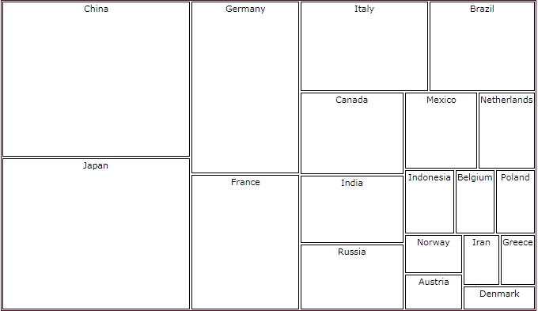
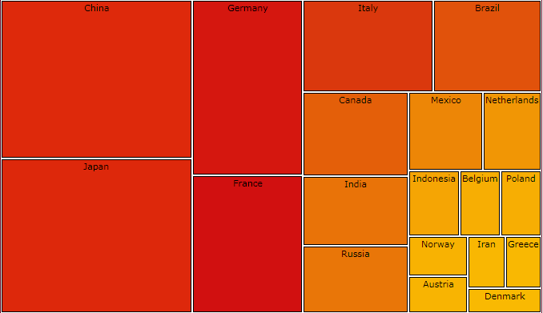
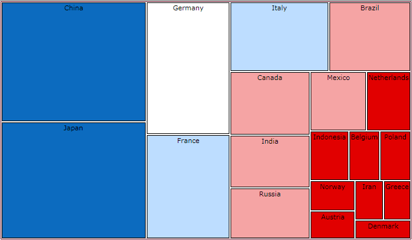
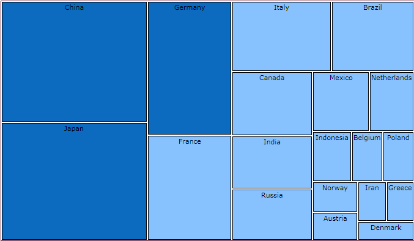
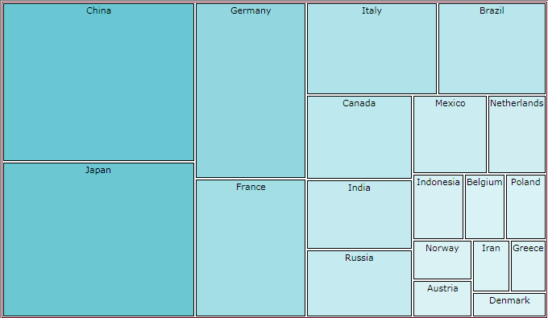
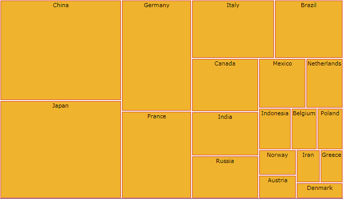

# Colorizers

This topic aims to get you familiar with all types of colorizers you may use to change the visualization of RadTreeMap/RadPivotMap controls. To know what colorizer is, you may check out our [Mappings]() topic.

Let's get started with creating a sample TreeMap, bound to collection of business objects.

> Getting to know how to bind RadTreeMap is beyond the scope of this topic. You may find it explained in [Populating With Data RadTreeMap]().

Here's our sample TreeMap:


```C#
	public MainPage()
	{
	  InitializeComponent();
	  treeMap1.ItemsSource = this.GetData();
	}

    public List<GdpInfo> GetData()
    {
        List<GdpInfo> data = new List<GdpInfo>()
        {
	  		new GdpInfo(){Country = "Austria", Gdp= 385.1},
	  		new GdpInfo(){Country ="Belgium" , Gdp=468.6},
	  		new GdpInfo(){Country ="Brazil" , Gdp=1749},
	  		new GdpInfo(){Country ="Canada" , Gdp=1565},
	  		new GdpInfo(){Country ="China" , Gdp=5308},
	  		new GdpInfo(){Country ="Denmark" , Gdp=318.1},
	  		new GdpInfo(){Country ="France" , Gdp=2669},
	  		new GdpInfo(){Country ="Germany" , Gdp=3402},
	  		new GdpInfo(){Country ="Greece" , Gdp=329},
	  		new GdpInfo(){Country ="India" , Gdp=1290},
	  		new GdpInfo(){Country ="Indonesia", Gdp=593.3},
	  		new GdpInfo(){Country ="Iran", Gdp=346.6},
	  		new GdpInfo(){Country ="Italy", Gdp=2107},
	  		new GdpInfo(){Country ="Japan", Gdp=5179},
	  		new GdpInfo(){Country ="Mexico", Gdp=1021},
	  		new GdpInfo(){Country ="Netherlands", Gdp=804.7},
	  		new GdpInfo(){Country ="Norway", Gdp=410.3},
	  		new GdpInfo(){Country ="Poland", Gdp=467.3},
	  		new GdpInfo(){Country ="Russia", Gdp=1250},
        };
        return data;
    }
	
	public class GdpInfo
	{
		public string Country { get; set; }
		public double Gdp { get; set; }
	}
```


```VB.NET
	Public Sub New()
		InitializeComponent()
		treeMap1.ItemsSource = Me.GetData()
	End Sub

	Public Function GetData() As List(Of GdpInfo)
		Dim data As New List(Of GdpInfo)() From {
		New GdpInfo() With {.Country = "Austria", .Gdp= 385.1},
		New GdpInfo() With {.Country ="Belgium", .Gdp=468.6},
		New GdpInfo() With {.Country ="Brazil", .Gdp=1749},
		New GdpInfo() With {.Country ="Canada", .Gdp=1565},
		New GdpInfo() With {.Country ="China", .Gdp=5308},
		New GdpInfo() With {.Country ="Denmark", .Gdp=318.1},
		New GdpInfo() With {.Country ="France", .Gdp=2669},
		New GdpInfo() With {.Country ="Germany", .Gdp=3402},
		New GdpInfo() With {.Country ="Greece", .Gdp=329},
		New GdpInfo() With {.Country ="India", .Gdp=1290},
		New GdpInfo() With {.Country ="Indonesia", .Gdp=593.3},
		New GdpInfo() With {.Country ="Iran", .Gdp=346.6},
		New GdpInfo() With {.Country ="Italy", .Gdp=2107},
		New GdpInfo() With {.Country ="Japan", .Gdp=5179},
		New GdpInfo() With {.Country ="Mexico", .Gdp=1021},
		New GdpInfo() With {.Country ="Netherlands", .Gdp=804.7},
		New GdpInfo() With {.Country ="Norway", .Gdp=410.3},
		New GdpInfo() With {.Country ="Poland", .Gdp=467.3},
		New GdpInfo() With {.Country ="Russia", .Gdp=1250}}
		Return data
	End Function

	Public Class GdpInfo
		Public Property Country() As String
		Public Property Gdp() As Double
	End Class
```


```XAML
	<telerik:RadTreeMap x:Name="treeMap1" LayoutStrategy="Squarified" BorderThickness="1" BorderBrush="#FF5F031C">
		<telerik:RadTreeMap.TypeDefinitions>
			<telerik:TypeDefinition TargetTypeName="GdpInfo" 
									ValuePath="Gdp" 
									LabelPath="Country" 
									ToolTipPath="Gdp" 
									ToolTipFormat="{}{0:C2} mln" >
			</telerik:TypeDefinition>
		</telerik:RadTreeMap.TypeDefinitions>
	</telerik:RadTreeMap>
```
	
The result si shown bellow:

	
## ValueGradientColorizer

A colorizer, which contains a set of GradientStops. It chooses the brush to be applied according to the RadTreeMapItem's value and colorizer's gradient stops. Each GradientStop.Offset value can be absolute or relative (between 0 and 1) depending on the IsAbsolute property value. Note that the RangeMinimum and RangeMaximum properties are set the same as the min and max values of the RadTreeMapItem-s.


```XAML
	  <telerik:TypeDefinition.Mappings>
		<telerik:ValueGradientColorizer RangeMinimum="318" RangeMaximum="5310">
			<GradientStop Offset="0" Color="#FFFFD000" />
			<GradientStop Offset="0.50" Color="#FFD11010" />
			<GradientStop Offset="1" Color="#de290b" />
		</telerik:ValueGradientColorizer>
	  </telerik:TypeDefinition.Mappings>
```



## ValueBrushColorizer

This colorizer contains a set of RangeBrush objects. It chooses the brush to be applied according to the RadTreeMapItem value, set by the *ValuePath* property of the TreeMap and the From and To values of each RangeBrush. The values of each RangeBrush can be absolute or relative (between 0 and 1) depending on the IsAbsolute property value.


```XAML
	<UserControl.Resources>
	    <SolidColorBrush Color="#FFE10000" x:Key="Thousand" />
	    <SolidColorBrush Color="#FFF5A4A4" x:Key="TwoThousand" />
	    <SolidColorBrush Color="#FFBDDDFF" x:Key="ThreeThousand"/>
	    <SolidColorBrush Color="#FF87C2FF" x:Key="FourThousand" />
	    <SolidColorBrush Color="#FF0C6BBF" x:Key="FiveThousand" />
	
	    <telerik:RangeBrushCollection x:Key="ColorizerBrushes">
	        <telerik:RangeBrush Brush="{StaticResource Thousand}" From="0" To="999" />
	        <telerik:RangeBrush Brush="{StaticResource TwoThousand}" From="1000" To="2000"  />
	        <telerik:RangeBrush Brush="{StaticResource ThreeThousand}" From="2001" To="3000" />
	        <telerik:RangeBrush Brush="{StaticResource FourThousand}" From="4000" To="5000" />
	        <telerik:RangeBrush Brush="{StaticResource FiveThousand}" From="5001" To="6000"  />
	    </telerik:RangeBrushCollection>
	</UserControl.Resources>
	
	<telerik:TypeDefinition.Mappings>
		<telerik:ValueBrushColorizer IsAbsolute="True" ValuePath="Gdp" RangeMinimum="318" RangeMaximum="5310"
									 Brushes="{StaticResource ColorizerBrushes}">
		</telerik:ValueBrushColorizer>
	</telerik:TypeDefinition.Mappings>
```



Here's an example of the same colorizer with relative colors (IsAbsolute property is turned off):


```XAML
	<UserControl.Resources>
	    <SolidColorBrush Color="#FFE10000" x:Key="Thousand" />
	    <SolidColorBrush Color="#FFF5A4A4" x:Key="TwoThousand" />
	    <SolidColorBrush Color="#FFBDDDFF" x:Key="ThreeThousand"/>
	    <SolidColorBrush Color="#FF87C2FF" x:Key="FourThousand" />
	    <SolidColorBrush Color="#FF0C6BBF" x:Key="FiveThousand" />
	
	    <telerik:RangeBrushCollection x:Key="ColorizerBrushes">
	        <telerik:RangeBrush Brush="{StaticResource FourThousand}" From="0" To="0.5" />
	        <telerik:RangeBrush Brush="{StaticResource FiveThousand}" From="0.6" To="1"  />
	    </telerik:RangeBrushCollection>
	</UserControl.Resources>
	
	<telerik:TypeDefinition.Mappings>
	    <telerik:ValueBrushColorizer IsAbsolute="False" 
	                                 Brushes="{StaticResource ColorizerBrushes}">
	    </telerik:ValueBrushColorizer>
	</telerik:TypeDefinition.Mappings>
```



## DesaturationColorizer

It reduces the level of saturation of a given StartColor depending on the RadTreeMapItem value. The level of desaturation can be controlled using From and To properties.


```XAML
	<telerik:TypeDefinition.Mappings>
	    <telerik:DesaturationColorizer From="1" To="0.2" StartColor="#69C7D3"/>
	</telerik:TypeDefinition.Mappings>
```



## Palette Colorizer

Colorizes RadTreeMap per predefined collection of Brush objects. 


```XAML
	<UserControl.Resources>
		<telerik:PaletteBrushes x:Key="ColorizerBrushes">
			<SolidColorBrush Color="#69C7D3" />
			<SolidColorBrush Color="#B1E292" />
			<SolidColorBrush Color="#D2B4E2" />
			<SolidColorBrush Color="#A2D7F0" />
			<SolidColorBrush Color="#E8D982" />
			<SolidColorBrush Color="#BBDBC6" />
		</telerik:PaletteBrushes>
	</UserControl.Resources>
	
	<telerik:TypeDefinition.Mappings>
	    <telerik:PaletteColorizer Brushes="{StaticResource ColorizerBrushes}" />
	</telerik:TypeDefinition.Mappings>
```


## Brush Colorizer

Paints RadTreeMapItem by the color set via brush. You may control the target of the coloring by *TargetPropertyName* property as shown below.


```XAML
	<telerik:TypeDefinition.Mappings>
	    <telerik:BrushColorizer Brush="#F0B32D" /> 
	    <telerik:BrushColorizer Brush="#D2412C" TargetPropertyName="BorderBrush" />
	</telerik:TypeDefinition.Mappings>
```

