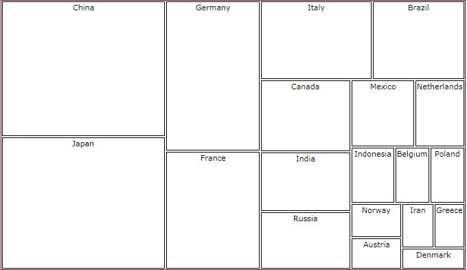
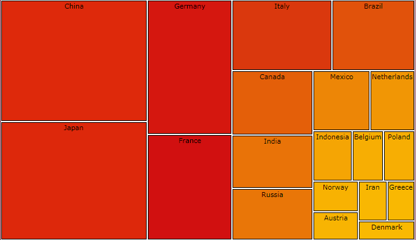
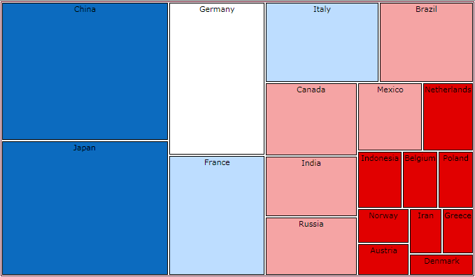
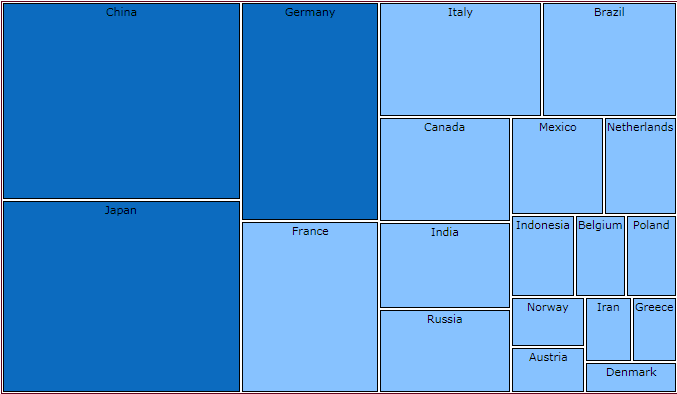
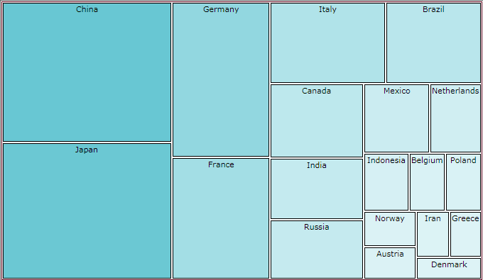
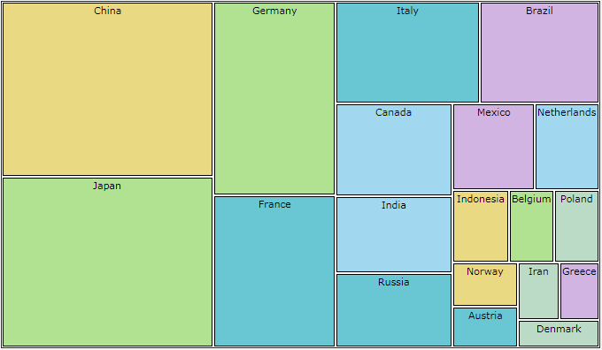
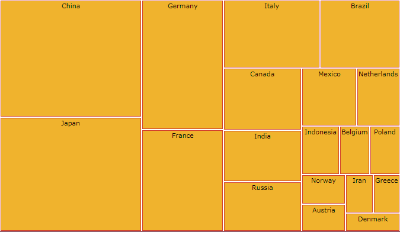

# Colorizers

This topic aims to get you familiar with all types of colorizers you may use to change the visualization of RadTreeMap/RadPivotMap controls. To know what colorizer is, you may check out our [Mappings]() topic.

Let's get started with creating a sample TreeMap, bound to collection of business objects.

> Getting to know how to bind RadTreeMap is beyond the scope of this topic. You may find it explained in [Populating With Data RadTreeMap]().

Here's our sample TreeMap:

<snippet id='radtreemap-colorizers-block_1-cs' />
<snippet id='radtreemap-colorizers-block_2-vb' />

<snippet id='radtreemap-colorizers-block_3-xaml' />
	
The result si shown bellow:

	
## ValueGradientColorizer

A colorizer, which contains a set of GradientStops. It chooses the brush to be applied according to the RadTreeMapItem's value and colorizer's gradient stops. Each GradientStop.Offset value can be absolute or relative (between 0 and 1) depending on the IsAbsolute property value. Note that the RangeMinimum and RangeMaximum properties are set the same as the min and max values of the RadTreeMapItem-s.

<snippet id='radtreemap-colorizers-block_4-xaml' />

## ValueBrushColorizer

This colorizer contains a set of RangeBrush objects. It chooses the brush to be applied according to the RadTreeMapItem value, set by the *ValuePath* property of the TreeMap and the From and To values of each RangeBrush. The values of each RangeBrush can be absolute or relative (between 0 and 1) depending on the IsAbsolute property value.

<snippet id='radtreemap-colorizers-block_5-xaml' />

Here's an example of the same colorizer with relative colors (IsAbsolute property is turned off):

<snippet id='radtreemap-colorizers-block_6-xaml' />

## DesaturationColorizer

It reduces the level of saturation of a given StartColor depending on the RadTreeMapItem value. The level of desaturation can be controlled using From and To properties.

<snippet id='radtreemap-colorizers-block_7-xaml' />

## Palette Colorizer

Colorizes RadTreeMap per predefined collection of Brush objects. 

<snippet id='radtreemap-colorizers-block_8-xaml' />

## Brush Colorizer

Paints RadTreeMapItem by the color set via brush. You may control the target of the coloring by *TargetPropertyName* property as shown below.

<snippet id='radtreemap-colorizers-block_9-xaml' />

