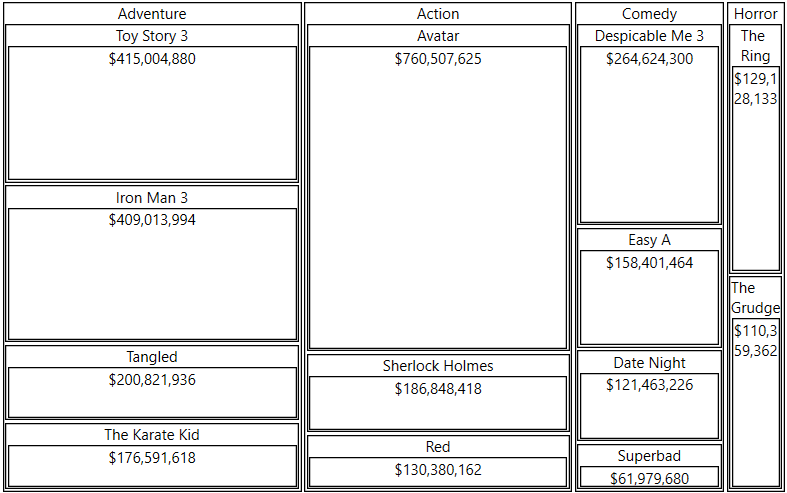

# Getting Start with {{ site.framework_name }} RadPivotMap

This tutorial will walk you through the creation of a sample application that contains __RadPivotMap__ control.
			
## Adding Telerik Assemblies Using NuGet

To use __RadPivotMap__ when working with NuGet packages, install the `Telerik.Windows.Controls.DataVisualization.for.Wpf.Xaml` package. The [package name may vary]() slightly based on the Telerik dlls set - [Xaml or NoXaml]()

Read more about NuGet installation in the [Installing UI for WPF from NuGet Package]() article.

>tip With the 2025 Q1 release, the Telerik UI for WPF has a new licensing mechanism. You can learn more about it [here]().

## Adding Assembly References Manually

If you are not using NuGet packages, you can add a reference to the following assemblies:

* __Telerik.Licensing.Runtime__
* __Telerik.Windows.Controls__
* __Telerik.Windows.Controls.DataVisualization__
* __Telerik.Windows.Data__

You can find the required assemblies for each control from the suite in the [Controls Dependencies]()[Controls Dependencies]() help article.

>tip With the 2025 Q1 release, the Telerik UI for WPF has a new licensing mechanism. You can learn more about it [here]().

## Setting up the Data Source

To populate the control with tiles you will need to provide a collection of items that will be assigned to its __ItemsSource__ property. 

For this example we will use a simple flat structure consisting of movies gross sales information.

#### __[C#] Defining the models__
{{region radtreemap-getting-started-pivotmap-0}}
	public class MovieInfo
    {
        public string Genre { get; set; }
        public string Title { get; set; }
        public double GrossSales { get; set; }
    }
{{endregion}}

#### __[C#] Populating a collection with the data__
{{region radtreemap-getting-started-pivotmap-1}}
	public ObservableCollection<MovieInfo> GetData()
	{
		var movies = new ObservableCollection<MovieInfo>()
		{
			new MovieInfo() { Genre = "Adventure", Title = "Toy Story 3", GrossSales = 415004880 },
			new MovieInfo() { Genre = "Adventure", Title = "Iron Man 3", GrossSales = 409013994 },
			new MovieInfo() { Genre = "Adventure", Title = "Tangled", GrossSales = 200821936 },
			new MovieInfo() { Genre = "Adventure", Title = "The Karate Kid", GrossSales = 176591618 },
			new MovieInfo() { Genre = "Action", Title = "Avatar", GrossSales = 760507625 },
			new MovieInfo() { Genre = "Action", Title = "Sherlock Holmes", GrossSales = 186848418 },
			new MovieInfo() { Genre = "Action", Title = "Red", GrossSales = 130380162 },
			new MovieInfo() { Genre = "Comedy", Title = "Despicable Me 3", GrossSales = 264624300 },
			new MovieInfo() { Genre = "Comedy", Title = "Easy A", GrossSales = 158401464 },
			new MovieInfo() { Genre = "Comedy", Title = "Superbad", GrossSales = 61979680 },
			new MovieInfo() { Genre = "Comedy", Title = "Date Night", GrossSales = 121463226 },
			new MovieInfo() { Genre = "Horror", Title = "The Ring", GrossSales = 129128133 },
			new MovieInfo() { Genre = "Horror", Title = "The Grudge", GrossSales = 110359362 },
		};
		return movies;
	}
{{endregion}}

## Setting up the RadPivotMap

To set up the control you can set few esential properties - __ItemsSource__, __ValuePath__ and __GroupDefinitions__. The GroupDefinitions is a collection of GroupDefinition objects which contain information that tells the pivot map how to fetch the groups from the  objects in the ItemsSource. 

The __ValuePath__ determines the size of the tile.

The __Member__ determines the name of the corresponding group.

The __LabelPath__ determines the label that will be displayed over the tile.

#### __[XAML] Defining RadPivotMap__
{{region radtreemap-getting-started-pivotmap-2}}
	<telerik:RadPivotMap x:Name="radPivotMap" 
						 ValuePath="GrossSales"
						 LabelPath="GrossSales" 
						 LabelFormat="{}{0:C0}">            
            <telerik:RadPivotMap.GroupDefinitions>
                <telerik:GroupDefinition Member="Genre" />
                <telerik:GroupDefinition Member="Title" />
            </telerik:RadPivotMap.GroupDefinitions>            
        </telerik:RadPivotMap>
{{endregion}}

#### __[XAML] Setting the ItemsSource in XAML__
{{region radtreemap-getting-started-pivotmap-3}}
	<telerik:RadPivotMap ItemsSource="{Binding MyDataSourceProperty}" />
{{endregion}}

#### __[XAML] Setting the ItemsSource in code (see Example 2)__
{{region radtreemap-getting-started-pivotmap-4}}
	this.radPivotMap.ItemsSource = GetData();
{{endregion}}

__RadPivotMap__  

>tip Avoid inserting RadPivotMap in panels that measure its children with Infinity. In this case, the control cannot properly measure and arrange its child visuals. Examples for panels that measure the control with Infinity size are StackPanel, ScrollViewer or a Grid's Row/ColumnDefinition with its size (Width or Height) set to Auto. Instead, use panels that measure its children with the available space.


## Telerik UI for WPF Learning Resources

* [Telerik UI for WPF TreeMap and PivotMap Component](https://www.telerik.com/products/wpf/treemap-and-pivotmap.aspx)
* [Getting Started with Telerik UI for WPF Components]()
* [Telerik UI for WPF Installation]()
* [Telerik UI for WPF and WinForms Integration]()
* [Telerik UI for WPF Visual Studio Templates]()
* [Setting a Theme with Telerik UI for WPF]()
* [Telerik UI for WPF Virtual Classroom (Training Courses for Registered Users)](https://learn.telerik.com/learn/course/external/view/elearning/16/telerik-ui-for-wpf) 
* [Telerik UI for WPF License Agreement](https://www.telerik.com/purchase/license-agreement/wpf-dlw-s)


## See Also  
* [Mappings]()
* [Colorizers]()
