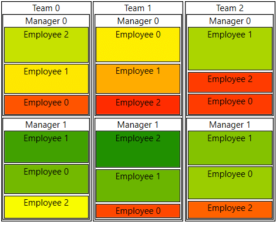

# Getting Started with {{ site.framework_name }} RadTreeMap

This tutorial will walk you through the creation of a sample application that contains __RadTreeMap__ control.

## Adding Telerik Assemblies Using NuGet

To use __RadTreeMap__ when working with NuGet packages, install the `Telerik.Windows.Controls.DataVisualization.for.Wpf.Xaml` package. The [package name may vary]() slightly based on the Telerik dlls set - [Xaml or NoXaml]()

Read more about NuGet installation in the [Installing UI for WPF from NuGet Package]() article.

>tip With the 2025 Q1 release, the Telerik UI for WPF has a new licensing mechanism. You can learn more about it [here]().

## Adding Assembly References Manually

If you are not using NuGet packages, you can add a reference to the following assemblies:

* __Telerik.Licensing.Runtime__
* __Telerik.Windows.Controls__
* __Telerik.Windows.Controls.DataVisualization__
* __Telerik.Windows.Data__

You can find the required assemblies for each control from the suite in the [Controls Dependencies]()[Controls Dependencies]() help article.

## Setting up the Data Source

To populate the control with tiles you will need to provide a collection of items that will be assigned to its __ItemsSource__ property. 

For this example we will use a simple hierarchical structure consisting of teams, managers and employees.

__Defining the models__
<snippet id='radtreemap-getting-started-getting-started-treemap-block_1-cs' />

__Populating a collection with the data__
<snippet id='radtreemap-getting-started-getting-started-treemap-block_2-cs' />

## Setting up the RadTreeMap

To set up the control you can set two essential properties - __ItemsSource__ and __TypeDefinitions__. The TypeDefinitions is a collection of TypeDefinition objects which contain information that tells the tree map how to fetch the data from the  objects in the ItemsSource. 

The __ValuePath__ determines the size of the tile.

The __LabelPath__ determines the label that will be displayed over the tile. 

The __TargetTypeName__ contains the class name of the corresponding object in the ItemsSource.

The __ChildrenPath__ is the path to the property that holds the children's collection.

__Defining RadTreeMap__
<snippet id='radtreemap-getting-started-getting-started-treemap-block_3-xaml' />

__Setting the ItemsSource in XAML__
<snippet id='radtreemap-getting-started-getting-started-treemap-block_4-xaml' />

__Setting the ItemsSource in code (see Example 2)__
<snippet id='radtreemap-getting-started-getting-started-treemap-block_5-xaml' />

__RadTreeMap__  

>tip Avoid inserting RadTreeMap in panels that measure its children with Infinity. In this case, the control cannot properly measure and arrange its child visuals. Examples for panels that measure the control with Infinity size are StackPanel, ScrollViewer or a Grid's Row/ColumnDefinition with its size (Width or Height) set to Auto. Instead, use panels that measure its children with the available space.

## See Also  
* [Mappings]()
* [Colorizers]()