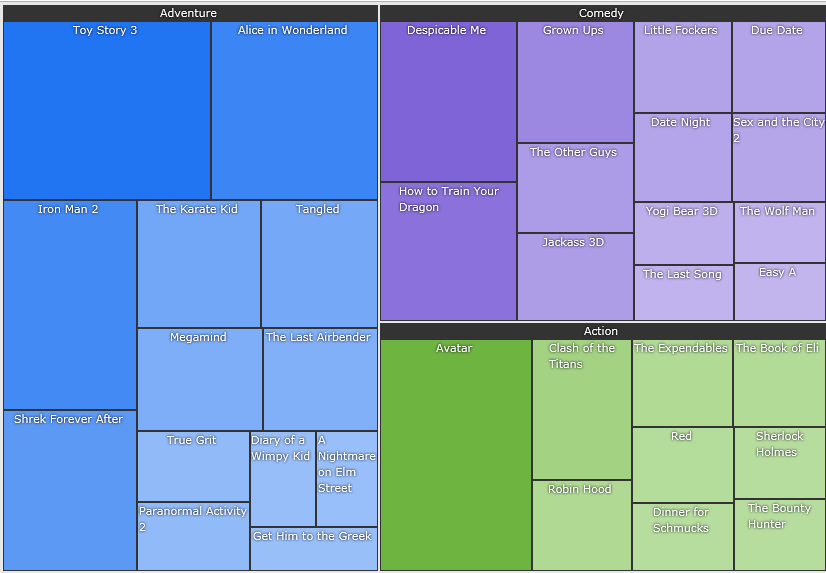
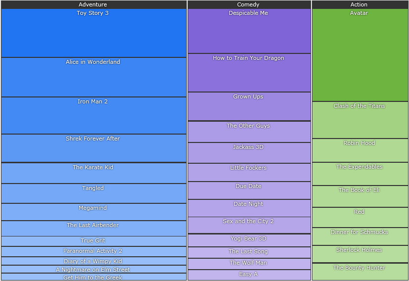

# Layout Strategies

By the end of this help topic you will learn about the *Layout Strategies* which are responsible for data tiling in the __RadTreeMap__ and __RadPivotMap__ controls.
*Treemap *algorithms represent hierarchical data sets via recursive subdivision of the initial rectangle. The area of each rectangle in the treemap is proportional to the size of that particular node.

>Layout Strategies are always applied to child nodes.

Currently there are two Layout Strategies to visualize the data:

* __Squarified__ - creates rectangles with best aspect ratio.

	 
	
* __Slice and Dice__ - creates rectangles with high aspect ratio and displays them sorted either horizontally or vertically. 

	

The default one is Slice and Dice.

For __Slice and Dice__ algorithm you can specify __Orientation__ (*Horizontal*, *Vertical* or *Smart*) and __SortDirection__ (*Ascending* or *Descending*):


```XAML
	<telerik:RadTreeMap>
	   <telerik:RadTreeMap.LayoutStrategy>
	      <telerik:SliceDiceStrategy SortDirection="Ascending" Orientation="Smart"/>
	  </telerik:RadTreeMap.LayoutStrategy>
	<telerik:RadTreeMap>
```

Setting the __Orientation__ to *Smart* means that the algorithm will automatically choose the most appropriate orientation depending on your data and the available space.

You can instantiate a layout strategy in XAML by using the layout strategy name:


```XAML
	<telerik:RadTreeMap Background="#57391A" BorderThickness="0"
	LayoutStrategy="Squarified" Padding="1" />
```

You can also use a TypeConverter that converts strings in *LayoutStrategy *using default settings:


```XAML
	<telerik:RadPivotMap>
	    <telerik:RadPivotMap.LayoutStrategy>
	      <telerik:SquarifiedStrategy/>
	    </telerik:RadPivotMap.LayoutStrategy>
	</telerik:RadPivotMap>
```

Have in mind that the LayoutStrategy may be different for each __TypeDefinition__ of __RadTreeMap__ or __GroupDefinition__ of __RadPivotMap.__ You can also set a layout strategy for the topmost level. If you set Squarified for example for the topmost level and you don't specify a strategy for its children - all will inherit the top-most level strategy which in this case is Squarified.


```XAML
	<telerik:GroupDefinition Member="Genre" LayoutStrategy="Squarified" />
	<telerik:RadTreeMap ItemsSource="{Binding Data}" LayoutStrategy="Squarified" />
```