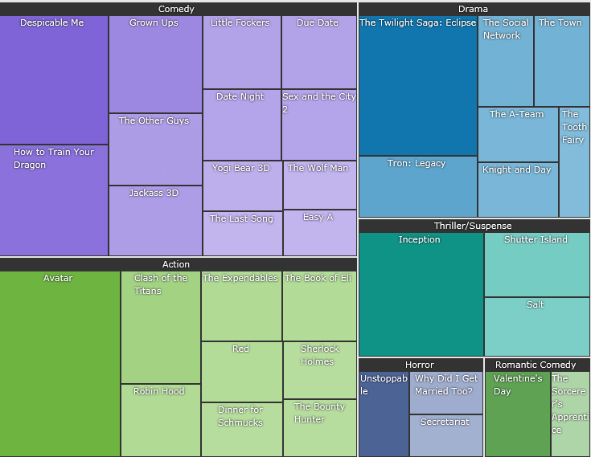

# {{ site.framework_name }} Map Overview

__RadTreeMap__ and __RadPivotMap__ are data visualization controls used to display hierarchical data as a set of nested rectangles. Each rectangle has an area proportional to a specified dimension on the data. Both controls are useful in scenarios where a lot of items have to be compared in a limited space. When the color and size dimensions are correlated in some way with the tree structure, you can easily see patterns that would be difficult to spot in other ways.





## Key Features

* __Different tiling algorithms__: The controls support two tiling algorithms to visualize the data - __Squarified__ and __Slice and Dice__. The default one is Slice and Dice. Read more about this in the [Layout Strategies]() article.

* __Colorizers__: The colorizers allow you to choose different color for the different tiles in the control. Read more about this in the [Colorizers]() article.

* __Selection__: The controls support selection functionality that allows you to highlight items upon click or setting a property. Read more about this in the [Selection]() article.

* __Data binding support__: The RadTreeMap control can be bound to a hierarchical collection which will be visualized in a tree-like layout. The RadPivotMap can be bound to a flat data where the control automatically groups the data to be visualized. Read more about this in the [Populating with Data RadTreeMap]() and [Populating with Data RadPivotMap]() articles.

* __Automatic items ordering__: The layout orientation (vertical or horizontal) will be chosen automatically - by calculating the available space for the given data. When horizontal orientation is applied - the child tiles are going to be stacked horizontally. Respectively vertical orientation will make the child tiles to be stacked vertically.

>tip Get started with the control with its [Getting Started]() help article that shows how to use it in a basic scenario.

> Check out the online demo at [demos.telerik.com](https://demos.telerik.com/silverlight/#Treemap/FirstLook)[demos.telerik.com](https://demos.telerik.com/wpf/)


## Telerik UI for WPF Support and Learning Resources

* [Telerik UI for WPF TreeMap and PivotMap Homepage](https://www.telerik.com/products/wpf/treemap-and-pivotmap.aspx)
* [Get Started with the Telerik UI for WPF TreeMap and PivotMap]()
* [Telerik UI for WPF API Reference](https://docs.telerik.com/devtools/wpf/api/)
* [Getting Started with Telerik UI for WPF Components]()
* [Telerik UI for WPF Virtual Classroom (Training Courses for Registered Users)](https://learn.telerik.com/learn/course/external/view/elearning/16/telerik-ui-for-wpf) 
* [Telerik UI for WPF TreeMap and PivotMap Forums](https://www.telerik.com/forums/wpf)
* [Telerik UI for WPF Knowledge Base](https://docs.telerik.com/devtools/wpf/knowledge-base)


## See Also  
* [Mappings]()
* [Developer Focused Examples]()
