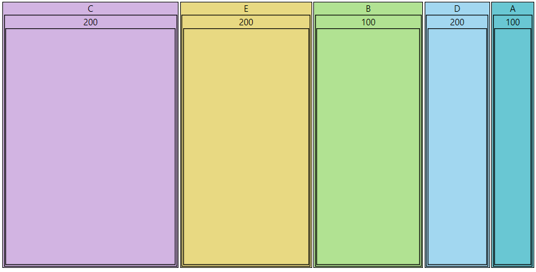

# Populating With Data RadPivotMap

__RadPivotMap__ expects data in tabular format and displays a treemap with grouped data, according to the *GroupDefinition*-s set.

Assuming that you have the following class:

__Example 1__

```C#
	public class TestData
	{
	     public int Value { get; set; }
	     public string Category { get; set; }
	     public string Subcategory { get; set; }
	}
```
```VB.NET
	Private _category As String
	    Public Property Category() As String
	        Get
	            Return _Category
	        End Get
	        Set(ByVal value As String)
	            _Category = value
	        End Set
	    End Property
	Private _Value As Integer
	    Public Property Value() As Integer
	        Get
	            Return _Value
	        End Get
	        Set(ByVal value As Integer)
	            _Value = value
	        End Set
	    End Property
	Private _Subcategory As String
	    Public Property Subcategory() As String
	        Get
	            Return _subcategory
	        End Get
	        Set(ByVal value As String)
	            _Subcategory = value
	        End Set
	    End Property
```

Using the above class we can now create sample data.

__Example 2__

```C#
	public MainWindow()
	{
		InitializeComponent();
		this.DataContext = new List<TestData>()
		{
			new TestData { Category = "A", Subcategory = "100", Value = 10 },
			new TestData { Category = "B", Subcategory = "100", Value = 25 },
			new TestData { Category = "C", Subcategory = "200", Value = 40 },
			new TestData { Category = "D", Subcategory = "200", Value = 15 },
			new TestData { Category = "E", Subcategory = "200", Value = 30 },
		};
	}
```

To bind the __RadPivotMap__ you should use the *__GroupDefinition__* collection and add several __GroupDefinitions__ - one for each of the properties as presented in the class. The __ValuePath__ property specifies from where the data should be taken. We can also change the color of the groups using [Colorizer]().

__Example 3__

```XAML
	<Window.Resources>
		<telerik:PaletteBrushes x:Key="PivotMapBrushes">
			<SolidColorBrush Color="#69C7D3" />
			<SolidColorBrush Color="#B1E292" />
			<SolidColorBrush Color="#D2B4E2" />
			<SolidColorBrush Color="#A2D7F0" />
			<SolidColorBrush Color="#E8D982" />
			<SolidColorBrush Color="#BBDBC6" />
			<SolidColorBrush Color="#B0BADB" />
		</telerik:PaletteBrushes>        
	</Window.Resources>
	<telerik:RadPivotMap Name="treeMap1" 
							ValuePath="Value" 
							ItemsSource="{Binding}">
		<telerik:RadPivotMap.GroupDefinitions>
			<telerik:GroupDefinition Member="Category">
				<telerik:GroupDefinition.Mappings>
					<telerik:PaletteColorizer Brushes="{StaticResource PivotMapBrushes}" />
				</telerik:GroupDefinition.Mappings>               
			</telerik:GroupDefinition>
			<telerik:GroupDefinition Member="SubCategory" />
		</telerik:RadPivotMap.GroupDefinitions>
	</telerik:RadPivotMap>
```

#### __Figure 1__


You can bind the RadPivotMap to any source that implements one of the following interfaces:

* [IEnumerable](http://msdn.microsoft.com/en-us/library/system.collections.ienumerable.aspx) - supports simple iteration of a collection. See the MSDN article for more on [IEnumerable](http://msdn.microsoft.com/en-us/library/system.collections.ienumerable.aspx). 

* [ICollection](http://msdn.microsoft.com/en-us/library/system.collections.icollection.aspx) - extends [IEnumerable](http://msdn.microsoft.com/en-us/library/system.collections.ienumerable.aspx) and supports size, enumerator, and synchronization methods for collections. 

* [IList](http://msdn.microsoft.com/en-us/library/system.collections.ilist.aspx) - extends [ICollection](http://msdn.microsoft.com/en-us/library/system.collections.icollection.aspx) and is the base class for lists. 