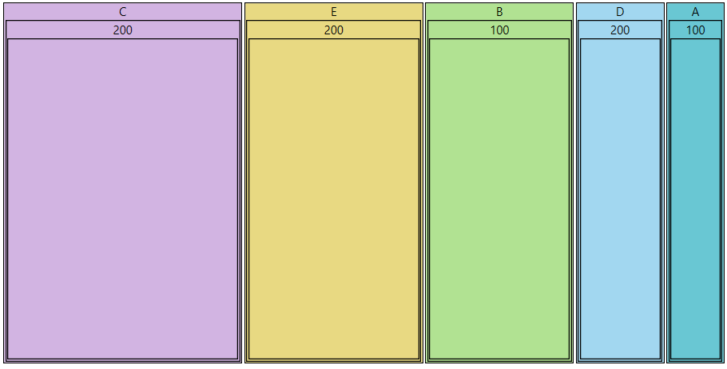

# Populating With Data RadPivotMap

__RadPivotMap__ expects data in tabular format and displays a treemap with grouped data, according to the *GroupDefinition*-s set.

Assuming that you have the following class:

__Example 1__

<snippet id='radtreemap-populating-with-data-radpivotmap-block_1-cs' />
<snippet id='radtreemap-populating-with-data-radpivotmap-block_2-vb' />

Using the above class we can now create sample data.

__Example 2__

<snippet id='radtreemap-populating-with-data-radpivotmap-block_3-cs' />

To bind the __RadPivotMap__ you should use the *__GroupDefinition__* collection and add several __GroupDefinitions__ - one for each of the properties as presented in the class. The __ValuePath__ property specifies from where the data should be taken. We can also change the color of the groups using [Colorizer]().

__Example 3__

<snippet id='radtreemap-populating-with-data-radpivotmap-block_4-xaml' />

#### __Figure 1__

You can bind the RadPivotMap to any source that implements one of the following interfaces:

* [IEnumerable](http://msdn.microsoft.com/en-us/library/system.collections.ienumerable.aspx) - supports simple iteration of a collection. See the MSDN article for more on [IEnumerable](http://msdn.microsoft.com/en-us/library/system.collections.ienumerable.aspx). 

* [ICollection](http://msdn.microsoft.com/en-us/library/system.collections.icollection.aspx) - extends [IEnumerable](http://msdn.microsoft.com/en-us/library/system.collections.ienumerable.aspx) and supports size, enumerator, and synchronization methods for collections. 

* [IList](http://msdn.microsoft.com/en-us/library/system.collections.ilist.aspx) - extends [ICollection](http://msdn.microsoft.com/en-us/library/system.collections.icollection.aspx) and is the base class for lists. 