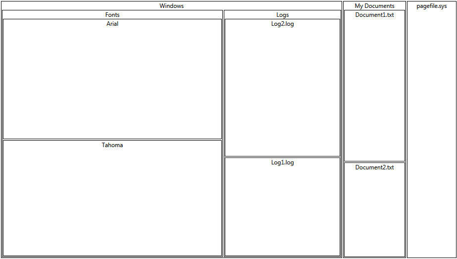

# Populating With Data RadTreeMap

__RadTreeMap__ control expects a hierarchical collection and presents the data according to the TypeDefinitions set.		

Assuming that you want to visualize a sample Windows Explorer structure - several folders with their containing files in __RadTreeMap__ you can follow this approach:

Create new interface that will represent the basic information for the files/folders:


```C#
	public interface IDiskItem
	{
		string Name { get; }
		long Size { get; }
		IEnumerable<IDiskItem> Children { get; }
	}
```
```VB.NET
	Public Interface IDiskItem
		ReadOnly Property Name() As String
		ReadOnly Property Size() As Long
		ReadOnly Property Children() As IEnumerable(Of IDiskItem)
	End Interface
```

The Children collection can be substituted with any source that implements one of the following interfaces:

* [IEnumerable](http://msdn.microsoft.com/en-us/library/system.collections.ienumerable.aspx) - supports simple iteration of a collection. See the MSDN article for more on [IEnumerable](http://msdn.microsoft.com/en-us/library/system.collections.ienumerable.aspx).			

* [ICollection](http://msdn.microsoft.com/en-us/library/system.collections.icollection.aspx) - extends [IEnumerable](http://msdn.microsoft.com/en-us/library/system.collections.ienumerable.aspx) and supports size, enumerator, and synchronization methods for collections.			

* [IList](http://msdn.microsoft.com/en-us/library/system.collections.ilist.aspx) - extends [ICollection](http://msdn.microsoft.com/en-us/library/system.collections.icollection.aspx) and is the base class for lists.

Add two new classes -> *File* and *Folder* that implement the above interface:		


```C#
	public class Folder : IDiskItem
	{
		private string _name;
		private IEnumerable<IDiskItem> _children;

		public Folder(string name, IEnumerable<IDiskItem> children)
		{
			this._name = name;
			this._children = children;
		}

		public string Name
		{
			get
			{
				return _name;
			}
		}

		public long Size
		{
			get
			{
				return this.Children.Sum(child => child.Size);
			}
		}

		public IEnumerable<IDiskItem> Children
		{
			get
			{
				return _children;
			}
		}
	}

	public class File : IDiskItem
	{
		private string _name;
		private long _size;

		public File(string name, long size)
		{
			this._name = name;
			this._size = size;
		}

		public string Name
		{
			get
			{
				return _name;
			}
		}

		public long Size
		{
			get
			{
				return _size;
			}
		}

		public IEnumerable<IDiskItem> Children
		{
			get { return null; }
		}
	}
```
```VB.NET
	Public Class Folder
		Implements IDiskItem

		Private _name As String

		Private _children As IEnumerable(Of IDiskItem)

		Public Sub New(ByVal name As String, ByVal children As IEnumerable(Of IDiskItem))

			Me._name = name

			Me._children = children

		End Sub

		Public ReadOnly Property Name() As String

			Get
				Return _name

			End Get

		End Property

		Public ReadOnly Property Size() As Long

			Get

				Return Me.Children.Sum(Function(child) child.Size)

			End Get

		End Property

		Public ReadOnly Property Children() As IEnumerable(Of IDiskItem)

			Get
				Return _children

			End Get

		End Property

	End Class

	Public Class File
		Implements IDiskItem

		Private _name As String

		Private _size As Long

		Public Sub New(ByVal name As String, ByVal size As Long)

			Me._name = name

			Me._size = size

		End Sub

		Public ReadOnly Property Name() As String

			Get

				Return _name

			End Get

		End Property

		Public ReadOnly Property Size() As Long

			Get
				Return _size

			End Get

		End Property

		Public ReadOnly Property Children() As IEnumerable(Of IDiskItem)

			Get
				Return Nothing
			End Get

		End Property
	
	End Class
```

In *XAML* add two __TypeDefinitions__ using the *__TypeDefinitions__* collection - one for the File and one for the Folder. The __ValuePath__ property specifies from where the data for the values should be taken. You may also control the Labels that are to be displayed for each tile using the __LabelPath__ property. Note how the __ChildrenPath__ property specifies the children of the Folder TypeDefinition:


```XAML
	<telerik:RadTreeMap Name="treeMap1">
		<telerik:RadTreeMap.TypeDefinitions>
						<telerik:TypeDefinition TargetTypeName="Folder" ValuePath="Size" ChildrenPath="Children" LabelPath="Name" />
						<telerik:TypeDefinition TargetTypeName="File" ValuePath="Size" LabelPath="Name" />
		</telerik:RadTreeMap.TypeDefinitions>
	</telerik:RadTreeMap>
```

Here is a sample datasource:


```C#
	public MainPage() // MainWindow in WPF
	{
		InitializeComponent();
		var datasource = new List<IDiskItem>() {
			new Folder("Windows", 
				new List<IDiskItem>() {
					 new Folder("Fonts", new List<IDiskItem>() { new File("Arial", 256), new File("Tahoma", 246)}),
					 new Folder("Logs", new List<IDiskItem>() { new File("Log1.log", 112), new File("Log2.log", 156)})
				}),
				new Folder ("My Documents", new List<IDiskItem>() {
					new File("Document1.txt", 88), new File("Document2.txt", 55)}),
				new File("pagefile.sys", 114)};
		treeMap1.ItemsSource = datasource;
	}
```
```VB.NET
	Public Sub New() ' MainWindow in WPF '
		InitializeComponent()
			Dim datasource = New List(Of IDiskItem)() From {New Folder("Windows", New List(Of IDiskItem)() With { New Folder("Fonts", New List(Of IDiskItem)() With { New File("Arial", 256), New File("Tahoma", 246)}), New Folder("Logs", New List(Of IDiskItem)() With { New File("Log1.log", 112), New File("Log2.log", 156)}) }), New Folder ("My Documents", New List(Of IDiskItem)() With { New File("Document1.txt", 88), New File("Document2.txt", 55)}), New File("pagefile.sys", 114)}
		treeMap1.ItemsSource = datasource
	End Sub
```

The result is shown below:
