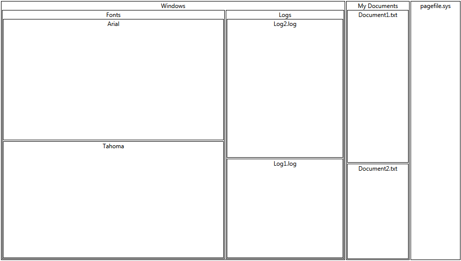

# Populating With Data RadTreeMap

__RadTreeMap__ control expects a hierarchical collection and presents the data according to the TypeDefinitions set.		

Assuming that you want to visualize a sample Windows Explorer structure - several folders with their containing files in __RadTreeMap__ you can follow this approach:

Create new interface that will represent the basic information for the files/folders:

<snippet id='radtreemap-populating-with-data-radtreemap-block_1-cs' />
<snippet id='radtreemap-populating-with-data-radtreemap-block_2-vb' />

The Children collection can be substituted with any source that implements one of the following interfaces:

* [IEnumerable](http://msdn.microsoft.com/en-us/library/system.collections.ienumerable.aspx) - supports simple iteration of a collection. See the MSDN article for more on [IEnumerable](http://msdn.microsoft.com/en-us/library/system.collections.ienumerable.aspx).			

* [ICollection](http://msdn.microsoft.com/en-us/library/system.collections.icollection.aspx) - extends [IEnumerable](http://msdn.microsoft.com/en-us/library/system.collections.ienumerable.aspx) and supports size, enumerator, and synchronization methods for collections.			

* [IList](http://msdn.microsoft.com/en-us/library/system.collections.ilist.aspx) - extends [ICollection](http://msdn.microsoft.com/en-us/library/system.collections.icollection.aspx) and is the base class for lists.

Add two new classes -> *File* and *Folder* that implement the above interface:		

<snippet id='radtreemap-populating-with-data-radtreemap-block_3-cs' />
<snippet id='radtreemap-populating-with-data-radtreemap-block_4-vb' />

In *XAML* add two __TypeDefinitions__ using the *__TypeDefinitions__* collection - one for the File and one for the Folder. The __ValuePath__ property specifies from where the data for the values should be taken. You may also control the Labels that are to be displayed for each tile using the __LabelPath__ property. Note how the __ChildrenPath__ property specifies the children of the Folder TypeDefinition:

<snippet id='radtreemap-populating-with-data-radtreemap-block_5-xaml' />

Here is a sample datasource:

<snippet id='radtreemap-populating-with-data-radtreemap-block_6-cs' />
<snippet id='radtreemap-populating-with-data-radtreemap-block_7-vb' />

The result is shown below:
