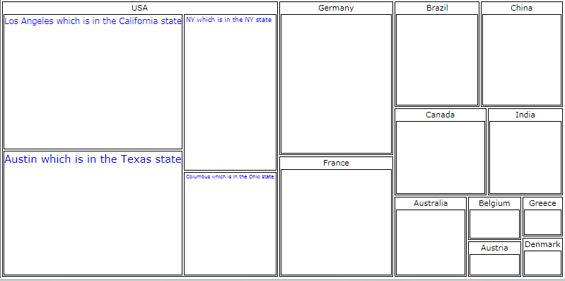
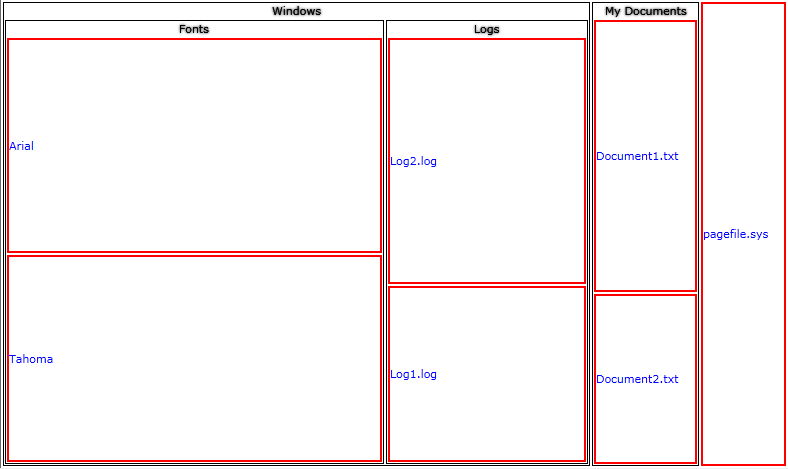

# Styles and Templates

This section is intended to give you a broad understanding of the possible ways in which you can change the visual appearance of the RadTreeMap and RadPivotMap.

You can modify the look of the RadTreeMap by using the __RadTreeMap.DefaultItemTemplate__ and __TypeDefinition.ItemTemplate__ properties. For the RadPivotMap you can use __RadPivotMap.LeafItemStyle__ and __GroupDefinition.ItemStyle__ properties. You can also use the __TypeDefiniton.ItemStyle__ which is common for both.

The following small practical samples will show you how to use this properties to customize your control:

## RadPivotMap

There could be cases in __RadPivotMap__ when the text per rectangle is chopped due to the size of the rectangles calculated, it is not adjustable by just tuning the text length and size because the rectangle size is recalculated every time when window size is changed. To have a fully readable labels you may wrap your TextBlock in a control like ViewBox for example which resizes itself based on the size of its content and put it in the header of your rectangle using __LeafTemplate__ like this:

#### __XAML__

```XAML
	<telerik:RadPivotMap x:Name="pivotMap" LayoutStrategy="Squarified" ValuePath="Gdp" LabelPath="City">
	    <telerik:RadPivotMap.LeafTemplate>
	        <DataTemplate>
	            <Viewbox>
	                <TextBlock Text="{Binding Label}" Foreground="Blue" />
	            </Viewbox>
	        </DataTemplate>
	    </telerik:RadPivotMap.LeafTemplate>
	    <telerik:RadPivotMap.GroupDefinitions>
	        <telerik:GroupDefinition Member="Country" />
	    </telerik:RadPivotMap.GroupDefinitions>
	</telerik:RadPivotMap>
```

This is the full source code of the sample:

#### __C#__

```C#
    public MainPage()
	{
	    InitializeComponent();
	    pivotMap.ItemsSource = this.GetData();
	}
	
	public class GdpInfo
	{
	    public string Continent { get; set; }
	    public string Country { get; set; }
	    public string City { get; set; }
	    public double Gdp { get; set; }
	}
	
	public List<GdpInfo> GetData()
	{
	    List<GdpInfo> data = new List<GdpInfo>()
	    {
	        new GdpInfo() { Country = "Australia", Gdp = 1146 },
	        new GdpInfo() { Country = "Austria", Gdp = 385.1 },
	        new GdpInfo() { Country = "Belgium", Gdp = 468.6 },
	        new GdpInfo() { Country = "Brazil", Gdp = 1749 },
	        new GdpInfo() { Country = "Canada", Gdp = 1565 },
	        new GdpInfo() { Country = "China", Gdp = 1700 },
	        new GdpInfo() { Country = "Denmark", Gdp = 318.1 },
	        new GdpInfo() { Country = "France", Gdp = 2669 },
	        new GdpInfo() { Country = "Germany", Gdp = 3402 },
	        new GdpInfo() { Country = "Greece", Gdp = 329 },
	        new GdpInfo() { Country = "India", Gdp = 1290 },
	        new GdpInfo() { Country = "USA", City = "NY which is in the NY state ", Gdp = 3000 },
	        new GdpInfo() { Country = "USA", City = "Columbus which is in the Ohio state", Gdp = 2000 },
	        new GdpInfo() { Country = "USA", City = "Los Angeles which is in the California state", Gdp = 5000 },
	        new GdpInfo() { Country = "USA", City = "Austin which is in the Texas state", Gdp = 4600 },
	    };
	    return data;
	}
```

#### __VB.NET__

```VB.NET
	  Public Sub New()
		InitializeComponent()
		pivotMap.ItemsSource = Me.GetData()
	End Sub
	
	Public Class GdpInfo
		Public Property Continent() As String
		Public Property Country() As String
		Public Property City() As String
		Public Property Gdp() As Double
	End Class
	
	Public Function GetData() As List(Of GdpInfo)
		Dim data As New List(Of GdpInfo)() From {New GdpInfo() With {.Country = "Australia", .Gdp = 1146},
		New GdpInfo() With {.Country = "Austria", .Gdp = 385.1},
		New GdpInfo() With {.Country = "Belgium", .Gdp = 468.6},
		New GdpInfo() With {.Country = "Brazil", .Gdp = 1749}, 
		New GdpInfo() With {.Country = "Canada", .Gdp = 1565},
		New GdpInfo() With {.Country = "China", .Gdp = 1700}, 
		New GdpInfo() With {.Country = "Denmark", .Gdp = 318.1},
		New GdpInfo() With {.Country = "France", .Gdp = 2669},
		New GdpInfo() With {.Country = "Germany", .Gdp = 3402}, New GdpInfo() With {.Country = "Greece", .Gdp = 329},
		New GdpInfo() With {.Country = "India", .Gdp = 1290}, New GdpInfo() With {.Country = "USA", .City = "NY which is in the NY state ", .Gdp = 3000},
		New GdpInfo() With {.Country = "USA", .City = "Columbus which is in the Ohio state", .Gdp = 2000},
		New GdpInfo() With {.Country = "USA", .City = "Los Angeles which is in the California state", .Gdp = 5000},
		New GdpInfo() With {.Country = "USA", .City = "Austin which is in the Texas state", .Gdp = 4600}}
		Return data
	End Function
```

>caution Since you wrapped the TextBlock in a ViewBox, the Size of the Text will change according to the space available which will lead to texts with different size (shown on the image below). If you don't want such appearance, you should consider removing the ViewBox and using __TextWrapping__ and __MaxWidth__ for the TextBlock-s.

The result is shown below:


## RadTreeMap

You can customize the way __RadTreeMap__ Items look like per *TypeDefinition*. This is where the __TypeDefinition's ItemStyle__ comes in handy. For example you want every Label to be colored Blue and to have a Red Border per every Item with TypeDefinition where the TargetTypeName is *File*.

>Please refer to the [Populating With Data RadTreeMap]() for the full source code of the sample.

#### __XAML__

```XAML
	<telerik:RadTreeMap Name="treeMap1">
		<telerik:RadTreeMap.TypeDefinitions>
			<telerik:TypeDefinition TargetTypeName="File" ValuePath="Size" LabelPath="Name">
				<telerik:TypeDefinition.ItemStyle>
					<Style TargetType="telerik:RadTreeMapItem" >
						<Setter Property="Control.Foreground" Value="Blue" />
						<Setter Property="Template">
							<Setter.Value>
								<ControlTemplate>
									<Border BorderBrush="Red" BorderThickness="2">
										<TextBlock Text="{Binding Label}" VerticalAlignment="Center"/>
									</Border>
								</ControlTemplate>
							</Setter.Value>
						</Setter>
					</Style>
				</telerik:TypeDefinition.ItemStyle>
			</telerik:TypeDefinition>
			<telerik:TypeDefinition TargetTypeName="Folder" ValuePath="Size" ChildrenPath="Children" LabelPath="Name" />
		</telerik:RadTreeMap.TypeDefinitions>
	</telerik:RadTreeMap>
```

The result is shown on the following image:

