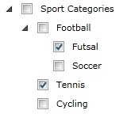
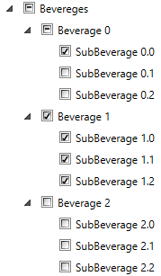
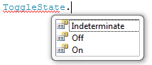
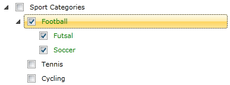

# CheckBox Support

Telerik __RadTreeView__ provides check boxes/radio buttons displayed next to each item. The __RadTreeView__ allows the user to check/uncheck the nodes and to perform various tasks with the collection of checked nodes. Using the corresponding events, you can entirely handle the node-check action.	  

The purpose of this tutorial is to show you how to:

* Enable check boxes next to each item - declaratively and programmatically.		  

	* Use the "tri-state" feature of the check boxes.
	* Access the check state property of the __RadTreeViewItem__ class.
	* Access the initially checked item when using the "[tri-state](#tri-state-check-boxes)" feature of the check boxes.			  

* Use the corresponding events to handle the check/uncheck action. 

For the next tasks will be used the treeview shown on the next figure. 


```XAML
	<telerik:RadTreeView Margin="8" x:Name="radTreeView">
	    <telerik:RadTreeViewItem Header="Sport Categories">
	        <telerik:RadTreeViewItem Header="Football">
	            <telerik:RadTreeViewItem Header="Futsal"/>
	            <telerik:RadTreeViewItem Header="Soccer"/>
	        </telerik:RadTreeViewItem>
	        <telerik:RadTreeViewItem Header="Tennis"/>
	        <telerik:RadTreeViewItem Header="Cycling"/>
	    </telerik:RadTreeViewItem>
	</telerik:RadTreeView>
```

## Enable Check Boxes Declaratively 

__RadTreeView__ provides check boxes displayed next to each item. In order to enable this behavior you need to set the __IsOptionElementsEnabled__ property of the __RadTreeView__ to __True__.
			

For example, add the following attribute to the treeview declaration in XAML: 

```XAML
	<telerik:RadTreeView x:Name="radTreeView" IsOptionElementsEnabled="True">
```

Here is a snapshot of the result. 


## Enable Check Boxes Programmatically 

You might want to enable check boxes in the code-behind. In order to do this, set the __IsOptionElementsEnabled__ property of an instance of the __RadTreeView__ class to __True__.

```C#
	private void EnableCheckBoxes()
	{
	    radTreeView.IsOptionElementsEnabled = true;
	}
```
```VB.NET
	Private Sub EnableCheckBoxes()
	    radTreeView.IsOptionElementsEnabled = True
	End Sub
```

## "Tri-state" Check Boxes 

The Tri-State CheckBox mode of __RadTreeView__ allows for RadTreeViewItems' CheckBoxes to have an additional, third state - __Indeterminate__. To enable it you need to set the __IsTriStateMode__ property of the __RadTreeView__ to __True__. When this mode is activated the __CheckState__ property of each item depends on the __CheckState__ property of its direct child items and its parent item. In this mode an item will be checked only if all of its child items are checked. The same item will be unchecked if all of its child items are unchecked. In all other combinations of states of its children the item will be in __Indeterminate__ state. It is important to keep in mind that if a parent item is checked or unchecked all its child items will inherit that state. This also will force its parent (if any) to update its state. This will recursively propagate all the way to the root of the RadTreeView.

```XAML
	<telerik:RadTreeView x:Name="radTreeView" IsOptionElementsEnabled="True" IsTriStateMode="True">
```

The result can be seen on the next figure: 


The "Tri-state" behavior can be activated in the code-behind too. To do so, set the __IsTriStateMode__ property of an instance of the __RadTreeView__ class to __True__.		

```C#
	radTreeView.IsTriStateMode = true;
```
```VB.NET
	radTreeView.IsTriStateMode = True
```

>important Please keep in mind that the __RadTreeView__ 'tri-state' check boxes logic is desined to work in declaratively populated __RadTreeView__ control. This is why if your applicaiton implements an MVVM approach and the __RadTreeView__ is databound, it's best to define custom 'tri-state' logic in your ViewModels following [this  tutorial]().

## Accessing the CheckState Property of a RadTreeViewItem 

To see the Item check state in the code-behind you should use the __CheckState__ property of the __RadTreeViewItem__ class. The __CheckState__ property is a __ToggleState__ enumeration and has the following values:


* __On__ - the treeview item is checked.
* __Off__ - the treeview item is not checked.			
* __Indeterminate__ - the treeview item has items that are checked and items that are not checked. This state is available only when the __RadTreeView IsTriStateMode__ property is set to __True__.			

>The __ToggleState__ enumeration is a part of the __System.Windows.Automation__ namespace.		  

## Accessing the initially checked item when using the "tri-state" check boxes 

In order to access the initially checked item when the __RadTreeView.IsTriStateMode__ property is set to __True__ you should use the __IsUserInitiated__  property of the __RadTreeViewCheckEventArgs__ class. The __IsUserInitiated__ property is a __Boolean__ property that indicates whether the item is the initially checked one.

```C#
	private void RadTreeViewItem_Checked(object sender, Telerik.Windows.RadRoutedEventArgs e)
	{
	 bool isInitiallyChecked = (e as RadTreeViewCheckEventArgs).IsUserInitiated;
	}
```

## Events 

The __RadTreeView__ and __RadTreeViewItem__ classes offer you four events for managing the changes of the item check state. These events are available both on the __RadTreeView__ and on the __RadTreeViewItem__ classes.		

```XAML
	<telerik:RadTreeView Margin="8" x:Name="radTreeView" IsOptionElementsEnabled="True"
	        PreviewChecked="radTreeView_PreviewChecked"
	        Checked="radTreeView_Checked"
	        PreviewUnchecked="radTreeView_PreviewUnchecked"
	        Unchecked="radTreeView_Unchecked">
```

The __PreviewChecked__ event occurs when the treeview item is about to be checked. The __Checked__ event is fired when the treeview item is already checked. The type of the passed event arguments for both of the events is __RadRoutedEventArgs__. In the event handlers you can place some code. For example, the following lines of code will set the foreground of the checked node green:

```C#
	private void radTreeView_Checked( object sender, RadRoutedEventArgs e )
	{
	    ( e.Source as RadTreeViewItem ).Foreground = new SolidColorBrush( Colors.Green );
	}
```
```VB.NET
	Private Sub radTreeView_Checked(ByVal sender As Object, ByVal e As RadRoutedEventArgs)
	    TryCast(e.Source, RadTreeViewItem).Foreground = New SolidColorBrush(Colors.Green)
	End Sub
```

And here is the result: 


The __PreviewUnchecked__ event is fired when the treeview item is about to be unchecked. The __Unchecked__ event occurs when the treeview item is unchecked. The type of the passed event arguments for both of the events is __RadRoutedEventArgs__.

>The __RadRoutedEventArgs__ class is part of the Telerik.Windows namespace. 

<!-- -->
>For a full list of the exposed by the __RadTreeView__ events, please refer to the [Events - Overview]() topic.
