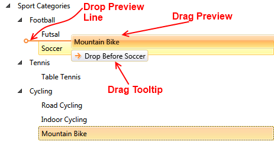
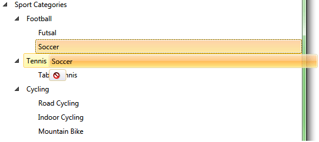
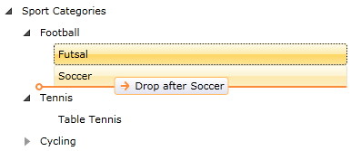
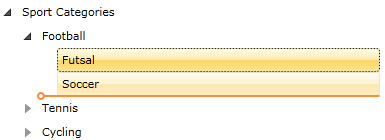
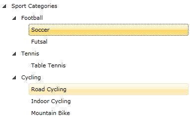

# Customizing Drag and Drop 

The drag/drop operations in RadTreeView can be customized using the control's API or the DragDropManager.

This article describes the customization points available in the control.

## Visual Elements of the Drag and Drop Operation 

Once enabled, dragging behavior by default allows items to be dropped on other items and between items. A line between the items will be displayed briefly as a visual indicator that the item can be dropped in the location of the line. 

#### Figure 1: Drag drop in action


The drag/drop operation contains three __visual elements__ (tooltips):		

* Drag Preview
* Drag Tooltip
* Drop Preview Line

#### Figure 2: Drag drop visual elements


More details about how to disable each one of the elements you will find later in the topic.

## Disable Drop Operation on Specific Item 

To disable the drop action on a specific RadTreeViewItem, set its __IsDropAllowed__ to False.
		
__Example 1: Disable drop in XAML__ 
```XAML
	<telerik:RadTreeViewItem x:Name="radTreeViewItem" IsDropAllowed="False">
```

__Example 2: Disable drop in code-behind__
```C#
	private void DisableDropOnSpecificItem()
	{
	    radTreeViewItem.IsDropAllowed = false;
	}
```
```VB.NET
	Private Sub DisableDropOnSpecificItem()
	    radTreeViewItem.IsDropAllowed = False
	End Sub
```

#### Figure 3: Disabled drop action


## Disable Drag Preview

To disable the [Drag Preview](#visual-elements-of-the-drag-and-drop-operation), set the __IsDragPreviewEnabled__ property of RadTreeView to False.

__Example 3: Disable drag preview in XAML__  
```XAML
	<telerik:RadTreeView x:Name="radTreeView" IsDragDropEnabled="True" IsDragPreviewEnabled="False">
```

__Example 4: Disable drag preview in code-behind__  
```C#
	private void DisableDragPreview()
	{
	    radTreeView.IsDragPreviewEnabled = false;
	}
```
```VB.NET
	Private Sub DisableDragPreview()
	    radTreeView.IsDragPreviewEnabled = False
	End Sub
```

#### Figure 4: Hidden drag preview element


## Disable Drag Tooltip 

To disable the [Drag Tooltip](#visual-elements-of-the-drag-and-drop-operation), set the __IsDragTooltipEnabled__ property of RadTreeView to False.

__Example 5: Disable drag tooltip in XAML__  
```XAML
	<telerik:RadTreeView x:Name="radTreeView" 
						 IsDragDropEnabled="True"
						 IsDragPreviewEnabled="False"
						 IsDragTooltipEnabled="False">
```

__Example 6: Disable drag tooltip in code-behind__  
```C#
	private void DisableDragTooltip()
	{
	    radTreeView.IsDragTooltipEnabled = false;
	}
```
```VB.NET
	Private Sub DisableDragTooltip()
	    radTreeView.IsDragTooltipEnabled = False
	End Sub
```

#### Figure 5: Hidden drag tooltip


## Disable Drop Preview Line 

To disable the [Drag Preview Line](#visual-elements-of-the-drag-and-drop-operation), set the __IsDropPreviewLineEnabled__ property of RadTreeView to False.

__Example 7: Disable drop preview line__  
```XAML
	<telerik:RadTreeView x:Name="radTreeView" 
						IsDragDropEnabled="True"
						IsDragPreviewEnabled="False"
						IsDragTooltipEnabled="False"
						IsDropPreviewLineEnabled="False">
```

__Example 8: Disable drop preview line in code-behind__  
```C#
	private void DisableDropPreviewLine()
	{
	    radTreeView.IsDropPreviewLineEnabled = false;
	}
```
```VB.NET
	Private Sub DisableDropPreviewLine()
	    radTreeView.IsDropPreviewLineEnabled = False
	End Sub
```

#### Figure 6: Hidden drag/drop visual elements


## Customizing Drag Drop Actions

The drag/drop feature of RadTreeView is implemented using [DragDropManager](). To customize the drag/drop actions, you can use the manager and subscribe to the corresponding events.

RadTreeView internally handles the following __DragDropManager events__:

* __DragInitialize__: Occurs when an object is about to be dragged. The control handles it in order to set all needed information regarding the drag - the DraggedItems, the DragVisual and the settings of the operation. This information is wrapped in a __TreeViewDragDropOptions__ object and passed to the arguments of the event.

* __GiveFeedback__: This event is continuously fired by the drag source during a drag/drop operation. The control handles it to apply an __Arrow__ cursor during the drag operation.

* __DragOver__: Occurs continuously while an object is dragged (moved) within the drop target's boundary. The control handles it to update the [DropPreview Line](#visual-elements-of-the-drag-and-drop-operation) position as well as the current action and position of the drop.

* __DragLeave__: Occurs when an object is dragged out of the drop target's boundary. The control handles it to update the [DropPreview Line](#visual-elements-of-the-drag-and-drop-operation) position as well as the current action and position of the drop.

* __Drop__: Occurs when an object is dropped on the drop target. The control handles it to implement the drop action.

* __DragDropCompleted__: Occurs when an object is dropped on the drop target and is used to notify the source that the drag operation is over. The control handles it to update its state and items based on the __DropAction__ type of a successful drop.

As RadTreeView handles internally the above DragDropManager events, in order to add a custom handler, you need to explicitly specify that you're adding a __handler that should be invoked even for already handled events__. This is done through the last - __bool__ - argument of the __DragDropManager.Add[Event]Handler__ extension method.

__Example 9: Subscribe to the DragOver event__  
```C#
	DragDropManager.AddDragOverHandler(xTreeView, OnTreeViewDragOver, true);  
```
```VB.NET
	DragDropManager.AddDragOverHandler(xTreeView, OnTreeViewDragOver, True) 
```		

>tip Find more information about the __DragDropManager__ events in the [Events]() tutorial.

The RadTreeView drag/drop operation creates a __TreeViewDragDropOptions__ object which is the payload and passed to the __Data__ property of the drag/drop event arguments. You can extract that object through the event arguments of the __DragDropManager__ events.

__Example 10: Getting the TreeViewDragDropOptions__  
```C#
	private void OnDragOver(object sender, Telerik.Windows.DragDrop.DragEventArgs e) 
    { 
        var options = DragDropPayloadManager.GetDataFromObject(e.Data, TreeViewDragDropOptions.Key) as TreeViewDragDropOptions;
    } 
```
```VB.NET
	Private Sub OnDragOver(ByVal sender As Object, ByVal e As Telerik.Windows.DragDrop.DragEventArgs)
		Dim options = TryCast(DragDropPayloadManager.GetDataFromObject(e.Data, TreeViewDragDropOptions.Key), TreeViewDragDropOptions)
	End Sub
```	

The __TreeViewDragDropOptions__ class exposes the following properties:		

* __DropAction__: Gets or sets the drop action that should be executed when drag drop operation completes. It is an enumeration of type __DropAction__ that exposes the following members:

	* __Copy__: Dragged items will be added to the destination and will not be removed from the source.
	* __Move__: Dragged items will be added to the destination and will be removed from the source.
	* __Delete__: Dragged items will not be added to the destination and will be removed from the source.
	* __None__: Dragged items will not be added to the destination and will not be removed from the source. If the drop operation is allowed, the default __DropAction__ is __Move__. And in order to change this logic, it would be best to define a custom __DragOverHandler__ and customize the __DropAction__ value in it. However, please note that you need to handle the __DragDropManager DragOver__ event of the __RadTreeView__ that is acting as a destination for the drop operation.
	
* __DropPosition__: Gets or sets the drop position of the dragged items. It is an enumeration of type __DropPosition__ that provides the following members:
	* __Before__: Indicates that the dragged items will be dropped before the target.
	* __Inside__: Indicates that the dragged items will be dropped inside the target.
	* __After__: Indicates that the dragged items will be dropped after the target.
	* __Undefined__: Indicates that the drop position of the item is not yet determined.	
	
* __DragVisual__: Gets or sets a visual representation of the drag/drop operation state. By default a [TreeViewDragVisual ](http://www.telerik.com/help/silverlight/t_telerik_windows_controls_treeview_treeviewdragvisual.html)[TreeViewDragVisual ](http://www.telerik.com/help/wpf/t_telerik_windows_controls_treeview_treeviewdragvisual.html) object is created automatically.

* __DraggedItems__: Gets an __IEnumerable__ collection populated with the dragged items.

* __DragSourceItem__: Gets the __RadTreeViewItem__ which has started the current drag/drop operation. This property is initialized when the drag operation starts and it will be __null__ if the __RadTreeView__ control is not the source of the operation.

* __DropTargetItem__: Gets the __RadTreeViewItem__ laying under the drop point. This property is initialized while dragging directly over a __RadTreeViewItem__ and it is set to __null__ as soon as the drag leaves the bounds of the __RadTreeViewItem__.

* __DropTargetTree__: Gets the __RadTreeView__ laying under the drop point. This property is initialized while dragging directly over a __RadTreeView__ and it is set to __null__ as soon as the drag leaves the bounds of the __RadTreeView__.

In order to __reflect changes in the TreeViewDragDropOptions object to the drag visual__, call the TreeViewDragDropOptions' __UpdateDragVisual method__. For instance, if you need to disable a drag operation and you set the TreeViewDragDropOptions DropAction value to None, the visual feedback of the operation won't reflect that change although the drop operation will be forbidden. And in order to make the RadTreeView instance update its drag visual to display a *DropImpossible* indicator, you need to invoke the UpdateDragVisual method.

__Example 11: Using the UpdateDragVisual method__  
```C#
	private void OnDragOver(object sender, Telerik.Windows.DragDrop.DragEventArgs e) 
    { 
        var options = DragDropPayloadManager.GetDataFromObject(e.Data, TreeViewDragDropOptions.Key) as TreeViewDragDropOptions; 
        if (options!=null && options.DropPosition != Telerik.Windows.Controls.DropPosition.Inside) 
        { 
            options.DropPosition = Telerik.Windows.Controls.DropPosition.Inside; 
            options.UpdateDragVisual(); 
        } 
    } 
```
```VB.NET
	Private Sub OnDragOver(ByVal sender As Object, ByVal e As Telerik.Windows.DragDrop.DragEventArgs)
		Dim options = TryCast(DragDropPayloadManager.GetDataFromObject(e.Data, TreeViewDragDropOptions.Key), TreeViewDragDropOptions)

		If options IsNot Nothing AndAlso options.DropPosition <> Telerik.Windows.Controls.DropPosition.Inside Then
			options.DropPosition = Telerik.Windows.Controls.DropPosition.Inside
			options.UpdateDragVisual()
		End If
	End Sub
```

## See Also
 * [Enable Only Drop Inside]()
 * [Disable Drop at Specific Location]()
 * [Implement Copy Drag]()
 * [Auto Expand on Drag Over]()
