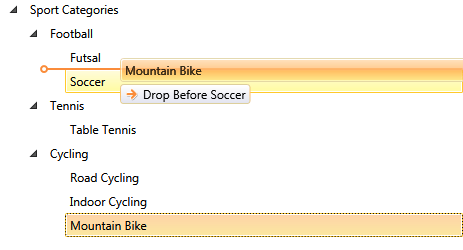
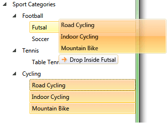
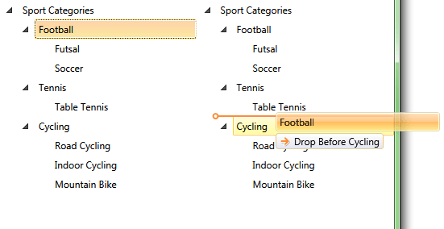

# Drag and Drop Support

The Telerik __RadTreeView__ control enhances further your application's capabilities through the rich drag-and-drop functionality. Your users can create and re-order any hierarchical structures and easily perform various drag-and-drop operations.

The following example shows a basic RadTreeView definition and enabled drag/drop feature. To enable the drag and drop, set the __IsDragDropEnabled__ property to True.

__Example 1: Enabling the drag and drop feature__
```XAML
	<telerik:RadTreeView x:Name="radTreeView" IsDragDropEnabled="True">
	    <telerik:RadTreeViewItem Header="Sport Categories">
	        <telerik:RadTreeViewItem Header="Football">
	            <telerik:RadTreeViewItem Header="Futsal"/>
	            <telerik:RadTreeViewItem Header="Soccer"/>
	        </telerik:RadTreeViewItem>
	        <telerik:RadTreeViewItem Header="Tennis">
	            <telerik:RadTreeViewItem Header="Table Tennis"/>
	        </telerik:RadTreeViewItem>
	        <telerik:RadTreeViewItem Header="Cycling">
	            <telerik:RadTreeViewItem Header="Road Cycling"/>
	            <telerik:RadTreeViewItem Header="Indoor Cycling"/>
	            <telerik:RadTreeViewItem Header="Mountain Bike"/>
	        </telerik:RadTreeViewItem>
	    </telerik:RadTreeViewItem>
	</telerik:RadTreeView>
```

#### Figure 1: Drag drop in action


__Example 2: Enabling the Drag/Drop functionality in code-behind__  
```C#
	private void EnableDragAndDrop()
	{
		radTreeView.IsDragDropEnabled = true;
	}
```
```VB.NET
	Private Sub EnableDragAndDrop()
	    radTreeView.IsDragDropEnabled = True
	End Sub
```

>tip In data binding scenario it is recommended to assign an INotifyCollectionChanged implementation (like ObservableCollection&lt;T&gt;) to the ItemsSource of RadTreeView. Otherwise, the drag/drop actions won't be reflected properly in the UI. Additionally, the __ItemsSource__ of the treeview items where drag/drop action will happen should be initialized. In case, the corresponding ItemsSource is null, the drop action won't get executed. Also, if the ItemsSource of RadTreeView or RadTreeViewItem is not an __IList__ implementation, then the drop operation is not allowed.

## Enable Drag of Multiple Items

The drag operation is based on the selected items in RadTreeView. To enable dragging of multiple items you will need to enable the multiple selection feature. To do so, set the __SelectionMode__ property of RadTreeView to __Multiple__  or __Extended__. 

__Example 3: Turn on multi-selection__  
```XAML
	<telerik:RadTreeView x:Name="radTreeView" 
						 IsDragDropEnabled="True" 
						 SelectionMode="Multiple">
```

__Example 4: Turn on multi-selection in code-behind__  
```C#
	private void EnableDragOfMultipleNodes()
	{
	    radTreeView.SelectionMode = Telerik.Windows.Controls.SelectionMode.Multiple;
	}
```
```VB.NET
	Private Sub EnableDragOfMultipleNodes()
	    radTreeView.SelectionMode = Telerik.Windows.Controls.SelectionMode.Multiple
	End Sub
```

#### Figure 2: Dragging multiple items


## DragDrop AutoScrolling Behavior

Since Q2 2013, you can take advantage of the built-in auto-scrolling functionality. Moreover, there are a set of properties exposed to allow you to customize the auto-scrolling functionality to better fit your needs.

The auto-scrolling functionality is controlled through the following attached properties:

* __ScrollingSettingsBehavior.IsEnabled__: Gets or sets a __bool__ value indicating whether the auto-scrolling behavior is enabled.
* __ScrollingSettingsBehavior.ScrollStep__: Gets or sets a __double__ value defining the scrolling offset used to define a single step during the scroll operation.
* __ScrollingSettingsBehavior.ScrollStepTime__: Gets or sets a __TimeSpan__ value defining the timeout period between two scroll steps.

This feature is not available with the [legacy DragDropExecutionMode]().

## Drag and Drop Between TreeViews 

RadTreeView allows you to automatically drag and drop between two or more RadTreeView instances without the need to implement additional code. To do so, set IsDragDropEnabled property of the corresponding treeview instances.

In order for the drag and drop to work automatically the treeviews should work directly with RadTreeViewItem elements. Or if the ItemsSource is set, the treeviews should contain the same type of objects. Otherwise, some custom conversion code should be implemented.

The following example shows how to use the feature with two RadTreeView instances.

__Example 5: Define two RadTreeView controls__  
```XAML
	<Grid>	
		<Grid.ColumnDefinitions>
			<ColumnDefinition/>
			<ColumnDefinition/>
		</Grid.ColumnDefinitions>
		<telerik:RadTreeView x:Name="radTreeView1" IsDragDropEnabled="True">
			<telerik:RadTreeViewItem Header="Sport Categories">
				<telerik:RadTreeViewItem Header="Football">
					<telerik:RadTreeViewItem Header="Futsal"/>
					<telerik:RadTreeViewItem Header="Soccer"/>
				</telerik:RadTreeViewItem>
				<telerik:RadTreeViewItem Header="Tennis">
					<telerik:RadTreeViewItem Header="Table Tennis"/>
				</telerik:RadTreeViewItem>
				<telerik:RadTreeViewItem Header="Cycling">
					<telerik:RadTreeViewItem Header="Road Cycling"/>
					<telerik:RadTreeViewItem Header="Indoor Cycling"/>
					<telerik:RadTreeViewItem Header="Mountain Bike"/>
				</telerik:RadTreeViewItem>
			</telerik:RadTreeViewItem>
		</telerik:RadTreeView>
		<telerik:RadTreeView x:Name="radTreeView2" Grid.Column="1" IsDragDropEnabled="True">
			<telerik:RadTreeViewItem Header="Sport Categories">
				<telerik:RadTreeViewItem Header="Football">
					<telerik:RadTreeViewItem Header="Futsal"/>
					<telerik:RadTreeViewItem Header="Soccer"/>
				</telerik:RadTreeViewItem>
				<telerik:RadTreeViewItem Header="Tennis">
					<telerik:RadTreeViewItem Header="Table Tennis"/>
				</telerik:RadTreeViewItem>
				<telerik:RadTreeViewItem Header="Cycling">
					<telerik:RadTreeViewItem Header="Road Cycling"/>
					<telerik:RadTreeViewItem Header="Indoor Cycling"/>
					<telerik:RadTreeViewItem Header="Mountain Bike"/>
				</telerik:RadTreeViewItem>
			</telerik:RadTreeViewItem>
		</telerik:RadTreeView>
	</Grid>
```

#### Figure 3: Dragging items between two treeviews 


To enable __drag/drop between RadTreeView and another control__ (such as ListBox), you can customize the default drag/drop actions using the [DragDropManager](). Read more about this in the [How To Implement Drag and Drop Between TreeView and ListBox]() article.

## See Also
 * [Enable Only Drop Inside]()
 * [Disable Drop at Specific Location]()
 * [Implement Copy Drag]()
 * [Auto Expand on Drag Over]()
