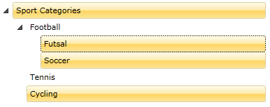

# Selection

__RadTreeView__ lets users select single or multiple nodes by simply setting the __SelectionMode__ property. Furthermore, you can manage the selection process using events exposed by the __RadTreeViewItem__ and __RadTreeView__ classes. This tutorial will walk you through the common tasks of:
	  

* [Selecting an item declaratively and programmatically](#Selecting_an_Item_Declaratively_and_Programmatically)
* [Selecting an item via the SelectedItems collection](#Selecting_an_Item_by_Using_the_SelectedItems_Collection)
* [Enabling single or multiple selection](#Changing_the_Selection_Mode)
* [Accessing the selected items in the code-behind](#Accessing_the_Selected_Item)
* [Handling the selection by the provided events](#Events)
* [Using the SelectedItem, SelectedValue and SelectedValuePath properties](#Using_the_SelectedItem,_SelectedValue_and_SelectedValuePath_Properties)
* [Binding the IsSelected property to a property of a business object](#Binding_the_IsSelected_Property)

## Selecting an Item Declaratively and Programmatically

If you want to select an item you need to set the __RadTreeViewItem__'s __IsSelected__ property to __True__.
		

#### __XAML__

{{region radtreeview-feautres-treeviewitem-selection_0}}
	<telerik:RadTreeViewItem x:Name="radTreeViewItem" IsSelected="True"/>
	{{endregion}}

#### __C#__

{{region radtreeview-feautres-treeviewitem-selection_1}}
	radTreeViewItem.IsSelected = true;
{{endregion}}

#### __VB.NET__

{{region radtreeview-feautres-treeviewitem-selection_2}}
	radTreeViewItem.IsSelected = True
{{endregion}}

>Note that the code snippets above cover a scenario when your __RadTreeView__ is [populated declaratively]() (with static data). If you want to bind the __IsSelected__ property to a property of a custom business object, check out the [Binding the IsSelected Property](#Binding_the_IsSelected_Property) section at the end of this topic.
		  

## Selecting an Item by Using the SelectedItems Collection

Another way to select a treeview item programmatically is to add it to the __SelectedItems__ collection of the __RadTreeView__ class. There are two possible cases here depending on how the __RadTreeView__ is populated.

* If your __RadTreeView__ is populated declaratively in XAML (with static data), then the __SelectedItems__ collection will contain instances of the __RadTreeViewItem__ class.

	#### __C#__

	{{region radtreeview-feautres-treeviewitem-selection_3}}
		radTreeView.SelectedItems.Add( radTreeViewItem );
	{{endregion}}

	#### __VB.NET__

	{{region radtreeview-feautres-treeviewitem-selection_4}}
		radTreeView.SelectedItems.Add(radTreeViewItem)
	{{endregion}}

* If your __RadTreeView__ is [data bound to a business object](), then the situation is different. The __SelectedItems__ collection will contain instances of your business object.
		  

	#### __C#__

	{{region radtreeview-feautres-treeviewitem-selection_5}}
		radTreeView.SelectedItems.Add( myViewModel );
	{{endregion}}

	#### __VB.NET__

	{{region radtreeview-feautres-treeviewitem-selection_6}}
		radTreeView.SelectedItems.Add(myViewModel)
	{{endregion}}

## Changing the Selection Mode

The __RadTreeView__ API allows you to change the selection mode of the treeview. You need to set the __SelectionMode__ property to do that. The __SelectionMode__ property is a __SelectionMode__ enumeration that exposes the following members:

* __Single__ - use it for a single selection. In this mode the user will be available to select only one item at once.

* __Multiple__ - allows selection of multiple items. Clicking an item selects or deselects it depending on its current state. Also, the previously selected items will preserve their selection state.

* __Extended__ - use this mode when you want the user to be able to select multiple items at one time by holding down the __Ctrl__ or __Shift__ keys and clicking multiple items with the mouse or by using the keyboard. A second click on a selected item will unselect that item.

>important Until Q3 2015 __Multiple__ and __Extended__ SelectionModes worked the same way.  

> There are two __SelectionMode__ enumerations - __'System.Windows.Controls.SelectionMode'__ and  __'Telerik.Windows.Controls.SelectionMode'__ 

If you intend to change the __SelectionMode__ in the code-behind you need to use the second one:

#### __C#__
	private void ChangeSelectionMode()
	{
		radTreeView.SelectionMode = Telerik.Windows.Controls.SelectionMode.Multiple;
	}
	
#### __VB.NET__
	Private Sub ChangeSelectionMode()
		radTreeView.SelectionMode = Telerik.Windows.Controls.SelectionMode.Multiple
	End Sub
	
The next example demonstrates how to set the __SelectionMode__ property.		

#### __XAML__
	{{region radtreeview-feautres-treeviewitem-selection_7}}
		<telerik:RadTreeView x:Name="radTreeView" SelectionMode="Multiple">
	{{endregion}}

As you can see from the snapshot below, now you are able to select more than one item (node).

>tip The default selection of the __RadTreeView__ is __Single__.
		

## Accessing the Selected Item(s)

The __RadTreeView__ class exposes several properties that allow you to access the currently selected item(s).

* __SelectedItem__- returns the currently selected item.
* __SelectedItems__ - this property returns a collection representing the currently selected items. It is appropriate to use the  __SelectedItems__ property when you have multiple selected items. __SelectedItems__ is an __ObservableCollection__ of objects.
* __SelectedContainer__ - gets the current selected item container. This property is __always__ of type __RadTreeViewItem__.
		  

Again, you have two possible cases:

* Your __RadTreeView__ is [populated declaratively]() in XAML (with static data). In this case, the __SelectedItem__ and __SelectedContainer__ properties will return objects of type __RadTreeViewItem__. The __SelectedItems__ collection contains __RadTreeViewItems__.	
* Your __RadTreeView__ is [data bound]() to a business object. In this case, the __SelectedItem__ property will be an instance of your business object. The __SelectedItems__ collection will contain instances of your business object. The __SelectedContainer__ property again will return __RadTreeViewItem__.

> When you have multiple selected items, the __SelectedItem__ property will return the first selected item in the treeview.
		  
<!-- -->
> When you reset the __RadTreeView__'s __Items__ collection (when you invoke the __RadTreeView.Items.Clear()__ method), that will also clear the __SelectedItems__ collection.

<!-- -->
> Telerik __RadTreeView__ class inherits from __ItemsControl__. The __Items__ collection of the __ItemsControl__ is a collection of data objects, __not__ from __RadTreeViewItems__. There is a very important concept about the items and item containers. For more information read [here]().

<!-- -->
> Each __ItemsControl__ provides two additional properties for working with selection - __SelectedValue__ and __SelectedValuePath__. If want to learn how to use these two properties, please check out the [Using SelectedItem, SelectedValue and SelectedValuePath](#Using_the_SelectedItem,_SelectedValue_and_SelectedValuePath_Properties) section at the end of this topic.

## Events
		 
The Telerik __RadTreeView__ and __RadTreeViewItem__ classes offer you five events for managing the edit process.		

#### __XAML__

{{region radtreeview-feautres-treeviewitem-selection_8}}
	<telerik:RadTreeView x:Name="radTreeView"
	        PreviewSelected="radTreeView_PreviewSelected"
	        Selected="radTreeView_Selected"
	        PreviewUnselected="radTreeView_PreviewUnselected"
	        Unselected="radTreeView_Unselected"
	        SelectionChanged="radTreeView_SelectionChanged"/>
	{{endregion}}

The __PreviewSelected__ event occurs when the treeview item is about to be selected. The __Selected__ event is fired when the treeview item is already selected. The type of the passed event arguments for both of the events is __RadRoutedEventArgs__. In the event handlers you can place some code.
		
For example, the next code snippet will change the __FontSize__ of the selected item.		

#### __C#__

{{region radtreeview-feautres-treeviewitem-selection_9}}
	private void radTreeView_Selected( object sender, RadRoutedEventArgs e )
	{
	    ( e.Source as RadTreeViewItem ).FontSize = 14;
	}
{{endregion}}

#### __VB.NET__

{{region radtreeview-feautres-treeviewitem-selection_10}}
	Private Sub radTreeView_Selected(ByVal sender As Object, ByVal e As RadRoutedEventArgs)
	    TryCast(e.Source, RadTreeViewItem).FontSize = 14
	End Sub
{{endregion}}

The __PreviewUnselected__ event is fired just before the currently selected item is unselected. The __Unselected__ event occurs when the treeview item is already unselected. The type of the passed event arguments for both of the events is __RadRoutedEventArgs__.

In order to handle a change in the selection you need to use the __SelectionChanged__ event. This event is available only for the __RadTreeView__ class. It is fired each time an item(s) is/are added or removed from the selection. The type of the passed event arguments for the event is __SelectionChangedEventArgs__. Here is a sample code for handling the __SelectionChanged__ event.

#### __C#__

{{region radtreeview-feautres-treeviewitem-selection_11}}
	private void radTreeView_SelectionChanged( object sender, Telerik.Windows.Controls.SelectionChangedEventArgs e )
	{
	    // Get a reference to the treeview
	    Telerik.Windows.Controls.RadTreeView treeView = sender as Telerik.Windows.Controls.RadTreeView;
	
	    // Get the currently selected items
	    ObservableCollection<Object> selectedItems = treeView.SelectedItems;
	    // Get the newly added items to the collection
	    IList addedItems = e.AddedItems;
	    // Get the removed items from the collection
	    IList removedItems = e.RemovedItems;
	}
	{{endregion}}

#### __VB.NET__

{{region radtreeview-feautres-treeviewitem-selection_12}}
	Private Sub radTreeView_SelectionChanged(ByVal sender As Object, ByVal e As Telerik.Windows.Controls.SelectionChangedEventArgs)
	    ' Get a reference to the treeview '
	    Dim treeView As Telerik.Windows.Controls.RadTreeView = TryCast(sender, Telerik.Windows.Controls.RadTreeView)
	
	    ' Get the currently selected items '
	    Dim selectedItems As ObservableCollection(Of [Object]) = treeView.SelectedItems
	
	    ' Get the newly added items to the collection '
	    Dim addedItems As IList = e.AddedItems
	
	    ' Get the removed items from the collection '
	    Dim removedItems As IList = e.RemovedItems
	End Sub
{{endregion}}
	
> Four out of the five events (__PreviewSelected, Selected, PreviewUnselected__ and __Unselected__) are exposed by both __RadTreeView__ and __RadTreeViewItem__ classes. While the __SelectionChanged__ event is available only in the __RadTreeView__ class.

## Using the SelectedItem, SelectedValue and SelectedValuePath Properties

The __SelectedValue__ property is used when you have linked your __RadTreeView__ to a data source and you want to return a value other than the one that is displayed. The __SelectedValuePath__ property provides a way to specify a __SelectedValue__ for the __SelectedItem__ in a __RadTreeView__. The __SelectedItem__ represents an object in the __Items__ collection and the __RadTreeView__ displays the value of a single property of the selected item. The __SelectedValuePath__ property specifies the path to the property that is used to determine the value of the __SelectedValue__ property. The next example illustrates this concept.

Imagine that you have a business object named __MyViewModel__, with three members (properties): __Title__, __Price__ and __Children__. And a __RadTreeView__ that is data bound to a list of __MyViewModel__ objects. The __Title__ property is the property that is displayed. The __Price__ is set to the __SelectedValuePath__ property.

#### __C#__

{{region radtreeview-feautres-treeviewitem-selection_13}}
	private class MyViewModel
	{
	    public string Title
	    {
	        get;
	        set;
	    }
	    public string Price
	    {
	        get;
	        set;
	    }
	    public IList<MyViewModel> Children
	    {
	        get;
	        set;
	    }
	}
{{endregion}}

#### __VB.NET__

{{region radtreeview-feautres-treeviewitem-selection_14}}
	Private Class MyViewModel
	Private _Title As String
	    Public Property Title() As String
	        Get
	            Return _Title
	        End Get
	        Set(ByVal value As String)
	            _Title = value
	        End Set
	    End Property
	
	Private _Price As String
	    Public Property Price() As String
	        Get
	            Return _Price
	        End Get
	        Set(ByVal value As String)
	            _Price = value
	        End Set
	    End Property
	
	Private _Children As IList(Of MyViewModel)
	    Public Property Children() As IList(Of MyViewModel)
	        Get
	            Return _Children
	        End Get
	        Set(ByVal value As IList(Of MyViewModel))
	            _Children = value
	        End Set
	    End Property
	End Class
{{endregion}}



#### __XAML__

{{region radtreeview-feautres-treeviewitem-selection_15}}
	<telerik:RadTreeView x:Name="radTreeView" SelectedValuePath="Price">
	    <telerik:RadTreeView.ItemTemplate>
	        <telerik:HierarchicalDataTemplate ItemsSource="{Binding RelatedItems}">
	            <TextBlock Text="{Binding Title}" />
	        </telerik:HierarchicalDataTemplate>
	    </telerik:RadTreeView.ItemTemplate>
	</telerik:RadTreeView>
{{endregion}}





#### __XAML__

{{region radtreeview-feautres-treeviewitem-selection_18}}
	<telerik:RadTreeView x:Name="radTreeView" SelectedValuePath="Price">
	    <telerik:RadTreeView.ItemTemplate>
	        <HierarchicalDataTemplate ItemsSource="{Binding RelatedItems}">
	            <TextBlock Text="{Binding Title}" />
	        </HierarchicalDataTemplate>
	    </telerik:RadTreeView.ItemTemplate>
	</telerik:RadTreeView>
{{endregion}}



When you select a __MyViewModel.Title__ from the __RadTreeView__, the __SelectedItem__ property returns the	 __MyViewModel__ data item that corresponds to the selected __Title__. However, because the __SelectedValuePath__ of this __RadTreeView__ is set to the __MyViewModel__'s __Price__ property, the __SelectedValue__ will return the __Price__ property of the __MyViewModel__ business object (e.g. 101.56$).		

## Binding the IsSelected Property

A very common issue is to have the __RadTreeViewItem__'s __IsSelected__ property bound to a property of a custom business object. The easiest way to achieve this is to use __ContainerBindingCollection__. For example, imagine your business object has a boolean property named __IsSelected__ and you want to bind the __IsSelected__ property of this business object to the __IsSelected__ property of the __RadTreeViewItem__. Thehe code snippet below demonstrates how to achieve this.



#### __XAML__

{{region radtreeview-feautres-treeviewitem-selection_16}}
	<!--Bindings collection for the RadTreeViewItems-->
	<telerik:ContainerBindingCollection x:Name="BindingsCollection">
	    <telerik:ContainerBinding PropertyName="IsSelected" Binding="{Binding IsSelected, Mode=TwoWay}" />
	</telerik:ContainerBindingCollection>
	....
	<telerik:HierarchicalDataTemplate  
	    x:Key="MyViewModelTemplate"  
	    telerik:ContainerBinding.ContainerBindings="{StaticResource BindingsCollection}">
	    <TextBlock Text="{Binding Name}" Foreground="Red" FontSize="16" FontFamily="Verdana" />
	</telerik:HierarchicalDataTemplate>
	....
	<telerik:RadTreeView ItemsSource="{Binding Source={StaticResource TreeViewDataSource}}" 
	    ItemTemplate="{StaticResource MyViewModelTemplate}"/>
{{endregion}}





#### __XAML__

{{region radtreeview-feautres-treeviewitem-selection_17}}
	
	<HierarchicalDataTemplate  
	    x:Key="MyViewModelTemplate">
	    <TextBlock Text="{Binding Name}" Foreground="Red" FontSize="16" FontFamily="Verdana" />
	</HierarchicalDataTemplate>
	....
	<telerik:RadTreeView  
	    ItemsSource="{Binding Source={StaticResource TreeViewDataSource}}" 
	    ItemTemplate="{StaticResource MyViewModelTemplate}"
	    ItemContainerStyle="{StaticResource ItemContainerStyle}"/>
{{endregion}}


		
# See Also

 * [How to Edit An Item]()
 * [Item Images]()
 * [Enable and Disable Items]()
 * [Expanding and Collapsing Items]()
 * [BringIntoView Support]()
