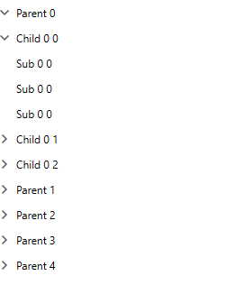
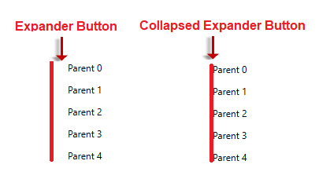
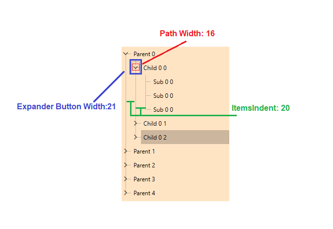
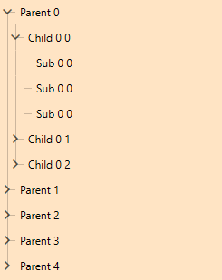

# Items Indent

The __RadTreeView__ allows you to control the indent of its items. You can do that by changing the value of the __ItemsIndent__ property. The default value of this property is 20.

__Example 1: Setting ItemsIndent Property__

```XAML
	<telerik:RadTreeView ItemsIndent="0" ItemsSource="{Binding NodeColletion}" ItemTemplate="{StaticResource dataTemplate}"/>
```

By setting the __ItemsIndent__ property to 0, we will vertically align all items in the RadTreeView. You can observe the outcome in __Figure 1__.

#### __Figure 1: Vertically Align TreeView Items__


## ExpanderButtonMinWidth

With the __2021 R1 SP1__ version of Telerik UI for WPF, we have to introduce the __ExpanderButtonMinWidth__ property of the RadTreeViewItem to control the width of the expander __ToggleButton__. This property has a different value depending on the theme. 

In __Figure 1__, the roots, and their nodes are vertically aligned. In a case when the nodes do not have children, the expander button will not be visible. Nevertheless, the expander ToggleButton is not visible. It still will occupy space depending on the __ExpanderButtonMinWidth__ property value. To completely remove the button, you can set the __ExpanderButtonMinWidth__ property to 0 and Collapsed the button. __Example 2__ demonstrate how you can do that through implicit style.

__Example 2: Collapsed Expander Button__
```XAML
	<Style TargetType="telerik:RadTreeViewItem" BasedOn="{StaticResource RadTreeViewItemStyle}">
		<Setter Property="ExpanderButtonMinWidth" Value="0" />
		<Setter Property="ExpanderStyle">
			<Setter.Value>
				<Style TargetType="ToggleButton">
					<Setter Property="Visibility" Value="Collapsed" />
				</Style>
			</Setter.Value>
		</Setter>
	</Style>
```

#### __Figure 2: Collapsed Expander Button__


## TreeView Lines and Item Indent

The control allows you to show connected lines between the nodes and their root nodes. More information regarding this feature can be found in the [Lines Support]() topic.

To correctly adjust the nodes' lines, the __ItemsIndent__ and __ExpanderButtonMinWidth__ properties need to be set. The __ItemsIndent__ property needs to be at least the half size of the expander Button. On the other hand, the ExpanderButtonMinWidth needs to be set to an odd value bigger than the expander button width. 

> The expander path element has a different width in different themes.

#### __Figure 3: Default Size of the Elements in Fluent Theme__


In the above case, we will reduce the space by using the __ItemsIndent__ and __ExpanderButtonMinWidth__ properties. The __ExpanderButtonMinWidth__ property can be set to an odd value bigger than the path's width. In our case, the minimum value will be 17. 

__Example 3: Set Compact View__
```XAML
	<Window.Resources>
		<HierarchicalDataTemplate x:Key="dataTemplate" ItemsSource="{Binding Children}" >
			<TextBlock Text="{Binding Header}" />
		</HierarchicalDataTemplate>
		<Style TargetType="telerik:RadTreeViewItem" BasedOn="{StaticResource RadTreeViewItemStyle}">
			<Setter Property="ExpanderButtonMinWidth" Value="17"/>
		</Style>        
	</Window.Resources>
	<Grid>
		<telerik:RadTreeView Background="Bisque" Loaded="RadTreeView_Loaded" ItemsIndent="9"  IsLineEnabled="True" IsRootLinesEnabled="True"  ItemsSource="{Binding NodeColletion}" ItemTemplate="{StaticResource dataTemplate}"/>
	</Grid>
```

#### __Figure 4: Compact TreeView Lines__


## See Also
 * [Selection]()
 * [Drag and Drop]()
 * [UI Virtualization]()
