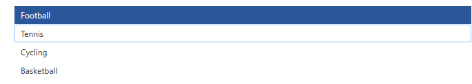

# Keyboard Support

__RadTreeView__ allows you to navigate through the nodes without using the mouse. The keyboard can entirely replace the mouse by allowing you to perform navigation, editing, expanding, collapsing and selecting the nodes.

## Keys List

RadTreeView provides support for the following keys:

* __Arrow Keys (Up, Down, Left and Right)__: Up and Down navigate through the items and change the selection. Left and Right, collapse and expand the selected node.

* __PageUp and PageDown__: Scroll the visible area up or down with an offset that equals the viewport (visible area) size. This action changes the selected item.

* __End and Home__: Go to the first or last RadTreeViewItem and selects it.

* __Enter__: If the selected item is in edit mode - commits the changes. Otherwise, toggles collapsed/expanded state.

* __Esc__: If the selected item is in edit mode - cancels the edit. If the drag operation is in progress it cancels it.

* __Multiply__: Expands all child items of the selected item.

* __Divide__ - Collapses all child items of the selected item.

* __Add and Substract__: Expand/collapses the selected item.

* __F2 and Space__: Starts edit mode.

* __Ctrl and Shift__: Selects multiple item selection while holding Ctrl or Shift and clicking on items with the mouse.

RadTreeView exposes several useful properties and events, which can help you control the keyboard interaction and get notified when a key is up or down.

## Properties 

Set the __IsTabStop__ property to include/exclude the control in the tab navigation cycle. If this property is set to __True__, then the control will be included; if it is __False__ then it will be skipped.

The __TabIndex__ property defines the index of the control in the tab navigation cycle. The lower the number is, the earlier the control will be focused while navigating using the Tab key. If you set this property, do not forget to set __IsTabStop__ to True. Once focused, you can navigate through the tab pages using the left and the right arrow keys. 

## Events 

* __KeyDown__: Get notofied when the user has pressed a keyboard key.
* __KeyUp__: Get notified when the user has released a keyboard key.

>tip To obtain the pressed key, the object that raised the event or some other information, use the instance of __System.Windows.Input.KeyEventArgs__ passed as a parameter to the event handler method.

In the example below you can see how to attach to __KeyDown__ and __KeyUp__ events and how to specify a value for the __TabNavigation__ property from your XAML. 

__Example 1: Subscribing to the KeyDown and KeyUp events__  
```XAML
	<telerik:RadTreeView x:Name="radTreeView" KeyDown="radTreeView_KeyDown" KeyUp="radTreeView_KeyUp"/>
```

The implementation of both of the event handlers `radTreeView_KeyDown` and `radTreeView_KeyUp` is located in the code-behind file (C# or VB.NET) and looks like in __Example 2__. 

__Example 2: Handling the KeyDown and KeyUp events__  	
```C#
	private void radTreeView_KeyDown( object sender, KeyEventArgs e )
	{
	    MessageBox.Show( "The pressed key is: " + e.Key.ToString() );
	}
	private void radTreeView_KeyUp( object sender, KeyEventArgs e )
	{
	    MessageBox.Show( "The released key is: " + e.Key.ToString() );
	}
```
```VB.NET
	Private Sub radTreeView_KeyDown(ByVal sender As Object, ByVal e As KeyEventArgs)
	    MessageBox.Show("The pressed key is: " & e.Key.ToString())
	End Sub
	Private Sub radTreeView_KeyUp(ByVal sender As Object, ByVal e As KeyEventArgs)
	    MessageBox.Show("The released key is: " & e.Key.ToString())
	End Sub
```

## Keyboard Selection

>More information on the __IsSelectable__ property of __RadTreeViewItem__ can be found in the [Selection]() topic. The __IsSelectable__ property is available since the __R3 2018__ version.

By default, navigating through the keyboard will select the given __RadTreeViewItem__. It exposes the __IsSelectable__ property through which this default behavior can be altered. Let's have the following example. In it the first item is selected and the second one has its __IsSelectable__ property set to __False__.

#### __Figure 1: RadTreeView with its first item selected__


When pressing the Down arrow key in this case the end result will be as follows.

#### __Figure 2: RadTreeView with the IsSelectable of the second item set to False__


## Text Search Navigation

RadTreeView allows you to navigate through items by typing on the keyboard __while the control is focused__. This will search and select the corresponding item.

To enable the feature, set the __IsTextSearchEnabled__ property to True.

To change the search mode that is used to match the results, set the __TextSearchMode__ property. This allows you to set one of the following modes:

* __StartsWith__: This is the default mode.
* __Contains__
* __StartsWithCaseSensitive__
* __ContainsCaseSensitive__


You can also utilize the __IsTextSearchCaseSensitive__ property of RadTreeView in order to determinne if the search is case sensitive. 


__Example 3: Setting up text search navigation__  
```XAML
	<telerik:RadTreeView IsTextSearchEnabled="True" TextSearchMode="Contains" />
```

When data binding the RadTreeView's ItemsSource property to a collection of business objects, you should set the __TextSearch.TextPath__ attached property in order to tell what property should be used for the text search. 

__Example 4: Setting TextPath__  
```XAML
	<telerik:RadTreeView IsTextSearchEnabled="True" telerik:TextSearch.TextPath="MyProperty" />
```

In __Example 4__ `MyProperty` points to a property defined in the view model of the treeview items. If the type text matches the value of this property, the corresponding item will get selected.

To increase the time interval for typing before the text is reset, set the __TextSearch.AutoCompleteTimeout__ static property.

__Example 5: Setting search text reset timeout__  
```XAML
	public MyUserControl() 
	{  
		Telerik.Windows.Controls.TextSearch.AutoCompleteTimeout = new TimeSpan(1500); 
		InitializeComponent();
	} 
```

Note that this property is used in several other Telerik controls and setting it will affect them as well.

## See Also
 * [Mouse Support]()
 * [Drag and Drop]()
