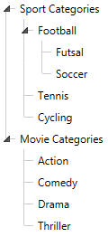
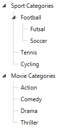

# Lines Support

The __RadTreeView__ allows you to enable connected lines between the nodes of a treeview. By default the connecting lines between the nodes are not enabled (they are not visible). You should use a single property to do so - __IsLineEnabled__and set it to __True__.

#### __XAML__

{{region radtreeview-features-lines-support_0}}
	<telerik:RadTreeView x:Name="radTreeView" IsLineEnabled="True">
	{{endregion}}

You can also control the visibility of the lines between the root items (the items on the first level) of the treeview. This can be done with the __IsRootLinesEnabled__ property of the treeview. The default value of this property is __True__

#### __XAML__

{{region radtreeview-features-lines-support_1}}
	<telerik:RadTreeView x:Name="radTreeView" IsLineEnabled="True" IsRootLinesEnabled="False">
	{{endregion}}

>tipFor more information about the visual structure of the __RadTreeView__, check out the [Visual Structure]() topic.

## Change the LineColor

Take a look at the [Styling the Lines]() topic in the Styling and Appearance section.

# See Also

 * [Selection]()

 * [Drag and Drop]()

 * [UI Virtualization]()
