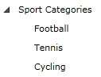
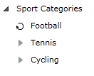

# Load on Demand

The performance of the Telerik __RadTreeView__ control when operating with huge amount of items is significantly optimized through its load on demand feature. This mechanism lets the nodes load their child nodes as the user expands the parent by clicking on the expander icon.

This tutorial will walk you through the following common tasks:

* Enable load on demand behavior declaratively and programmatically.
* Using events to manage the load on demand process.
* Using the __IsLoadingOnDemand__ property.

For the purpose of this tutorial will be used the following treeview declaration: 

<snippet id='radtreeview-features-load-on-demand-block_1-xaml' />

## Enable Load on Demand Declaratively 

To enable this feature you can set the __IsLoadOnDemandEnabled__ property to the __RadTreeViewItem__ to __True__.

<snippet id='radtreeview-features-load-on-demand-block_2-xaml' />

## Enable Load on Demand Programmatically 

The same effect can be achieved if you set the __IsLoadOnDemandEnabled__ property of an instance of the __RadTreeViewItem__ class in the code-behind:

<snippet id='radtreeview-features-load-on-demand-block_3-cs' />
<snippet id='radtreeview-features-load-on-demand-block_4-vb' />
	

## Events 

When the expand icon is clicked the __LoadOnDemand__ event is fired. This event provides the opportunity to add new items based on the identity of the clicked-on Item.

* Here is an example of how to handle the __LoadOnDemand__ event when attached to a __RadTreeViewItem__:

	<snippet id='radtreeview-features-load-on-demand-block_5-xaml' />
	
	<snippet id='radtreeview-features-load-on-demand-block_6-cs' />
	<snippet id='radtreeview-features-load-on-demand-block_7-vb' />

* If you want to enable the Load on demand functionality globally for the entire __RadTreeView__ you can set the __IsLoadOnDemandEnabled__ property to the __RadTreeView__. This will make all Items in the __RadTreeView__ to have the expander icon enabled.
		
	Here is an example of how to handle the __LoadOnDemand__ event when attached to the __RadTreeView__:

	<snippet id='radtreeview-features-load-on-demand-block_8-xaml' />

	<snippet id='radtreeview-features-load-on-demand-block_9-cs' />
	<snippet id='radtreeview-features-load-on-demand-block_10-vb' />

>tip The __RadRoutedEventArgs__ expose both the __Source__ and the __OriginalSource__ of the event. Both properties point to the __RadTreeViewItem__ that was clicked. The __Source__ property points to the __RadTreeView__ control that is currently handling the event, but the __OriginalSource__ property points to the __RadTreeViewItem__ that was clicked.

## The IsLoadingOnDemand Property 

When there are no items to add, and you want to stop the loading animation, set the __IsLoadingOnDemand__ property to __False__ to the __RadTreeViewItem__ that has fired the __LoadOnDemand__ event.

>tip When there are no items to add, and you want to prevent the __LoadOnDemand__ event to fire again, set the __IsLoadOnDemandEnabled__ property to __False__ to the __RadTreeViewItem__ that has fired the __LoadOnDemand__ event.

## See Also

 * [Data Binding]()
 * [CheckBox Support]()
 * [Keyboard Support]()