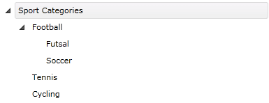

# Enable and Disable Items

By using the API of the __RadTreeView__ control you can easily disable or enable a node. You can set the boolean property __IsEnabled__ to each one of the following objects:

* __RadTreeView__
* __RadTreeViewItem__

This tutorial will walk you through the common tasks of __enabling__ and __disabling__ treeview item(s) declaratively and programmatically.

## Enable and Disable Items Declaratively 

This is a snapshot of a regular __RadTreeView__ with a couple of items.

And here is the XAML declaration:

<snippet id='radtreeview-features-treeview-item-feautres-treeviewitem-enable-disable-items-block_1-xaml' />

By default all items in the treeview are enabled (their __IsEnabled__ property is set to __True__). That means you can select, expand, collapse, drag and drop these items. If you want to disable a specific item, just add the following attribute to the treeview item declaration: 

<snippet id='radtreeview-features-treeview-item-feautres-treeviewitem-enable-disable-items-block_2-xaml' />

If you want to disable the whole treeview then add the same attribute to the treeview declaration. On the next snapshot the whole treeview is disabled. 

Here is the XAML declaration. Note that if you set the __IsEnabled__ property to __False__ for the __RadTreeView__ object then all treeview items will be disabled. 

<snippet id='radtreeview-features-treeview-item-feautres-treeviewitem-enable-disable-items-block_3-xaml' />

## Enable and Disable Items Programmatically

In order to disable a treeview item, you have to set the __IsEnabled__ property of an instance of the __RadTreeViewItem__ class. 

<snippet id='radtreeview-features-treeview-item-feautres-treeviewitem-enable-disable-items-block_4-cs' />
<snippet id='radtreeview-features-treeview-item-feautres-treeviewitem-enable-disable-items-block_5-vb' />
	
If you want to disable the whole treeview then you have to set the __IsEnabled__ property of an instance of the __RadTreeView__ class. 

<snippet id='radtreeview-features-treeview-item-feautres-treeviewitem-enable-disable-items-block_6-cs' />
<snippet id='radtreeview-features-treeview-item-feautres-treeviewitem-enable-disable-items-block_7-vb' />

>tip Consider disabling treeview items in XAML instead of code-behind whenever it's possible. This includes situations when you know what items you need to disable at design time.

## Events 

Both __RadTreeView__ and __RadTreeViewItem__ offer you __IsEnabledChanged__ event which is raised, when the tree or an item is enabled/disabled.

<snippet id='radtreeview-features-treeview-item-feautres-treeviewitem-enable-disable-items-block_8-xaml' />

You can also attach to the __IsEnabledChanged__ event in the code-behind.

<snippet id='radtreeview-features-treeview-item-feautres-treeviewitem-enable-disable-items-block_9-cs' />
<snippet id='radtreeview-features-treeview-item-feautres-treeviewitem-enable-disable-items-block_10-vb' />

## See Also
 * [How to Edit An Item]()
 * [Item Images]()
 * [Working with selection]()
 * [Expanding and Collapsing Items]()
 * [BringIntoView Support]()